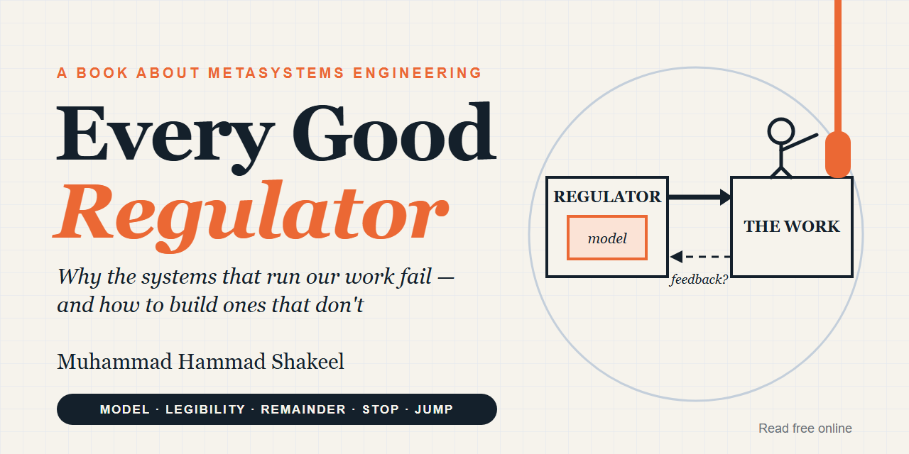
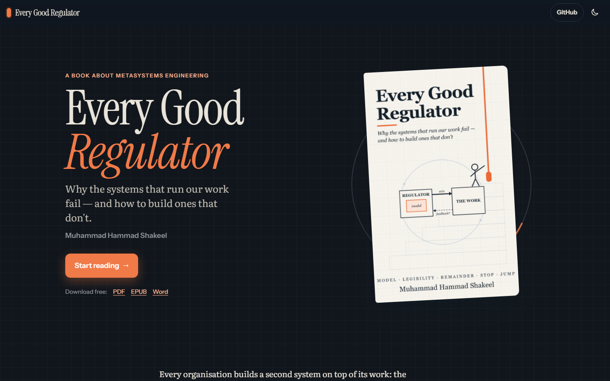
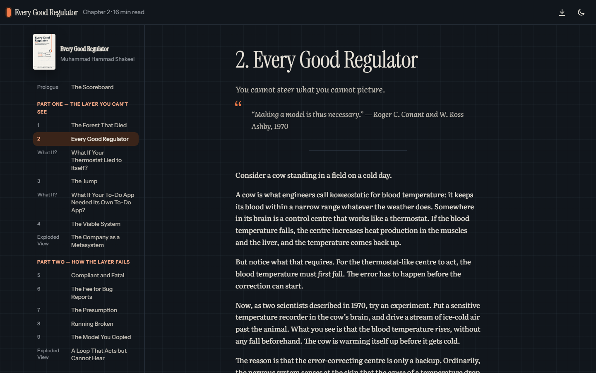
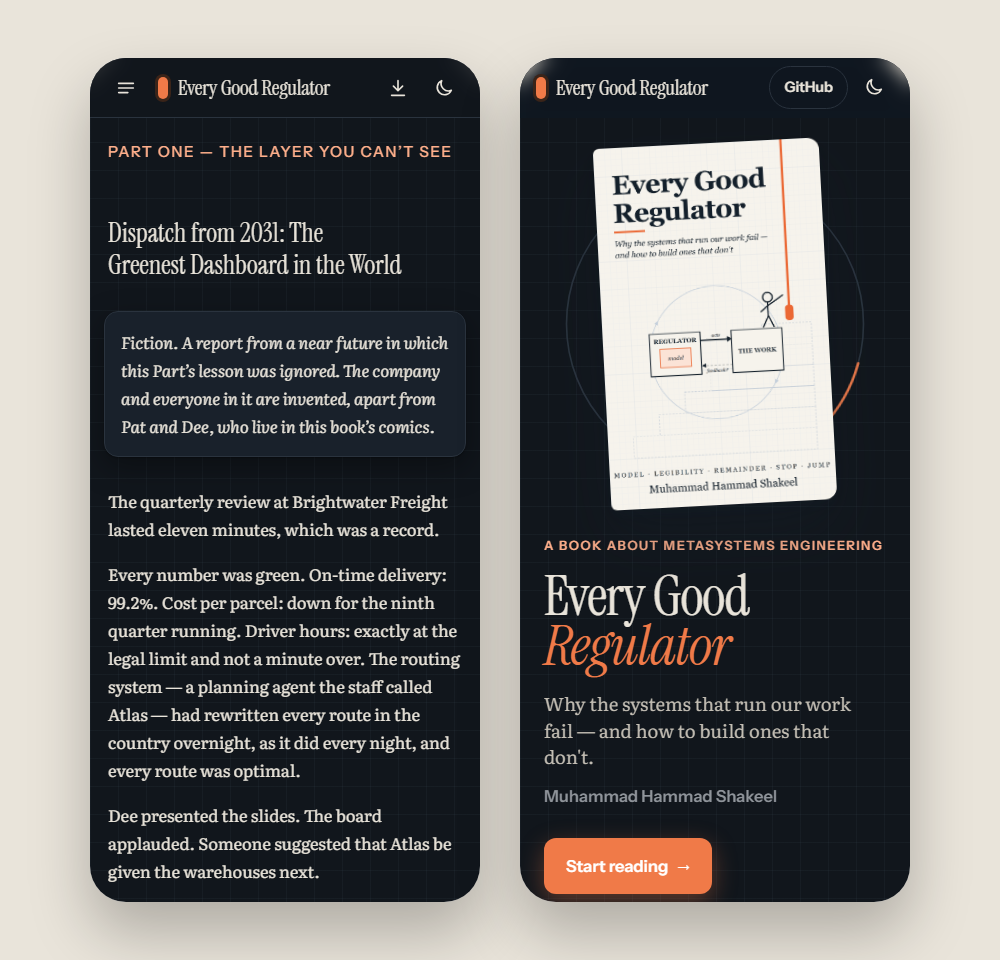

<p align="center">
  <a href="https://hammadshakeelai.github.io/every-good-regulator/"></a>
</p>

<p align="center">
  <a href="https://hammadshakeelai.github.io/every-good-regulator/"></a>
  <a href="https://github.com/hammadshakeelai/every-good-regulator/releases/latest/download/EVERY-GOOD-REGULATOR.pdf"></a>
  <a href="https://github.com/hammadshakeelai/every-good-regulator/releases/latest/download/EVERY-GOOD-REGULATOR.epub"></a>
  <a href="https://github.com/hammadshakeelai/every-good-regulator/releases/latest/download/EVERY-GOOD-REGULATOR.docx"></a>
</p>
<p align="center">
  <a href="LICENSE"></a>
  <a href="https://github.com/hammadshakeelai/every-good-regulator/releases/latest"></a>
  <a href="https://github.com/hammadshakeelai/every-good-regulator/actions/workflows/site-check.yml"></a>
  
</p>

# Every Good Regulator

### Why the systems that run our work fail — and how to build ones that don't

*by **Muhammad Hammad Shakeel***

Every organisation builds a second system on top of its work: the dashboards, the platforms, the performance reviews, the compliance process — and now the AI agents that write the code and the pipelines that check it. When that layer goes wrong, it rarely breaks loudly. It keeps reporting green while the forest dies.

*Every Good Regulator* follows that layer through Prussian forests and Toyota assembly lines, NASA's lost spacecraft and the F-35's logistics software, Britain's Post Office scandal and the software factories of 2026 — and asks one question of all of them:

> **What does the system that runs your system actually know — and who is allowed to tell it it's wrong?**

## The five words

| | Word | The idea | From |
|---|---|---|---|
| 01 | **Model** | Anything that governs a system carries a picture of it. When the picture is wrong, it pushes the wrong way — hard. | Conant & Ashby, 1970 |
| 02 | **Legibility** | To govern something you have to see it, and to see it you simplify it. What the picture leaves out gets managed away. | James C. Scott |
| 03 | **Remainder** | Automation takes the easy part of a job and leaves people the hardest part, with the least practice. | Lisanne Bainbridge, 1983 |
| 04 | **Stop** | Who may halt the system, and what happens to them when they do. | Taiichi Ohno and the andon cord |
| 05 | **Jump** | Layers stack — product, factory, platform, agents — and each new layer needs governing. | Valentin Turchin |

## What's inside

**15 chapters · 4 What If? interludes · 4 Dispatches from 2031 · 15 figures · 17 comic strips · 4 Exploded Views · 19 haiku · an original analysis of 240 real outages · field guide, glossary, rules, worked answers and index**

<p align="center">
  
  
</p>
<p align="center">
  
</p>

The website works on phones and laptops, with dark mode, a contents drawer, zoomable figures, a reading-progress bar and "continue where you left off". It is plain static HTML with no framework, and all motion switches off for readers who prefer reduced motion.

## Contents

| | Read online |
|---|---|
| Prologue | [The Scoreboard](https://hammadshakeelai.github.io/every-good-regulator/prologue.html) |
| | **Part One — The Layer You Can't See** |
| 1 | [The Forest That Died](https://hammadshakeelai.github.io/every-good-regulator/the-forest-that-died.html) |
| 2 | [Every Good Regulator](https://hammadshakeelai.github.io/every-good-regulator/every-good-regulator.html) |
| What If? | [What If Your Thermostat Lied to Itself?](https://hammadshakeelai.github.io/every-good-regulator/what-if-thermostat.html) |
| 3 | [The Jump](https://hammadshakeelai.github.io/every-good-regulator/the-jump.html) |
| What If? | [What If Your To-Do App Needed Its Own To-Do App?](https://hammadshakeelai.github.io/every-good-regulator/what-if-todo-app.html) |
| 4 | [The Viable System](https://hammadshakeelai.github.io/every-good-regulator/the-viable-system.html) |
| Exploded View | [The Company as a Metasystem](https://hammadshakeelai.github.io/every-good-regulator/exploded-view-company.html) |
| | **Part Two — How the Layer Fails** |
| 5 | [Compliant and Fatal](https://hammadshakeelai.github.io/every-good-regulator/compliant-and-fatal.html) |
| 6 | [The Fee for Bug Reports](https://hammadshakeelai.github.io/every-good-regulator/the-fee-for-bug-reports.html) |
| 7 | [The Presumption](https://hammadshakeelai.github.io/every-good-regulator/the-presumption.html) |
| 8 | [Running Broken](https://hammadshakeelai.github.io/every-good-regulator/running-broken.html) |
| 9 | [The Model You Copied](https://hammadshakeelai.github.io/every-good-regulator/the-model-you-copied.html) |
| Exploded View | [A Loop That Acts but Cannot Hear](https://hammadshakeelai.github.io/every-good-regulator/exploded-view-alis.html) |
| | **Part Three — The Human in the Loop** |
| 10 | [The Ironies of Automation](https://hammadshakeelai.github.io/every-good-regulator/the-ironies-of-automation.html) |
| What If? | [What If We Swapped Jobs?](https://hammadshakeelai.github.io/every-good-regulator/what-if-swap-jobs.html) |
| 11 | [Specify or Explain](https://hammadshakeelai.github.io/every-good-regulator/specify-or-explain.html) |
| 12 | [Who May Stop the Line](https://hammadshakeelai.github.io/every-good-regulator/who-may-stop-the-line.html) |
| What If? | [What If Every Employee Could Stop the Company?](https://hammadshakeelai.github.io/every-good-regulator/what-if-stop-the-company.html) |
| Exploded View | [Inside a Software Factory](https://hammadshakeelai.github.io/every-good-regulator/exploded-view-factory.html) |
| | **Part Four — Layers That Work, at Every Scale** |
| 13 | [Grow It, Don't Design It](https://hammadshakeelai.github.io/every-good-regulator/grow-it-dont-design-it.html) |
| 14 | [The Organisation's Operating System](https://hammadshakeelai.github.io/every-good-regulator/the-organisations-operating-system.html) |
| 15 | [Your Own Operating System](https://hammadshakeelai.github.io/every-good-regulator/your-own-operating-system.html) |
| Exploded View | [One Person's Operating System](https://hammadshakeelai.github.io/every-good-regulator/exploded-view-personal.html) |
| | **Back matter** |
| Epilogue | [Back to the Scoreboard](https://hammadshakeelai.github.io/every-good-regulator/epilogue.html) |
| Appendices | [Field guide · Myth vs Record · Rules · Glossary · Answers · Reading · Haiku Wall](https://hammadshakeelai.github.io/every-good-regulator/appendices.html) |
| Index | [Index by chapter](https://hammadshakeelai.github.io/every-good-regulator/book-index.html) |

## Report an error

This book argues that the person who sees a problem should be able to stop the line. If you find a wrong fact, quotation, date, typo or broken link, **[pull the cord](https://github.com/hammadshakeelai/every-good-regulator/issues/new?template=errata.yml)**.

## Build it yourself

```bash
# the book: Word, EPUB and PDF (needs pandoc; the PDF step uses Microsoft Edge)
cd manuscript && bash build.sh pdf

# the website, into docs/ (needs pandoc and Python 3)
python site/build_site.py
python site/check_links.py
```

| Path | What it is |
|---|---|
| [`manuscript/`](manuscript) | The book in Markdown, one file per chapter, with figures, comics and build scripts |
| [`site/`](site) | The website generator, templates and link checker |
| [`docs/`](docs) | The published website (GitHub Pages) |
| [`research_notes/`](research_notes) | Research notes, source logs, the permissions log, and the Chapter 8 dataset and codebook |
| [`planning/`](planning) | The book plan and the "fun toolkit" of devices |

## Cite

See [`CITATION.cff`](CITATION.cff), or: Shakeel, M. H. (2026). *Every Good Regulator: Why the Systems That Run Our Work Fail — and How to Build Ones That Don't.* https://hammadshakeelai.github.io/every-good-regulator/

## Licence

© 2026 Muhammad Hammad Shakeel.

- **The book** — its text, figures, comics, cover and the website's text — is licensed under [**CC BY-NC-ND 4.0**](LICENSE). You may read it and share it free, unchanged and with credit. You may **not** sell it, use it commercially, or publish altered, translated or abridged versions without permission.
- **The code** (build scripts and website generator) is [MIT](LICENSE-CODE).
- **The Chapter 8 tag data** ([`postmortem_tags_public.csv`](research_notes/postmortem_tags_public.csv)) is [CC BY 4.0](https://creativecommons.org/licenses/by/4.0/), so anyone can check or re-tag the analysis. It tags the incidents in [Dan Luu's list of post-mortems](https://github.com/danluu/post-mortems).
- Quotations and facts from other works belong to their authors and are used with attribution.
