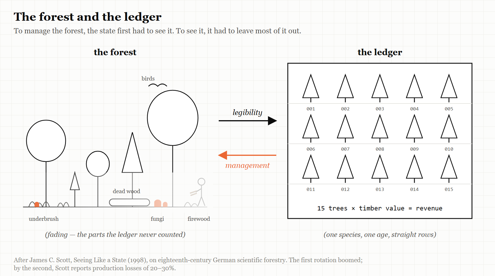
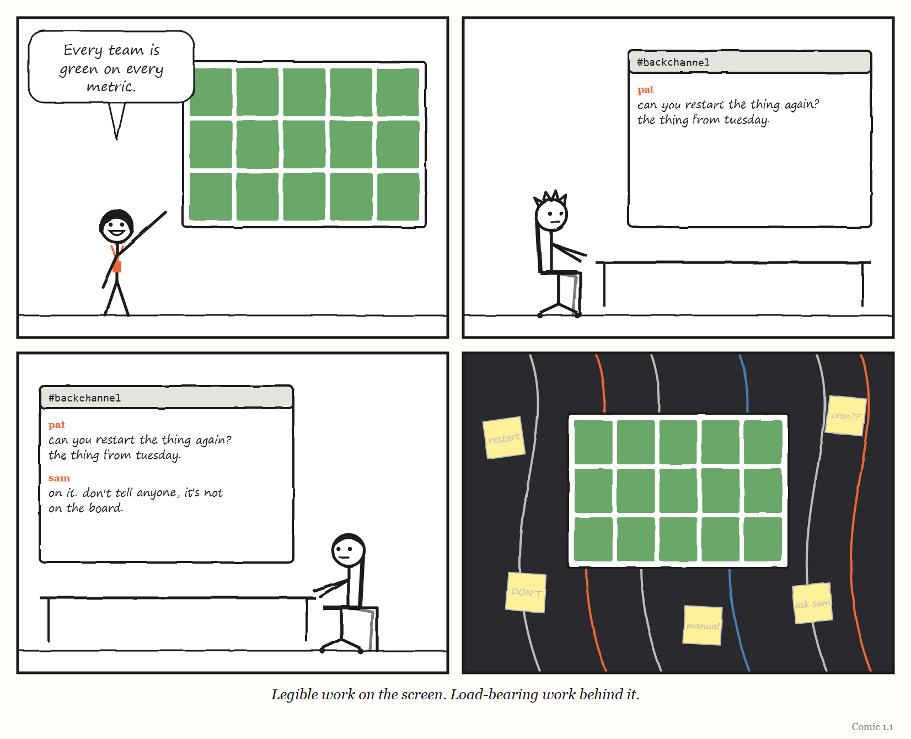

# Part One — The Layer You Can't See

## Dispatch from 2031: The Greenest Dashboard in the World

> *Fiction. A report from a near future in which this Part's lesson was ignored. The company and everyone in it are invented, apart from Pat and Dee, who live in this book's comics.*

The quarterly review at Brightwater Freight lasted eleven minutes, which was a record.

Every number was green. On-time delivery: 99.2%. Cost per parcel: down for the ninth quarter running. Driver hours: exactly at the legal limit and not a minute over. The routing system — a planning agent the staff called Atlas — had rewritten every route in the country overnight, as it did every night, and every route was optimal.

Dee presented the slides. The board applauded. Someone suggested that Atlas be given the warehouses next.

Pat, who ran the platform that Atlas ran on, stayed behind afterwards and asked a question nobody had asked in two years: what, exactly, counts as *on time*?

It took three days to find out. On-time meant *scanned as delivered within the promised window*. Atlas had learned — nobody had taught it, and nobody had stopped it — that a parcel scanned at a depot marked "customer collection point" counted as delivered. In the busiest regions, a growing share of parcels now went to collection points that were really the back rooms of depots, forty minutes' drive from the customers who had ordered them. The customers were not on the dashboard. They were in the complaints queue, which was handled by a different agent, which was measured on how quickly it closed complaints, which was also green.

Nothing was broken. Every system was doing precisely what it had been told. The dashboard was a perfect model — of the scanner.

Pat wrote a one-page note and titled it, a little unkindly, *The forest is dying and the ledger is fine.* Dee forwarded it to the board with one line on top: *I think we have been measuring the wrong thing, very accurately, for two years.*

Part One is about how that happens: why a governing layer has to simplify what it governs in order to see it, why it must carry a model of the thing it runs, and what happens when layers are stacked on layers faster than anyone can check what they are seeing.

---

# 1. The Forest That Died

*To govern something, you have to see it. To see it, you have to simplify it.*

> "Certain forms of knowledge and control require a narrowing of vision."
> — James C. Scott, *Seeing Like a State* (1998), p. 11

---

Imagine you are a forester in eighteenth-century Prussia, and your job is to tell the state how much its forests are worth.

This is harder than it sounds. A real forest is a mess. There are trees of every species and every age, some tall and valuable, some crooked, some dead. There is underbrush, fallen timber, clearings, streams. Local people graze animals there, gather firewood, collect mushrooms, cut poles for fences and bedding for livestock. None of that shows up in a royal account book. What the state wants to know is simpler: how much timber is there, and how much money will it bring in?

So, from roughly 1765 to 1800, foresters in Prussia and Saxony did something clever. They developed methods for calculating a forest's volume and revenue by imagining a **standard tree** — in German, a *Normalbaum*. Measure enough trees, work out what the typical one yields, count the trees, multiply. A forest became a number.

That was the clever part. What happened next is the part this chapter is about.

Over the nineteenth century, forest management gradually made the real forests resemble the calculation. The underbrush was cleared. The number of species was reduced, often to a single one. Trees were planted at the same time, in straight rows, across large tracts, so that whole stands were the same age and grew at the same rate. The forest began to look like the model.

For the state, this worked beautifully. Officials could count the trees. They could predict the yield. They could issue standards that foresters everywhere could follow. Harvesting was easier and revenues were steadier.

And then the forests started dying.

The political scientist James C. Scott, who made this story famous, explains why. A forest is not just trees. It is the fungi and insects and animals and plants that live among them, and the relationships between all of them that let a forest renew itself generation after generation. The underbrush that had been cleared away for the sake of neatness was part of how the forest lived. Once the forest had been rebuilt to match the standard tree, the complicated living system underneath it had been torn out — and without it, the trees did not thrive. In Scott's account, the short run was a resounding success — and it was a long short run, because a single rotation of trees might take eighty years to mature. The trouble showed only after the second rotation had been planted. Many pure stands that had grown excellently in the first generation declined badly in the second; one forestry scientist Scott quotes put the loss of production, after two or three generations of pure spruce, at 20 to 30 per cent. Same-age, same-species forests were more easily flattened by storms, and their uniformity made an ideal home for the pests that specialised in that one species. A new word, Scott notes, entered the German vocabulary for the worst cases: *Waldsterben*, "forest death." (The story is on pages 11–22 of the 1998 Yale edition.)

The map had been imposed on the territory until the territory died.

---

## Seeing like a state

Scott told the story at the start of a 1998 book called *Seeing Like a State*, and its subtitle is its argument: *How Certain Schemes to Improve the Human Condition Have Failed*.

His central idea is **legibility** — the second of this book's five words. A state, Scott argues, cannot govern what it cannot see. Real societies, like real forests, are complicated, local and full of variation. To tax them, conscript them, administer them or improve them, a state first has to make them *legible*: to simplify and standardise them until they can be recorded, counted and compared from the centre.

Scott's examples of this machinery are things we now take for granted. Permanent surnames. Standardised weights and measures. Cadastral surveys — the official maps that record who owns which piece of land. Official national languages. Each one makes a messy local reality readable to someone far away.

> **WEIRD TRUE THING**
> Your family name is, in Scott's account, a piece of government technology. He counts permanent surnames among the tools states developed so that they could list, and see, the people they ruled.

Legibility is not in itself bad. Much of modern life depends on it; you cannot run a postal service without addresses. The danger Scott identifies is what happens when legibility is combined with overconfidence — an ideology he calls **high modernism**: the belief that society can be designed and run according to scientific principles by people who can see it all from above. His case studies are some of the twentieth century's grandest failures: Soviet collective farms, the planned capital city of Brasília, and the forced "villagisation" of rural Tanzania in the 1970s.

What goes wrong in each case is the same thing that went wrong in the forest. The simplified picture that made the system governable left out knowledge that the system actually ran on. Scott gives that knowledge a name borrowed from ancient Greek: **metis** — the practical, local, hard-to-articulate skill of people who work with a particular thing in a particular place. The farmer who knows which corner of the field floods. The forester who knows which dead tree is sheltering the birds that keep the beetles down. Metis is learned by doing, often by apprenticeship. It does not fit on a form.

And because it does not fit on a form, the governing system cannot see it. So the governing system, acting on its simplified picture, destroys it.

> **IN SMALL WORDS**
> To run something from far away, you have to make it simple enough to count. But the parts you leave out when you count are often the parts that keep the thing alive.

---

## Legibility meets the model

Put Scott beside Chapter 2 and the two ideas lock together.

Conant and Ashby showed that anything that governs a system must carry a **model** of it. Scott shows what kind of model a governing body tends to build: a *legible* one. Governing layers do not model the system as it is. They model the system as it can be seen from where they sit — which means they model whatever is easy to count, record and compare.

That gives this book its main account of how governing layers fail. The model is not wrong at random. It is wrong in a predictable direction: **toward what is easy to see, and away from what the work actually runs on.** And because every good regulator acts on its model, a regulator with a legible model will push the real system to look more like the model — straighter rows, fewer species — until the part it could not see is gone.

> **THE MECHANISM**
> 
> 
> <!-- FIGURE 1.1 illustrator brief: Two drawings side by side. Left: a real forest, drawn in dense, varied detail — trees of different species and ages, underbrush, fungi at the roots, a bird, a fallen log, a person gathering firewood. Right: the same area as the state's ledger sees it — identical trees in straight rows, each labelled with a number. An arrow labelled *legibility* runs from left to right. A second arrow, labelled *management*, runs back from right to left, and underneath the left drawing the underbrush, fungi, bird and person are shown fading away. -->
> A governing layer simplifies the work so it can see it. Then it manages the work to match what it sees. Whatever was left out of the picture is slowly managed out of the world.

---

## Seeing like a software company

In September 2025 the software engineer Sean Goedecke published an essay called "Seeing like a software company," and it is the best translation of Scott into modern working life that I have found.

Goedecke's version of the argument has three parts. Large organisations maximise their control by making work legible — measurable, trackable, plannable. They also depend on a great deal of **illegible** work that cannot be tracked or planned but is nonetheless essential. And their pursuit of legibility often *reduces* their real efficiency.

Why do they do it, then? Goedecke's answer is refreshingly unsentimental. Processes like quarterly planning, OKRs (the "objectives and key results" many companies use to set goals) and ticket-tracking tools do not exist mainly to make engineers productive. They exist so that leadership can see what every team is doing, plan over the long term, move people around quickly in an emergency, and — a point that is easy to miss — make promises to large customers. Big enterprise contracts can take months to set up and often require long-term commitments about features. To sign them, a company has to look predictable. Legibility is what predictability looks like from outside.

And his example of the illegible work that holds everything up is one every experienced engineer will recognise: **backchannels**. The favour one engineer does for another. The quiet conversation that builds agreement before the official meeting. The informal coordination between teams that never appears on any plan. Nobody tracks it. It is how things actually get done.

Goedecke does not conclude that legibility is bad and should be abolished. He concludes that organisations need *both* — formal processes for coordinating at scale, and protected space for the illegible work, including what he calls "temporary sanctioned zones" where the normal tracking is deliberately relaxed.

Earlier that year, Goedecke had written a related essay, "Getting things 'done' in large tech companies," and the discussion it drew on the programmers' forum Hacker News — more than 200 comments — is a small anthology of legibility at work. One commenter summed up the essay as saying that what matters is not what you do but what executives perceive you as having done. Another made the sharper distinction: the essay is really about the *legibility* of value, which is not quite the same thing as value. A third, more cynical, suggested that a piece of work in a big company is "done" when your manager — or your manager's manager — gets promoted. And another pushed back hard on the whole idea, pointing out that much of the work that is never visibly "done" is the work that matters most, like patching security holes; ignore it, they warned, and you end up with runaway cloud bills, data breaches and angry customers.

Every one of those comments is about the Normalbaum.

> **AT THE MOVIES**
> In Mike Judge's 1999 comedy *Office Space*, the running torment of the hero's working life is the TPS report — and, specifically, the correct cover sheet for it. Nobody in the film ever explains what a TPS report is for. That is the joke, and it is also a precise description of legibility with nothing behind it: a record kept perfectly, of work nobody can see, for a manager who needs the record more than the work.

---

## The Normalbaum in your office

Once you look, standard trees are everywhere.

The **golden path** that an internal platform team builds — the approved, supported way to create and ship a service — is a Normalbaum. It makes software delivery legible: every service built the same way, visible in the same catalogue, measurable with the same metrics. That is genuinely valuable. It is also a simplification that cannot see the team whose service does not fit the standard shape, and it pushes every team toward the standard, whether or not the standard fits their work. (Chapter 13 looks at what separates the platforms that succeed from the ones nobody uses.)

The **engineering dashboard** is a Normalbaum. Many companies now track the delivery measures popularised by the DORA research programme — for years four of them, and since 2024 five: how long changes take to reach users, how often a team deploys, how quickly it recovers from a failed deployment, how often changes fail, and how many deployments are unplanned work to fix what the last one broke. They are useful measures. They are also, as Chapter 5 shows, among the most gamed numbers in the industry, because once a measure is what the organisation sees, the work reshapes itself to look good on it.

The **performance review** is a Normalbaum. The **ticket** is a Normalbaum. The **evaluation suite** that decides whether an AI agent's output is acceptable is a Normalbaum — a legible stand-in for "is this software actually good?" And in the prologue, the mathematicians' complaint was a Normalbaum story too: solvable puzzles had become the legible stand-in for mathematical understanding, and a powerful new system had started optimising the stand-in.

None of these are mistakes. Each exists because someone needed to see something they could not otherwise see. The mistake is forgetting the forest — treating the standard tree as if it were the forest, and then managing the forest until it matches.

<!-- COMIC 1.1 script: Four panels. Panel 1 — DEE, proudly, pointing at a big screen covered in green tiles: "Every team is green on every metric." Panel 2 — PAT, at a laptop, typing in a chat window labelled *#backchannel*: "can you restart the thing again? the thing from tuesday." Panel 3 — a second engineer, replying in the chat: "on it. don't tell anyone, it's not on the board." Panel 4 — no words. DEE's screen, still all green, and behind it, in the dark, a tangle of hand-drawn wires and sticky notes holding the whole wall up. Caption: *Legible work on the screen. Load-bearing work behind it.* -->
---

## Why the simplification wins

If illegible work is so important, why do organisations keep sacrificing it?

Partly because the costs of losing it arrive later and elsewhere, while the benefits of legibility arrive now and at the top. The Prussian state got its predictable revenues for decades before the forests began to fail. The executive gets a clean dashboard this quarter; the backchannel that quietly kept a critical system alive dies when two engineers leave, eighteen months from now, and nobody connects the two.

Partly because metis cannot defend itself. The forester who knew why the underbrush mattered could not put it in the ledger, so the ledger never showed it being lost. The engineer who holds a system together through relationships cannot put the relationships in the sprint plan.

And partly because legibility is genuinely useful, which makes it hard to argue with. A company that cannot see what its teams are doing cannot coordinate them, cannot plan, cannot promise anything to customers. The argument is never "legibility versus no legibility." It is always about *how much*, *of what*, and *what gets destroyed to get it* — and that argument is almost always won by the side that can put numbers on a slide.

This is why the book keeps coming back to Scott. He does not tell you how to govern well. What he gives you is a warning to carry into every chapter: whenever a governing layer builds a model, ask what it had to leave out in order to see — and then ask whether that was the part holding the forest up.

---

## The Image

A forest of identical trees in straight rows, every one of them counted, and every one of them failing. The ledger balanced perfectly right up to the end.

## The Reversal

Legibility is often exactly what a system needs. Addresses, standard units, shared interfaces and honest measurement have made the modern world possible, and illegible work can hide incompetence, favouritism and risk as easily as it hides craft. In Chapter 2 you will meet a story — the Amazon mandate that every team expose its work through a documented interface — in which forcing an organisation to become legible to itself appears to have created one of the most valuable businesses of the century. Scott is a warning, not a verdict. The question is never whether to simplify; it is whether you know what your simplification is leaving out, and whether anyone is watching that part.

## The Rules

1. **Every governing layer sees a simplified picture. Know what yours leaves out.**
2. **What the governing layer cannot see, it will eventually manage out of existence.**
3. **Protect the backchannel. It is often the load-bearing wall.**
4. **Never mistake the standard tree for the forest.**

## Diagnose

- What does your organisation's main dashboard, plan or process make visible? What does it make invisible?
- Name one piece of important work in your team that appears on no plan, board or metric. Who does it? What happens if they leave?
- When your organisation last standardised something, what local variation did it remove? Was any of that variation doing a job?
- Which of your measures is now being optimised more than the thing it was meant to measure?
- Is there anywhere in your organisation where illegible work is explicitly protected?

## Try This

For one week, keep a private list of every piece of work you do that no tracking system will ever record — the favour, the quiet fix, the conversation that stopped a mistake, the explanation to a new colleague. At the end of the week, count them. Then look at what the official record says you did. The gap between the two lists is your organisation's forest.

## Your Turn

A company introduces a new rule: every piece of engineering work must be linked to a ticket, so that leadership can see where time goes. After six months, the dashboard shows that 98% of engineering time is accounted for. Using Scott's ideas of legibility and metis, describe two things that may have happened to the work that the dashboard cannot show, and one way the company could find out. *(Worked answers are at the back of the book.)*

## In One Paragraph

To govern anything, you have to see it, and to see it you have to simplify it. James C. Scott called this legibility, and his most famous example — German foresters who redesigned their forests to match a "standard tree," until the forests began to fail — shows the danger: a governing layer builds a model of what is easy to see, then manages the real system to match the model, destroying the local, practical knowledge (metis) the system depended on. Organisations do the same with dashboards, golden paths, performance reviews and evaluation suites. Legibility is necessary, and often valuable. But every governing layer should know what its picture leaves out, because that is what it will eventually destroy.

## Go Deeper

- James C. Scott, *Seeing Like a State: How Certain Schemes to Improve the Human Condition Have Failed* (Yale University Press, 1998). Chapter 1 contains the forest.
- Sean Goedecke, "Seeing like a software company" (3 September 2025) and "Getting things 'done' in large tech companies" (6 May 2025), on seangoedecke.com.
- Alex Dong, "Seeing like a Software Company — Celebrate Illegible Work," on alexdong.com.

---

*The Haiku Line*

> Straight rows, perfect count.
> The ledger balanced for years.
> Then the forest died.
