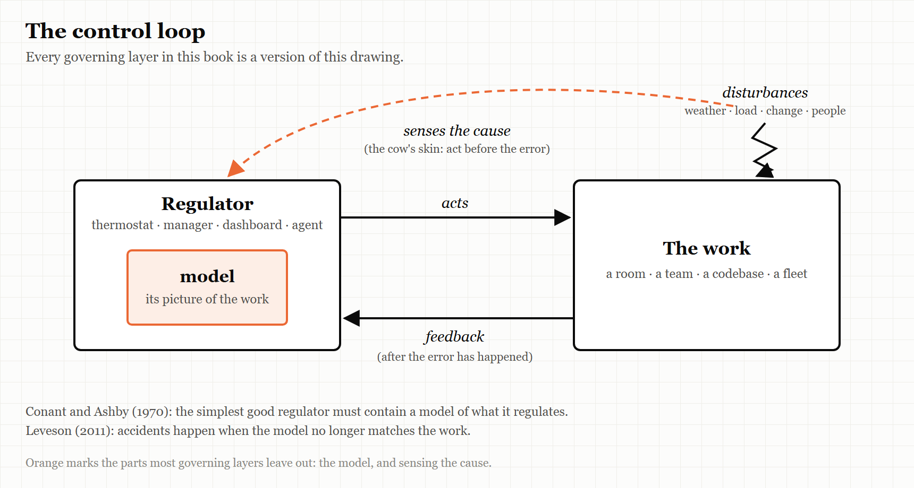
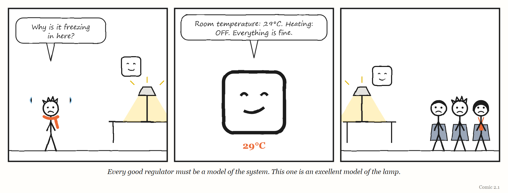

# 2. Every Good Regulator

*You cannot steer what you cannot picture.*

> "Making a model is thus necessary."
> — Roger C. Conant and W. Ross Ashby, 1970

---

Consider a cow standing in a field on a cold day.

A cow is what engineers call *homeostatic* for blood temperature: it keeps its blood within a narrow range whatever the weather does. Somewhere in its brain is a control centre that works like a thermostat. If the blood temperature falls, the centre increases heat production in the muscles and the liver, and the temperature comes back up.

But notice what that requires. For the thermostat-like centre to act, the blood temperature must *first fall*. The error has to happen before the correction can start.

Now, as two scientists described in 1970, try an experiment. Put a sensitive temperature recorder in the cow's brain, and drive a stream of ice-cold air past the animal. What you see is that the blood temperature *rises*, without any fall beforehand. The cow is warming itself up before it gets cold.

The reason is that the error-correcting centre is only a backup. Ordinarily, the nervous system senses at the skin that the *cause* of a temperature drop has arrived — cold air — and starts regulating before any error occurs in the blood at all.

The two scientists were Roger Conant and Ross Ashby, and the cow appears in a short paper with one of the most useful titles in the history of science: "Every Good Regulator of a System Must Be a Model of That System." They used the cow to make a point about two kinds of control. Waiting for the error and then correcting it, they wrote, is "primitive and demonstrably inferior." Sensing the cause and acting on it is better — in principle, it can be perfect.

But to act on the cause, the cow has to know that cold air on the skin *means* colder blood soon. It has to carry, somewhere inside it, a picture of how its own body responds to the world.

It has to carry a model.

This chapter is about the first of the book's five words: **Model**.

---

## The paper

Roger Conant was at the Department of Information Engineering at the University of Illinois in Chicago; W. Ross Ashby, one of the founders of cybernetics, was at the university's Biological Computers Laboratory in Urbana. Their paper was received by the *International Journal of Systems Science* on 3 June 1970 and published that year in its first volume, on pages 89 to 97.

It opens with a very practical worry. By 1970, people were building models of complex systems everywhere. The authors' examples are wonderfully specific: the air-traffic flows around New York, money moving between banking centres, and — the one that sticks — "the endocrine balances of the pregnant sheep." But nobody knew whether building a model was *necessary* for controlling a system, or just one option among many. A cybernetician building a model of an airport, they wrote, might always fear that someone would decide the model was a waste of time and some other approach was better.

Their paper set out to settle it. And their answer, in the paper's own summary, is that under very broad conditions, any regulator that is *maximally both successful and simple* must be, in effect, a model of the system it regulates. Making a model, they concluded, is not optional. It is necessary.

> **WEIRD TRUE THING**
> The paper that made model-building compulsory for every regulator in the universe was partly funded by the US Air Force Office of Scientific Research — and its opening list of things people were modelling in 1970 includes "the endocrine balances of the pregnant sheep."

### What the theorem actually says

The title is the slogan. The theorem underneath it is narrower, and more interesting, and it is worth getting right — partly because the slogan is quoted far more often than the paper is read.

Conant and Ashby set the problem up with a few ingredients. There is a **system** being regulated, which can be in various states. There are **disturbances** from outside, pushing it around. There is a **regulator** — a thermostat, a pilot, an air-traffic control tower — which responds to what is happening. And there is a set of **outcomes**, some of which count as good. A good regulator is one that keeps the outcomes as tightly controlled as possible; in their mathematical language, it minimises the unpredictability of the outcomes.

Then they prove something about the *best, simplest* such regulator. Among all the regulators that do the job as well as possible, the simplest ones behave like a **mapping** from the system's states to the regulator's actions: each situation the system can be in corresponds to one particular response. The regulator, in that sense, mirrors the system. It is a model of it.

The authors then add four comments of their own, and each one matters more to this book than the title does.

**First:** the theorem leaves room for regulators that work just as well but are *not* models of the system — and says those are all **unnecessarily complex**. So the real claim is not that every working regulator is a model. It is that every working regulator that is not a model is carrying complexity that buys nothing.

**Second:** the search for the best regulator is really a search among the possible mappings from the system to the regulator. If you want to design a good regulator, start by asking what it needs to mirror.

**Third:** how faithful the mirror must be depends on how the regulator is wired to the system. In some arrangements the regulator's states are simply mapped versions of the system's states; in others, the modelling has to be stronger.

**Fourth — and this is the one to underline:** the proof assumes the system's behaviour is statistically stable. If the system changes slowly, the theorem still holds over any period in which it is roughly stable, but the mapping has to change as the system does. In their words, "a time-varying model will be needed to regulate the time-varying reguland" — the *reguland* being the thing regulated.

### What it does not prove

Honesty requires a paragraph here, because the theorem is famous enough to attract both over-enthusiasm and debunking.

The paper's summary uses the word *isomorphic*, which in mathematics means an exact, one-to-one correspondence. But what the proof constructs is a mapping that can lose information — in the jargon, a *homomorphism*, a simplified likeness rather than a perfect copy. Commentators, including the mathematician John Baez, have pointed out the gap, and there is a genuine debate about whether the paper proves quite what its title says. The authors themselves discuss the difficulty; they note that the idea of isomorphism loses its precise meaning once you stretch it beyond the branch of mathematics where it was born.

The safe reading — the one this book uses — is this: **a regulator that is both effective and as simple as it can be must contain a picture of what it regulates, and that picture must be good enough for the job.** Not perfect. Good enough. Which raises the question the rest of the book keeps returning to: good enough *for what*, and who decides?

> **IN SMALL WORDS**
> If you want to keep something working, you need a picture of that thing in your head. If your picture is wrong, you will push the wrong way — and you will push hard, because you think you are right.

---

## Someone got there first

At this point, a book like this one would be tempted to announce that it has found a forgotten idea. It has not, and it should say so.

In 2011, the MIT safety engineer Nancy Leveson published *Engineering a Safer World*, a book that is now freely available online under an open licence. Conant and Ashby's paper is in its bibliography, and the idea sits at the core of the approach to safety she developed, which she calls STAMP.

Leveson's starting point is that accidents are not just chains of broken parts. They are failures of **control**. To control anything, she writes, you need four things: a **goal**; a way to **act** on the thing you control; a way to **observe** it, through feedback; and — the condition that matters here — a **model** of the process you are controlling. Any controller, human or automated, needs one. Her diagram of it carries a caption that could be this chapter's epigraph: every controller must contain a model of the process being controlled.

And her account of how accidents happen follows straight from it. Accidents occur, she argues, when the controller's model of the process no longer matches the process. Her examples are chilling in their simplicity. The software on NASA's Mars Polar Lander believed the spacecraft had landed, and shut down the descent engines. The captain of the ferry *Herald of Free Enterprise* believed the bow doors were closed, and ordered the ship to leave its mooring. The pilots of a Boeing 757 approaching Cali, Colombia, believed a particular symbol on their navigation display marked the radio beacon near the city. In each case the controller acted correctly *according to its model*. The model was wrong.

From that mismatch, Leveson derives four ways control goes wrong: an unsafe command is given; a command needed for safety is not given; a correct command is given too early or too late; or a command is stopped too soon or continued too long. She insists that models are needed at every level — the refinery manager needs a model of the maintenance state and the training of the workforce; the chief executive needs a broader, less detailed model of every refinery — and not only during operation, but during development, including the developers' model of the development process itself.

So the idea at the heart of this chapter is not neglected in safety engineering. It is taught at MIT. What *is* neglected is its use in the places this book is about: the dashboards, internal platforms, performance systems, operating models and, now, AI agents that the software industry has been building at speed. Most of the people building those layers have never met the idea. This book tries to carry Leveson's control view into that territory — and to add three things that her framework, built for safety, does not put at its centre: why the models these layers carry go wrong in *predictable* ways (Chapter 1), what happens to the human controllers when automation takes over the work (Chapter 10), and what happens when governing layers start building other governing layers (Chapter 3).

---

## The dashboard is a model

Once you have the idea, you start seeing models everywhere, including in places nobody calls them models.

A thermostat's model is tiny. In Leveson's description, it holds little more than the current temperature, the temperature you want, and a rule for what to do about the difference. That is enough, because a room is a simple system.

An air-traffic controller's model is enormous: dozens of aircraft, their positions, speeds, intentions, fuel, the weather, the runways, the rules.

And an organisation's model of its own work lives mostly in its **dashboards**, **reports** and **processes**. The quarterly metrics are a model of how the business is doing. The ticket queue is a model of what engineering is working on. The internal developer platform is a model of how software ought to get built and shipped. The performance review is a model of what a good engineer does. An AI agent's instructions and context are a model of the codebase and of what you want from it.

Each of those is a regulator's model. And Conant and Ashby's theorem, read carefully, gives you three tests to apply to every one of them.

**Is it a model of the right thing?** A regulator that does not mirror the system is, at best, unnecessarily complex. A great deal of organisational machinery fails this test quietly: a process that exists because some earlier problem needed it, now regulating nothing in particular, adding steps that mirror no current reality.

**Is it good enough for the job?** Not perfect — good enough. A two-variable thermostat is a fine model of a room. It is a terrible model of a hospital.

**Is it changing as fast as the thing it models?** This is the fourth comment, and it is where most models die. The work changes: new people, new tools, new customers, a new AI system that doubles the rate at which code gets written. The dashboard does not. The model goes stale, and the regulator keeps pushing — confidently — in the direction that used to be right.

> **THE MECHANISM**
> 
> 
> <!-- FIGURE 2.1 illustrator brief: The control loop that the rest of the book redraws. A box labelled *Regulator* contains a smaller box labelled *model*. An arrow labelled *acts* runs from the regulator to a box labelled *The work*. An arrow labelled *feedback* returns. A zig-zag arrow labelled *disturbances* strikes the work from outside. A second, dashed arrow runs from the disturbances directly to the regulator, labelled *senses the cause* — the cow's skin. -->
> A regulator acts on the work and learns from feedback. The better regulator also senses the *causes* of trouble directly and acts before the error arrives. Both depend on the model inside the box. When the model stops matching the work, every arrow in this picture carries the wrong message.

<!-- COMIC 2.1 script: Three panels. Panel 1 — a thermostat on the wall, with a small face, beside a lamp; the lamp is on. PAT, in a scarf, shivering: "Why is it freezing in here?" Panel 2 — close-up of the thermostat, smug: "Room temperature: 29°C. Heating: OFF. Everything is fine." Panel 3 — no words. Wide shot: the lamp glowing next to the thermostat, and three people in coats huddled at the far end of the office. Caption: *Every good regulator must be a model of the system. This one is an excellent model of the lamp.* -->
---

## Regulate the cause

Go back to the cow. Its better regulator does not wait for its blood to cool; it responds to the cold air on its skin. It regulates the *cause*.

Organisations mostly regulate the error. A metric drops, and a meeting is called. An outage happens, and a review is written. A deadline slips, and more people are added. Each of these is the thermostat waiting for the room to get cold.

The most famous example of an organisation choosing to regulate the cause instead is also one of the most famous stories in the software industry — and one whose provenance is shakier than its fame.

As the story is usually told, around 2002 Jeff Bezos issued a mandate to Amazon's engineering teams. All teams would henceforth expose their data and functionality only through service interfaces — defined, documented connections that other teams could call. No other form of communication between programs would be allowed: no reaching directly into another team's database, no shared memory, no back doors. Every interface had to be designed as if it might one day be opened to outside customers. And, in the line everybody remembers, anyone who did not comply would be fired.

Read through this chapter's lens, the mandate is a textbook act of cause-control. Integration failures between teams are an *error*; the usual response is to catch and fix them one by one. The mandate did something else. It changed the rules of communication so that a whole class of those errors could not arise in the first place. It also made every team's work legible to every other team, in a standard form — which, as the story goes, turned out to be a product: over the following years Amazon rebuilt itself around services, and the mandate is widely credited with laying the ground for Amazon Web Services.

> **MYTH**
> "Jeff Bezos's famous 2002 API memo."
> **RECORD**
> No Amazon document containing the mandate has ever been published. The account comes from Steve Yegge, a former Amazon engineer, in a 2011 post he wrote for colleagues at Google about platforms — shared publicly by accident, and then widely copied. Neither Bezos nor Amazon has denied it. It is best described as credible, widely reported, and unverified.
> *Sources: Yegge's "Platforms Rant" (2011), archived copies; Nordic APIs and Net API Notes on the memo's provenance.*

The lesson survives the uncertainty. The cow and the mandate make the same move: stop waiting for the error, and act on its cause. And both depend on a model. The cow has to know what cold air means. Amazon's leadership had to believe that uncontrolled coupling between teams was the cause of its trouble. When that belief is right, cause-control is the most powerful regulation there is. When it is wrong, it is the most confident way to push in the wrong direction.

---

## The model that goes stale

The fourth of Conant and Ashby's comments — the time-varying model — deserves its own section, because it is the thread that runs through half of this book.

A model is fitted to a system at a particular time. If the system changes, the model has to change with it, or the regulator slowly becomes a regulator of something that no longer exists.

You will meet several versions of this in later chapters. In Chapter 6, the logistics system that managed the maintenance of America's F-35 fighter jets held records of aircraft parts so often wrong that it grounded aircraft that were fit to fly — and nobody had a process for measuring what the system was doing to the fleet's readiness. In Chapter 9, companies copied the famous "Spotify model" of team organisation from a snapshot of a company that, according to people who worked there, did not run that way for long. And in Chapter 10, the best-known experiment on AI and programmer productivity had to be redesigned because the developers it studied had changed faster than its methods could follow.

Each of those is a regulator whose model stood still while the world moved.

The fix is not to build a perfect model. It is to build a model that is *designed to be updated* — with a route for new information to reach it, and someone whose job is to notice when the picture no longer matches. In Chapter 13, you will meet an engineering leader who built exactly that into an AI system he was experimenting with in 2026: a step in which the agent checks whether the project's own description has gone stale before doing any more work.

---

## The Image

A cow warming itself up before it gets cold. It is not reacting to the error. It is reading the cause — because it carries a picture of what the cold will do.

## The Reversal

A model does not have to be explicit to work. Conant and Ashby themselves allow that a successful regulator's model may have been built deliberately, or may simply have grown as the regulator was improved. Many excellent regulators — an experienced nurse, a senior engineer, a well-run team — carry models nobody has ever written down, and forcing those models into a formal document can make them worse, not better. (Chapter 1 explains why.) There is a newer version of the same warning. In 2026 the engineer Sean Goedecke argued that building special tools for AI agents is often a mistake, because the agents already carry a detailed model of existing tools from their training. A bespoke system built "for the agent" can destroy that fit rather than improve it. Build a model only where the existing one — written or unwritten, human or machine — is demonstrably failing.

## The Rules

1. **A dashboard is a model of the work, not the work.**
2. **A regulator that isn't a model of the system is carrying complexity that buys nothing.**
3. **Regulate the cause, not the error, wherever you can.**
4. **A system that changes needs a model that changes at the same speed.**

## Diagnose

- What does your team's main dashboard actually model? List its variables. Which part of the real work is not on it?
- When did that model last change? What changed in the work since then?
- Which of your processes exist to regulate a problem you no longer have?
- Where are you waiting for the error — the outage, the missed deadline, the drop in the metric — when you could be sensing its cause?
- Who is responsible for noticing that the picture no longer matches the thing?

## Try This

Take one regulator in your working life — a dashboard, a weekly report, a review process, the instructions you give an AI agent. On one side of a page, write down everything it pays attention to. On the other side, write down the three most important things that changed in your work in the last six months. Draw lines between them. The changes with no line going anywhere are where your regulator has gone blind.

## Your Turn

A team's reliability dashboard shows five metrics, all green, for six months. In that time the team has adopted AI agents that write most new code, and the number of changes shipped each week has tripled. Using Conant and Ashby's four comments, explain what may have happened to the dashboard as a model, and propose one change to it that would make it a better regulator. *(Worked answers are at the back of the book.)*

## In One Paragraph

Anything that governs a system needs a model of it. Conant and Ashby proved in 1970 that the simplest effective regulators must mirror what they regulate — not perfectly, but well enough — and that regulators which do not are carrying pointless complexity. Their own qualifications matter more than their slogan: the model must change as the system changes, and regulating the cause of trouble beats waiting for the error. The idea is not new — Nancy Leveson built modern safety engineering on it — but it is largely missing from the dashboards, platforms, processes and AI systems the software industry now uses to run itself. Every one of those is a regulator carrying a model, and every one of them can go stale.

## Go Deeper

- Roger C. Conant and W. Ross Ashby, "Every Good Regulator of a System Must Be a Model of That System," *International Journal of Systems Science* 1(2), 1970, pp. 89–97. Short and free online.
- Nancy G. Leveson, *Engineering a Safer World: Systems Thinking Applied to Safety* (MIT Press, 2011), especially chapters 3 and 4. Open access.
- W. Ross Ashby, *An Introduction to Cybernetics* (1956). Free on the Internet Archive.
- John Baez, "The Good Regulator Theorem" (blog post, 2016) — for the argument about what the proof does and does not show.

---

*The Haiku Line*

> The thermostat knows
> exactly how warm it is
> next to the toaster.
