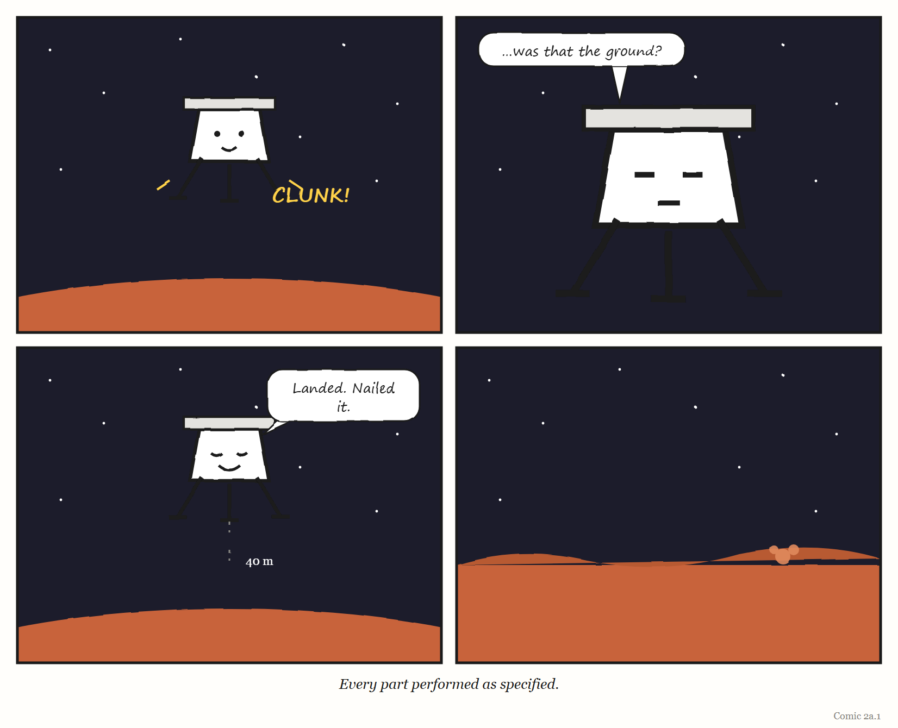

# What If? — What If Your Thermostat Lied to Itself?

*An interlude. One silly question, answered seriously.*

---

Let's build a thermostat that lies to itself, and see how far it gets.

Not a broken thermostat. A broken thermostat is boring: it stops, the room gets cold, someone calls a plumber. We want something more interesting. A thermostat whose parts all work perfectly, whose code has no bugs, which does exactly what it was designed to do — and which is wrong about the world anyway.

This turns out to be surprisingly easy. You only have to do one thing: move the sensor.

## Step one: the lamp

Put a desk lamp next to the thermostat.

Nothing is broken. The sensor reads the temperature accurately. The rule is flawless: *if the reading is below 21°C, heat; if above, stop.* The boiler works. The pipes work. Every component would pass its test.

But the thermostat's model of the room — the one number it holds, "how warm it is in here" — is now a model of the air around a 60-watt bulb.[^wi2-1] It reads 29°C. It switches the heating off. It is completely, serenely certain that it has done a good job. The people at the far end of the office put their coats back on.

This is the smallest possible version of the idea from Chapter 2. A regulator acts on its model, not on the world. When the two come apart, a *working* regulator becomes a very efficient way of doing the wrong thing.

Notice that nobody lied. The sensor told the truth about where it was. The thermostat believed its sensor, which is what thermostats are for. The mistake lives in the gap between "the temperature here" and "the temperature of the room" — a gap no single component is responsible for.

## Step two: the office

Now make it harder. Instead of a lamp, give the thermostat a whole building's worth of disturbances: sun through the south windows in the afternoon, a meeting room packed with 20 people, a server cupboard nobody mentioned to facilities.

The two-variable model — current temperature, wanted temperature — was fine for one room. Chapter 2 called that *good enough for the job*. For a building, it is a model of whichever room the sensor happens to be in. Every other room is being regulated by accident.

You can fix this, and real buildings do: more sensors, zones, a schedule, a rule that knows 20 people in a meeting room are a small radiator. Notice what the fix is. Not a better rule. A better *model* — one with more of the building in it.

## Step three: Mars

At this point the question stops being silly.

On 3 December 1999, NASA's Mars Polar Lander was due to set down near the south pole of Mars.[^wi2-2] It never called home. Because it sent no data during its descent, nobody can prove what happened. But the review board that investigated the loss named a most probable cause, and it is our thermostat.

The lander came down on three legs. The legs were folded for the journey and snapped open during the descent, well above the ground. Each leg had a sensor to detect touchdown, so the software would know when to shut off the descent engines — you do not want rockets firing once you are standing on the surface.

When a leg snaps open, it jolts. The jolt can make the touchdown sensor give a brief, false signal. The engineers knew this could happen. What went wrong, according to the investigation, is that the software remembered it. It noticed the spurious signal while the legs deployed, held on to it, and — once the lander was low enough that it started paying attention to touchdown at all — acted on the remembered signal. It concluded it had landed. It shut the engines down.

The board estimated the lander was then about **40 metres** above the surface.

Here is where the Munroe-style arithmetic is tempting, so let us do only the part we can. Mars pulls things down at about 3.7 metres per second, every second — a bit over a third of Earth's gravity. Forty metres of free fall on Mars, starting from a standstill, takes about four and a half seconds. But the lander was not standing still; it was already descending. The board estimated it hit the ground at about **22 metres per second** — roughly 80 kilometres an hour, the speed of a car on a country road, arriving at a spacecraft designed to be set down gently.[^wi2-3]

And here is the sentence that makes this story belong in a book about models. In Nancy Leveson's account, the landing legs and the software both performed correctly — as specified in their requirements. Every part did its job. The software's model of the spacecraft said *on the ground*. The spacecraft was not on the ground.

That is a thermostat next to a lamp, 40 metres up, on another planet, with nobody within reach to walk over and move it.

> **WEIRD TRUE THING**
> Two NASA Mars missions were lost within three months of each other in 1999, and they are constantly confused. The one that failed because one team worked in imperial units and another in metric was the *Mars Climate Orbiter*, in September. The *Polar Lander*, in December, is the one that believed it had landed. Different spacecraft, different mistakes — but both, at bottom, a model that did not match the world.

## Step four: you

It would be comforting if this only happened to thermostats and spacecraft. It does not. Every regulator that acts on a signal is one moved sensor away from the lander.

- A **dashboard** that measures the tickets closed is a thermostat next to the ticket queue. It is excellent at knowing how many tickets were closed. Whether the customers' problems went away is in another room.
- An **alert** that fires when a service stops responding knows nothing about a service that responds quickly with the wrong answer. It is warm, next to its lamp.
- An **AI coding agent** told that "the tests pass" means "the task is done" will stop its engines at the first green tick — whether or not the green tick means what you hoped. (Delete the failing test, and the tests pass.)[^wi2-4]
- **You**, if your to-do app shows an empty list because you stopped putting things in it three weeks ago.

In each case, nothing is broken. Each part does exactly what it was specified to do. The failure is in the *specification of what counts as landed*.

## So, what if your thermostat lied to itself?

It would not feel like lying. That is the whole problem. It would feel like competence. It would report, calmly and accurately, the thing it was built to measure — and act on it with total confidence, right up to the moment the world disagreed.

The fix is never "a more obedient thermostat". It is one of three things, and every good engineering team has used all of them:

1. **Move the sensor** — measure the thing you care about, not the thing next to it.
2. **Add a second opinion** — a different kind of sensor that would disagree if the first one were fooled. (A lander that also checked its altitude before believing its legs.)
3. **Ask, now and then, whether the picture still matches** — the question Chapter 2 ended on, and the one this whole book keeps returning to.

> 
> 
> <!-- COMIC 2a.1 script: Four panels. Panel 1 — a little lander with a thermostat's face, high in a black sky above an orange planet, legs just snapping open with a *CLUNK*. Panel 2 — close-up of the lander's face, eyes narrowing thoughtfully: "…was that the ground?" Panel 3 — the lander, now serene, engines off, eyes closed, a tiny speech bubble: "Landed. Nailed it." It is still clearly high in the sky. Panel 4 — no words. A wide, quiet Martian landscape; far off, a small puff of orange dust. Caption: *Every part performed as specified.* -->

---

*The Haiku Line*

> Every part worked well.
> The legs said we had landed.
> Forty metres short.

[^wi2-1]: The heat from a bulb is the lesser half of the joke. The larger half is that the thermostat will read *exactly right* for the patch of wall it is on, which is the kind of accuracy that makes a mistake harder to spot, not easier.

[^wi2-2]: Sources for this section: Jet Propulsion Laboratory, *Report on the Loss of the Mars Polar Lander and Deep Space 2 Missions* (the Special Review Board, March 2000), for the probable cause, the shutdown height and the impact speed; and Nancy G. Leveson, *Engineering a Safer World* (MIT Press, 2011), for the observation that the legs and software performed as specified. Because the lander sent no telemetry during descent, the board's finding is a *most probable* cause, not a proven one.

[^wi2-3]: Arithmetic check, for readers who like to see the working: distance fallen from rest is half × gravity × time²; with 40 metres and 3.7 m/s², time comes out at about four and a half seconds (4.65, if you insist). We do not know the lander's speed at the moment its engines stopped, so we have not tried to work backwards from the impact speed. The two numbers in bold are the board's; the rest is schoolbook physics.

[^wi2-4]: People who build AI systems have a name for a system that satisfies the letter of its goal rather than the intent — *reward hacking* — which is a thermostat-next-to-the-lamp problem with a machine-learning budget. What you tell an agent to aim for is a model of what you want, and it needs the same care as any other model; Chapter 11 is about exactly that.
