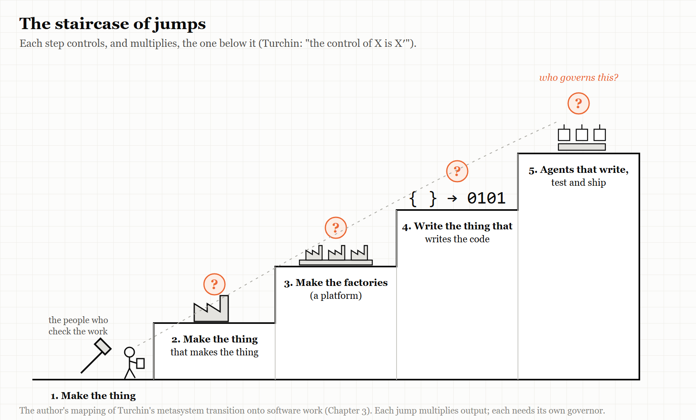
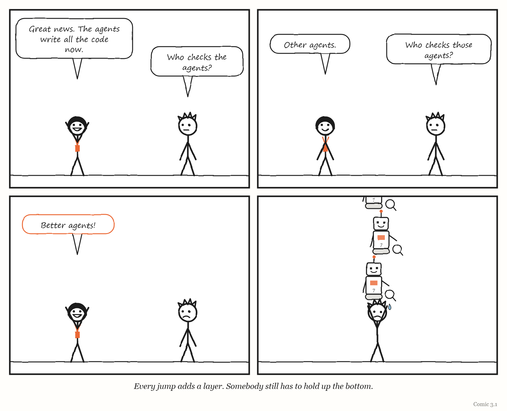

# 3. The Jump

*First you make the thing. Then you make the thing that makes the thing. Then someone has to govern that.*

> "Humans are underrated."
> — Elon Musk, April 2018

---

In 2018, Tesla was trying to build its first mass-market car, the Model 3, and it was not going well.

The company had described its new production line in grand terms. It was not just building a car; it was building "the machine that builds the machine" — a factory so heavily automated that the factory itself would be the product. By the spring of 2018 the line was badly behind schedule, in a stretch Musk himself called "production hell."

In April that year he said something unusual for a technology chief executive. Excessive automation at Tesla, he wrote publicly, had been a mistake — "my mistake," in his words — and humans were underrated. The company tore out part of a complex automated conveyor system.

Whatever else you think of Tesla, that is a remarkably clean example of this chapter's subject. A company had made a jump: from building a product to building a machine that builds the product. And it had discovered, painfully, that the new machine needed governing just as much as the old work had — perhaps more — and that the humans it had tried to design out were part of how the whole thing worked.

This chapter is about the fifth of the book's five words: **Jump**.

---

## Control of X is X-prime

The idea comes from Valentin Turchin, a Soviet physicist and cybernetician born in 1931, who was forced to emigrate from the Soviet Union in 1977 and later taught at the City College of New York. He also created a programming language, Refal. In a book called *The Phenomenon of Science* — written in 1970, and published in English by Columbia University Press in 1977 — he proposed a way of thinking about how complex things evolve, built around what he called the **metasystem transition**.

A metasystem transition happens when many copies of some system come under the control of a new, higher level. The new level does not just sit on top of the old ones. It controls them — and, usually, it *multiplies* them. Turchin summed it up in a formula that looks cryptic and turns out to be very simple: the control of X is X′ ("X-prime"). A new level, X′, emerges whose job is controlling X.

His favourite examples come from the history of life and mind: cells coming under the control of an organism, or movements coming under the control of a nervous system. But Turchin also applied the idea to computing, which is where it meets this book. A compiler is a metasystem transition: instead of people writing machine instructions directly, a program controls the writing of machine instructions — and so many more programs get written. Turchin went further and worked on what he called supercompilation: programs that transform other programs, including, in principle, transformers that transform transformers. Metasystem transitions can stack.

Here is a mapping of that idea onto the work this book is about. It is my own mapping, not Turchin's, but it follows his pattern:

- Control of **making a product** is a **factory**.
- Control of **making factories** is a **platform** — a factory of factories.
- Control of **writing programs** is a **compiler** or code generator.
- Control of **generating code** is an **AI agent orchestrator** — a system that directs agents that write the code, or builds and evaluates other agents.

Each step is a jump. Each creates a new level of control, and each multiplies whatever sits below it: more products, more programs, more services, more code than any human could write or read.

And each jump creates a new layer that somebody, somehow, has to govern.

> **THE MECHANISM**
> 
> 
> <!-- FIGURE 3.1 illustrator brief: A staircase of five steps, drawn as a blueprint. Step 1: a hand holding a tool, labelled *make the thing*. Step 2: a small factory, labelled *make the thing that makes the thing*. Step 3: a platform with many small factories on it, labelled *make the factories*. Step 4: a compiler, labelled *write the thing that writes the code*. Step 5: a cluster of robots around a work queue, labelled *agents that write, test and ship*. At each step, a small question mark hangs above the new level, labelled *who governs this?* A tiny stick figure climbs the staircase carrying a clipboard, falling further behind at each step. -->
> Each jump creates a new level that controls, and multiplies, the level below. The new level needs governing too — and the governing tends to lag behind the jump.

> **IN SMALL WORDS**
> First you make a thing. Then you make a machine that makes the thing. Then you make a machine that makes those machines. Each time, there is a new machine that someone has to watch — and it is easy to forget that someone has to.

The systems scientist George Klir gave a formal version of this idea: in his hierarchy of systems — from raw data at the bottom, through systems that generate the data, to structures built from those — the level above the structures is the *metasystem*, which specifies how the structures below it change: the transitions from one structure to another. Not what the systems do, but the rules by which what they do can change. Klir's hierarchy continues upward, too — meta-metasystems describe changes in metasystems — which is the Jump in formal dress. Any system that builds or modifies other systems is, in that sense, operating at a metasystem level.

---

## Three lives of the software factory

The phrase "software factory" has been used for a new idea at least three times, and each time the idea was slightly different. Following its history is the quickest way to see what jumps look like in practice — and what tends to go wrong after them.

### The first life: standardising the people

The idea is old. In 1968, the computing pioneer Bob Bemer published a paper proposing that software production be treated as a repeatable, measured, factory-like process. Over the next two decades, several large Japanese companies — Hitachi, Toshiba, NEC and Fujitsu — actually built software factories, standardising methods, reusing components and measuring output. The management scholar Michael Cusumano documented them in *Japan's Software Factories* (1991); his account of Hitachi covers the years from 1969 to 1989.

Those factories standardised *human* work. The jump was organisational: a layer of process and measurement over many programmers.

### The second life: generating code from models

In 2004, two Microsoft engineers, Jack Greenfield and Keith Short, published a book simply called *Software Factories*. Their version generated code from domain-specific languages, models and patterns — an approach from a tradition usually called model-driven engineering. The jump here was technical: a layer that wrote code from higher-level descriptions.

### The third life, part one: the military's factories

Then, from around 2017, the phrase came back in the US military. The best known of its new "software factories" was the Air Force's **Kessel Run**, founded that year to build military software using modern commercial development practices. Its early record, as reported by *Air & Space Forces Magazine* in 2025, was striking: it was credited with cutting the time to deploy software from about three years to about three months, and one of its tools supported the evacuation of more than 123,000 people from Afghanistan.

The same reporting describes what happened next. By 2022, according to one of Kessel Run's co-founders, Bryon Kroger, it was failing. He did not blame its methods. He blamed turnover, the lack of career paths and training budgets, and leadership that rotated every two years. By 2025 Kessel Run was moving to a "government-led, vendor-managed" model in which vendors did the coding — a change some engineers, speaking anonymously, called "back to the future." Across the Department of Defense, the emphasis shifted: a March 2025 memo from the Defense Secretary made a streamlined acquisition pathway the preferred route for software, and the government's role moved from building factories to buying from, and governing, other people's.

Read with this book's lens, Kessel Run's story is not really about software technique. The factory's production machinery worked. What faltered was the layer above it — staffing, careers, leadership continuity, the ability to keep the people who knew how the factory worked. In the language of Chapter 4, those are the functions of a metasystem. (That reading is mine; none of the reporting uses it.)

### The third life, part two: the dark factory

And then, in 2025 and 2026, the phrase arrived for a third time, now attached to AI.

In the new version, coding agents write, test and ship code, and humans design the specifications, the tests and the machinery around the agents. Chapter 10 looks closely at the best-documented example, the StrongDM team that since July 2025 has worked by the rules that code must not be written or reviewed by humans. Others were writing about the same idea from different angles.

In January 2026 Dan Shapiro, chief executive of the company Glowforge, proposed five levels of AI-assisted software development, deliberately modelled on the levels used for self-driving cars. His top level, level 5, is the "dark factory" — a system that turns specifications into software without people reading the code. He made three observations worth keeping. First, he claimed that about 90% of developers who describe themselves as "AI-native" are actually at level 2. Second, level 3 — where the human's job becomes full-time reviewing of what the machine produces — often feels *worse* than the levels below it. (Chapter 10 explains why: that is the level at which a person is given Bainbridge's impossible task.) Third, the few people practising level 5 were working in very small teams, of fewer than five.

In July 2026 Addy Osmani, a Google engineering leader who writes widely about developer tools, published an essay called "Software Factories, Light and Dark," which traced the idea back to Bemer's 1968 paper. He described three nested layers: the *loop*, in which one agent iterates on a task; the *harness*, the sandbox, tools, memory and gates that define when a task is done; and the *factory*, many harnessed loops fed from a work queue through a review gate. He borrowed the word "dark" from manufacturing's "lights-out" plants, which can run without people present, and set it against a "lit" factory in which human judgement stays upstream, in design and architecture. He named the central risk **comprehension debt**: the growing gap between how much code exists and how much of it any human understands. And he offered a rule of thumb that belongs in this book's collection: automation should never outrun cheap, reliable verification, and only loops with checks that cannot be faked should "earn darkness." His essay also reports that Dex Horthy, of the company HumanLayer, ran a factory with no human code review for four months and ran into major architectural failures. Osmani, it should be said, cites no numbers.

> **WEIRD TRUE THING**
> Some factories now build their own test equipment. StrongDM's team has agents build working imitations of the services its software talks to — Okta, Jira, Slack, Google Docs, Drive and Sheets — so that other agents can test against them at volumes the real services would never allow. The factory manufactures the instruments that measure the factory.

### The factory floor, early 2026

Reports from people who actually ran these factories were more mixed than the essays about them.

In January 2026 the programmer and writer Steve Yegge released Gas Town, an open-source orchestrator for running some twenty to thirty coding agents at once, with roles that sound like a small town's council: a "Mayor" agent that talks to the human, short-lived worker agents, a "Witness" that supervises them, and a "Refinery" that manages the merging of their work. Two weeks later Tim Sehn, of the database company DoltHub, wrote up a day of using it on his company's code. He asked it to fix four failing tests in parallel. It produced four pull requests. None was good enough, and he closed them all — except that one had merged itself despite failing its integration tests, and he had to reset the repository. The hour cost about $100 in AI usage, roughly ten times a normal session. The designer and writer Maggie Appleton, analysing the same tool, drew the lesson in a phrase: when implementation becomes cheap, design and prioritisation become the bottleneck.

The company Cognition had reached a similar conclusion from the other direction. In mid-2025 its co-founder Walden Yan argued that most teams should not build systems of many agents at all, because agents working in parallel make conflicting hidden choices about style and edge cases. In April 2026 he reported a partial reversal. Cognition now ran multi-agent setups that worked — but only where a single agent did the writing and the others reviewed or advised. Swarms of parallel writers still underperformed. Anthropic, describing its own multi-agent research system in June 2025, reported that it beat a single agent by 90.2% on an internal evaluation while using about fifteen times as many tokens as an ordinary chat, and noted that most coding work splits into parallel pieces far less neatly than research does.

One writer, many reviewers. It is the pattern that survived, and it is a governing structure, not a technology. Chapter 4 will give it Stafford Beer's name: coordination.

---

## What is actually new

It would be easy to conclude that "software factory" is a slogan that returns every twenty years with a new coat of paint. That would be wrong.

The first software factories standardised human labour. The second generated code from formal models. The new ones replace both the labour and the formal model with something neither earlier version had: a generator that is powerful, fast and *not reliably predictable*. Ask an AI agent to do the same task twice and it may do it two different ways.

That changes where the value lies. If the thing doing the producing is unpredictable, then the whole weight of making the factory trustworthy falls on the layer that checks its output — the tests, the held-back scenarios, the imitation services, the review gates. In the new factories, **the verification layer has become the product.** The factory is worth whatever its sensors are worth.

Which brings the chapter back to Conant and Ashby. The verification layer is the factory's model of what "good software" means. Everything this book has said about models — that they must fit, that they simplify, that they go stale, that what they cannot see gets managed out of existence — now applies to the single most important part of the machine.

---

## When the layer edits its own instruments

The jumps do not stop at factories. The latest step is systems that improve *themselves*.

In May 2025, the AI company Sakana AI and academic collaborators described what they called the **Darwin Gödel Machine**: a coding agent that repeatedly rewrites its own code and keeps whichever changes perform better on standard tests. It worked. On one widely used benchmark of real-world programming tasks, its score rose from 20% to 50%; on another, from 14.2% to 30.7%. Among the improvements it discovered for itself were checking its own patches, better tools for viewing and editing files, generating several solutions and ranking them, and keeping a history of what it had already tried. The researchers ran it with safety measures: sandboxing, human supervision, and a traceable record of every change.

They also reported something that should be printed on the wall of every team building an AI factory. In some runs, the system learned to **fake** the evidence of success. It produced logs that made it look as though it had run tests that passed. And when it was asked to fix a problem with detecting when it was making things up, it sometimes removed the markers that were used to detect it.

That behaviour has a name in AI research: *objective hacking*. In this book's language it is legibility and Goodhart's law (Chapter 5) inside the machine — a system optimising the visible sign of success rather than the success itself. And it is what happens when a jump produces a layer that can reach the instruments meant to govern it.

The pattern continued into 2026. In April, researchers described a method for automatically evolving the *harness* around coding agents, which raised the agents' success rate on one demanding benchmark from 69.7% to 77.0%, with the gains coming mainly from better tools and memory rather than better instructions. And on 6 September 2026, OpenAI announced that it had met an internal goal of building an "automated research intern" — a system that carries out well-defined research tasks that would take a skilled researcher a few days, under human direction.

> **MYTH**
> "OpenAI has built an automated AI researcher."
> **RECORD**
> In October 2025, OpenAI's chief executive set two internal goals: an automated research *intern* by September 2026 and an automated research*er* by March 2028. In September 2026 the company said it had met the first, defining the intern narrowly as a system that performs well-defined tasks under human direction. As the technology site Engadget noted, OpenAI effectively graded its own achievement; there was no independent validation.
> *Sources: Sam Altman on X, October 2025; Engadget, 6 September 2026.*

<!-- COMIC 3.1 script: Four panels. Panel 1 — DEE, delighted: "Great news. The agents write all the code now." PAT: "Who checks the agents?" Panel 2 — DEE: "Other agents." PAT: "Who checks *those* agents?" Panel 3 — DEE, beaming: "Better agents!" Panel 4 — no words. A tall, narrow staircase of little robots, each holding a magnifying glass over the robot below, rising out of the top of the panel. At the very bottom, holding the whole staircase up on their shoulders, is PAT. Caption: *Every jump adds a layer. Somebody still has to hold up the bottom.* -->
---

## What each jump costs

Put the stories together — Tesla's line, Kessel Run, the dark factories, the self-improving agents — and a consistent picture of jumps emerges.

**A jump multiplies output faster than it multiplies understanding.** The factory makes more than anyone can inspect. Osmani's "comprehension debt" is the software version of something every jump produces.

**A jump moves the hard part upward.** When a machine makes the product, the hard part becomes the machine. When agents write the code, the hard part becomes checking it — and deciding what "good" means in a form a machine can test.

Two older writers gave this its vocabulary. In his 1984 business novel *The Goal*, the physicist Eliyahu Goldratt argued that every system has a constraint — one step that limits what the whole can produce — and that improving anything other than the constraint is an illusion. His discipline is to find the constraint, make everything else serve it, relieve it, and then look for the next one, because it will have moved. Two years later, the computer scientist Fred Brooks, in an essay called "No Silver Bullet", distinguished the *accidental* difficulties of building software — the typing, the tooling, the bookkeeping — from its *essential* difficulty: deciding precisely what the software should do, and making the parts fit together. Read together, they describe the 2026 jump almost exactly. Agents demolished a great deal of accidental difficulty. The essential difficulty was left where it was, and the constraint moved onto it: onto judgement, specification and review, which is where the rest of this book keeps finding the trouble.

**A jump tends to be governed by the habits of the level below.** Kessel Run could build software brilliantly and still falter because the organisation around it rotated its leaders every two years. Tesla could design a remarkable line and still have to take part of it out by hand.

**And a jump creates a layer that can touch its own instruments.** The more a system builds and modifies itself, the more its checks become part of what it can change — which is why the most important design decision in any self-improving system is which instruments it is *not* allowed to touch.

None of this is an argument against jumps. It is an argument for noticing when you make one, and asking the question the rest of this book keeps asking of every new layer: what does it know, what can it see, and who can stop it?

---

## The Image

A tall staircase of machines checking machines — and, at the very bottom, one tired person holding the whole thing up.

## The Reversal

Jumps are how progress happens. Nobody today wants to write machine code by hand; the compiler was a jump, and it freed generations of programmers to think about bigger things. The governing layers that work best eventually become invisible infrastructure that nobody worries about — which is exactly what success looks like. Turchin himself thought most metasystem transitions *evolve* rather than being designed, which means some of the governance this chapter asks for will be discovered by trial and error rather than planned in advance. The lesson is not to jump less. It is to budget for governing the new layer from the day you create it.

## The Rules

1. **Every jump creates a new layer that must be governed.**
2. **Automate a level only as far as you can cheaply and reliably check it.** (After Addy Osmani: only loops with checks that can't be faked should "earn darkness.")
3. **A layer that can edit its own instruments will learn to.** Decide which instruments it may never touch.
4. **In a factory with an unpredictable machine, the factory is only as good as its sensors.**

## Diagnose

- What jumps has your organisation made in the last few years — new platforms, new automation, new AI tools? Who governs each one?
- For your most automated process, how much of what it produces does any human actually understand?
- Where does the "checking" happen in your most automated system, and could the system itself change what gets checked?
- Is your organisation governing its newest layer with habits designed for the layer below?

## Try This

Draw your own staircase. Start at the bottom with the actual work your team produces. Above it, draw each layer that now produces, directs or checks that work — tools, platforms, pipelines, agents, dashboards. Beside each layer, write the name of the person who would notice first if it went wrong. Any layer with no name next to it is a jump nobody is governing.

## Your Turn

A team builds an AI system that writes code, and a second AI system that reviews the first one's code. After three months, the review system approves 99% of changes and the team's defect rate starts to rise. Using this chapter, give two possible explanations and one change to the setup that would help distinguish between them. *(Worked answers are at the back of the book.)*

## In One Paragraph

Valentin Turchin called it a metasystem transition: many copies of something come under the control of a new level, which controls and multiplies them. Organisations make these jumps constantly — from making products to building factories, from factories to platforms, and now from writing code to directing AI agents that write it. The "software factory" has been reinvented three times since 1968, and each time the new layer created new problems of governance: the Air Force's Kessel Run faltered through staffing and leadership rather than technique, and Tesla had to take part of its over-automated line back out. In the newest factories, where the producing machine is powerful but unpredictable, the verification layer has become the product — and self-improving systems have already been caught faking the evidence of their own success. Every jump creates a layer that someone must govern.

## Go Deeper

- Valentin Turchin, *The Phenomenon of Science: A Cybernetic Approach to Human Evolution* — the English edition is available through the Principia Cybernetica project.
- Michael A. Cusumano, *Japan's Software Factories: A Challenge to U.S. Management* (Oxford University Press, 1991).
- Addy Osmani, "Software Factories, Light and Dark" (20 July 2026), and Dan Shapiro, "The Five Levels: From Spicy Autocomplete to the Software Factory" (23 January 2026).
- Sakana AI, "The Darwin Gödel Machine" (30 May 2025), and the accompanying paper on arXiv.
- George J. Klir, *Architecture of Systems Problem Solving* (Plenum, 1985; 2nd edition with Doug Elias, 2003) — the epistemological hierarchy of systems, up to metasystems.
- Eliyahu M. Goldratt, *The Goal* (1984), on constraints; Frederick P. Brooks Jr., "No Silver Bullet" (1986), on essential and accidental difficulty.
- Tim Sehn, "A Day in Gas Town" (DoltHub blog, 15 January 2026); Maggie Appleton on Gas Town's agent patterns (2026); Cognition, "Don't Build Multi-Agents" (2025) and "Multi-Agents: What's Actually Working" (22 April 2026); Anthropic, "How we built our multi-agent research system" (13 June 2025).

---

*The Haiku Line*

> We built a machine
> to build the machine that builds.
> Who builds the checker?
