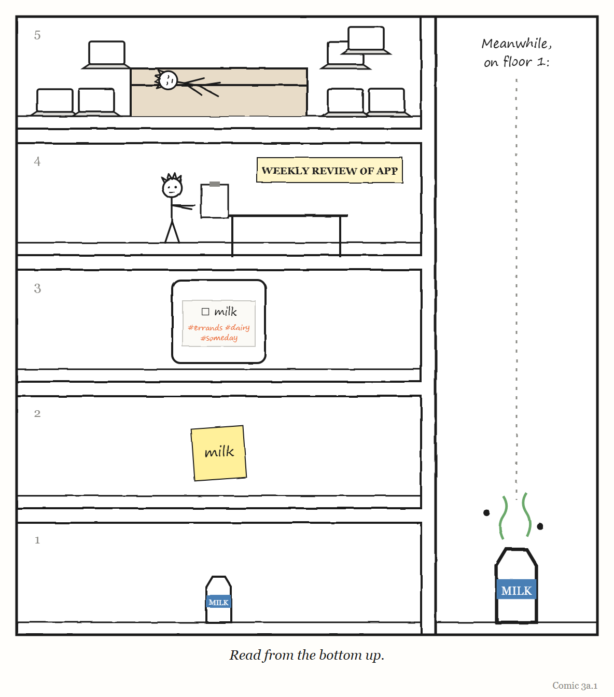

# What If? — What If Your To-Do App Needed Its Own To-Do App?

*An interlude. One silly question, answered seriously.*

---

You have things to do. So you write them down. So far, so sensible: a list is the smallest governing layer there is — a model of your work, kept outside your head so your head can do the work.

Let's see what happens if we keep going.

## Level 0: the work

Buy milk. Reply to Sam. Fix the bug in the invoice page. Call the dentist.

This is the level that actually matters. Everything that follows exists, in theory, to serve it.

## Level 1: the list

You write the four things on a sticky note. This is a real improvement. You stop forgetting the dentist. In Chapter 3's language, the list is X′ — "the control of X" — and it is doing what a good new level does: letting you handle more of X than you could before.

Cost of the list: about a minute a day.

## Level 2: the app

The sticky note gets lost, so you install a to-do app. Now your tasks have due dates, priorities, tags and colours. The app has to be set up, and the tasks have to be moved into it, and the tags need deciding. *Is "Call the dentist" a #health task or a #phone task?* It is both, and now you have to choose.

The app is not controlling your work any more. It is controlling your *list*. It is X″.

## Level 3: the review

The app fills up. Some tasks are six weeks old and will never be done; some are done but not ticked; the tags have drifted. The popular fix, made famous by the productivity writer David Allen, is a **weekly review**: a regular session in which you go through the whole system and bring it back in line with reality.[^wi3-1]

This is a genuinely good idea — it is Chapter 2's "a model must change as the system changes", turned into a habit. It is also X‴: a process whose job is to maintain the app whose job is to maintain the list whose job is to help with the milk.

## Level 4: the template for the review

The weekly review keeps getting skipped, because it is long and nobody quite remembers the steps. So you make a checklist for it. Then a template in your notes app, with sections. Then a recurring task, in the to-do app, reminding you to do the review of the to-do app.

We have now achieved the title of this chapter. Your to-do app has its own to-do item. It is, technically, on the list.

## Level 5: the system for choosing the system

Somewhere around here, you watch a video comparing seven productivity apps. You start to suspect that the real problem is that you are using the wrong one. You spend a Sunday migrating. Every level above has to be rebuilt in the new app, and in the process you discover features that suggest new levels.

> 
> 
> <!-- COMIC 3a.1 script: Five panels in a tall column, like floors of a building, read from the bottom up. Floor 1 — a pint of milk, alone. Floor 2 — a sticky note: *milk*. Floor 3 — a phone app, the milk task tagged #errands #dairy #someday. Floor 4 — PAT at a desk with a clipboard labelled *WEEKLY REVIEW OF APP*. Floor 5 — PAT asleep on a sofa, surrounded by seven laptops open on seven different productivity apps. Final panel, beside the column, no words: the milk, still on the ground floor, has gone off. -->
## The arithmetic of the staircase

Can this go on forever? Here is where a bit of schoolbook maths gives a surprisingly cheerful answer — with one catch.

*Assume* — and this is an assumption, for illustration, not a measurement — that each new level costs some fixed fraction of the time of the level beneath it. Call that fraction *r*. If your actual work takes 10 hours a week and *r* is one tenth, then:

- the list costs 1 hour,
- the app costs 6 minutes,
- the review costs 36 seconds,
- and so on, shrinking fast.

Add up every level, forever, and you get a finite number. With *r* at one tenth, the whole infinite staircase costs you about an hour and seven minutes a week: roughly 11% on top of the work.[^wi3-2] An infinite tower of to-do apps is, mathematically, affordable. Archimedes summed an infinite series like this one in the third century BC, and it remains the most reassuring thing in this book.

Now the catch. With *r* at one half, the tower costs *exactly as much as the work itself*. Every hour of doing buys an hour of managing. And if *r* reaches one — if each level costs as much as the one it manages — the sum never stops growing. You will spend the rest of your life maintaining the system, and the milk will never be bought.

Which *r* are you on? Nobody measures it, which is the real finding. But Chapter 15, near the end of this book, offers a clue. The writer Joan Westenberg, before she deleted it, had a second brain of about 10,000 notes built up over seven years. The computer scientist Jeff Huang has run his entire working life from **one plain text file** for 14 years, and it passed 51,000 lines — with a maintenance ritual of copying tomorrow's calendar into it each evening. One of those systems has about one level above the work. The other, by its owner's account, had begun to replace the thinking it was meant to serve.

## What Turchin would say

Valentin Turchin, whose staircase Chapter 3 is built on, would not object to any of this in principle. The new level, for him, is how complex things grow. But his best examples all have one feature in common: **the new level multiplies the level below it**. A compiler does not merely supervise programs. It lets people write far more of them. A nervous system does not merely watch muscles. It makes movements possible that no muscle could manage alone.

That gives you a test for any level on your own staircase, and it is the whole point of this interlude:

> **Does this level make more of the level below it happen — or does it just watch it?**

A to-do list passes, easily. A weekly review usually passes: it makes the list true again, and a true list makes more work happen. A template for the review — maybe. The Sunday spent migrating between apps almost never passes. It is a level that controls nothing below it; it controls only itself.

## So, what if your to-do app needed its own to-do app?

It already does, probably. Most of ours do. That is not a disaster — the maths says the tower is affordable, as long as each level is *much* cheaper than the one it manages and actually multiplies it.

The failure is not height. It is a tower where each floor costs nearly as much as the floor below and produces nothing but the floor above. Chapter 3 called that a jump nobody is governing. You may just call it Sunday.

> **WEIRD TRUE THING**
> Turchin applied his idea to programming as well as to biology. He designed a programming language, Refal, and worked on what he called *supercompilation*: programs that transform other programs — and, in principle, transformers that transform the transformers. A program for improving programs is exactly a to-do app for your to-do app, except that it was intended to make the thing below it work better, and not merely to keep it organised.

---

*The Haiku Line*

> A list for my lists.
> A review of the review.
> The milk has gone off.

[^wi3-1]: The weekly review is part of David Allen's method *Getting Things Done* (2001). The versions that take all of Sunday are, as far as this book can tell, a contribution of the method's more enthusiastic fans rather than a requirement of the method.

[^wi3-2]: For the curious, this is a geometric series. The total cost of all the levels above the work is the work × *r* ÷ (1 − *r*). At *r* = 0.1 that is 10 hours × 0.1 ÷ 0.9 ≈ 1.1 hours. At *r* = 0.5 it is 10 hours × 0.5 ÷ 0.5 = 10 hours. At *r* = 1 the formula divides by zero, which is maths's way of saying "you have a problem". Achilles, who was trying to catch a tortoise over a sum just like this one in Zeno's paradox, would sympathise.
