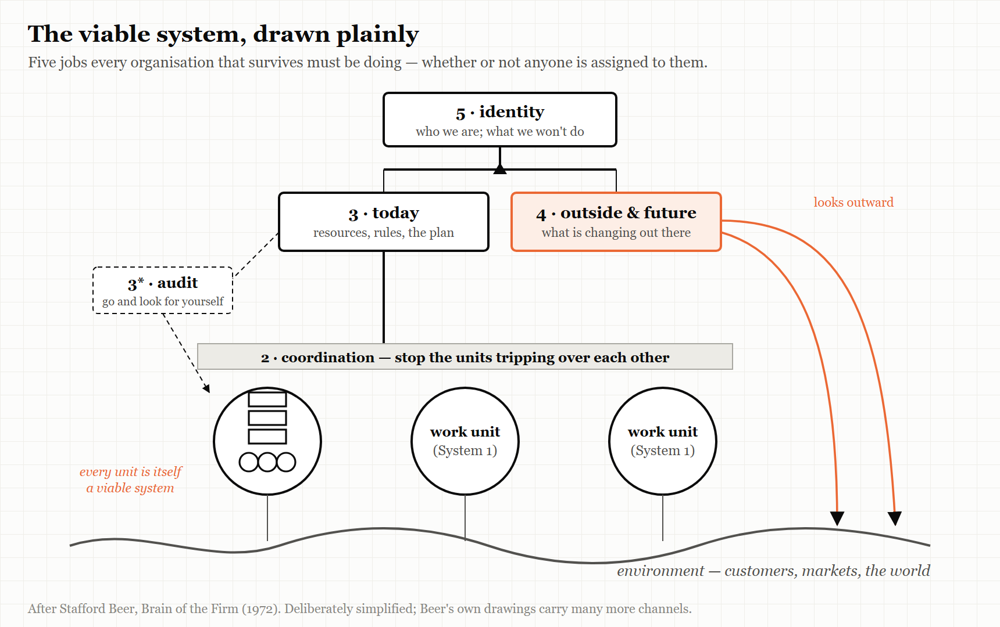
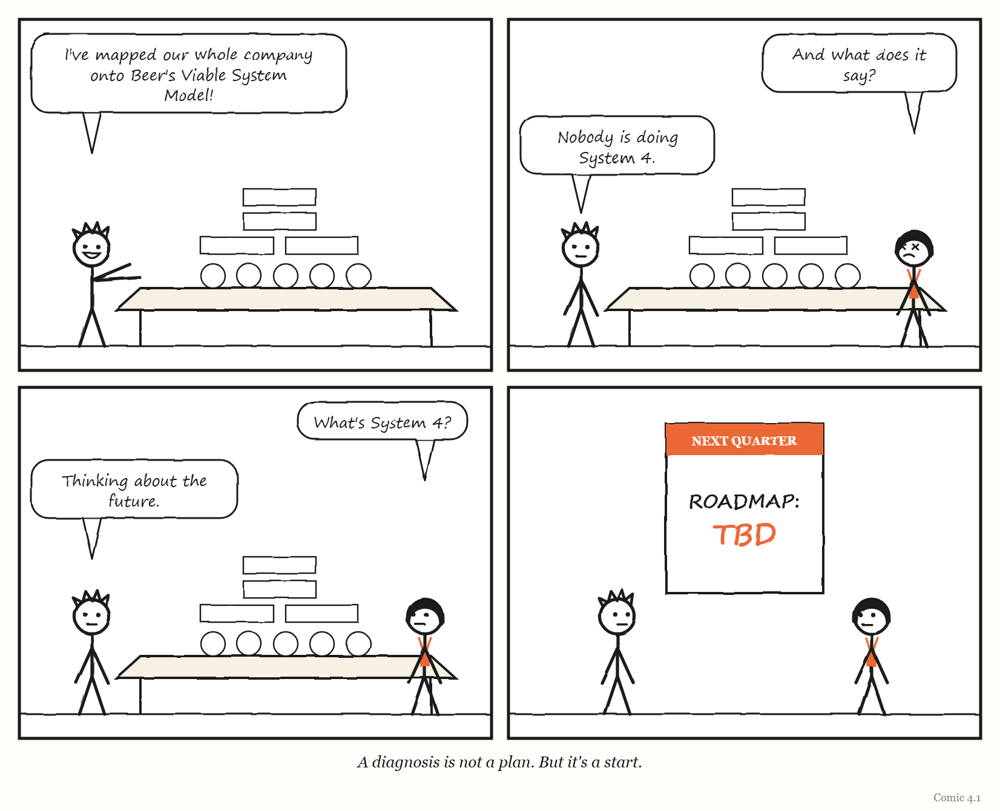

# 4. The Viable System

*Every organisation that survives is doing five jobs. Most only know about one.*

> "According to the cybernetician, the purpose of a system is what it does."
> — Stafford Beer, lecture at the University of Valladolid, October 2001

---

By about 1985, a wholefood co-operative called Suma — founded in Leeds in 1977 — had a problem that many growing organisations will recognise.

Suma was a workers' co-operative — owned and run by the people who worked in it. It had grown to roughly 35 members, and every significant decision went through a single meeting of all of them, held on Wednesdays. The meeting, in the words of one member, Jon Walker, had become "a shambles." People avoided it. Decisions were increasingly taken outside it, by whoever happened to be around, in ways the co-op's own rules did not allow.

The usual fix for this problem is managers. Suma's members did not want managers. They had formed a co-operative precisely to avoid having bosses, and they rejected the idea of electing some.

So Walker went looking for another answer, and found it in the work of a British management scientist named Stafford Beer. Beer had spent decades developing a model of what any organisation needs in order to survive — any organisation, of any size, whether or not it has bosses. Walker applied it to Suma. And the diagnosis was precise: the all-member meeting was being asked to do every job that keeps an organisation coordinated and steered, all at once, and it had been overwhelmed.

In April 1987, four members wrote a set of proposals based on Beer's model. They called them the "Doughnut Proposals." Instead of one meeting deciding everything, Suma would be organised into small, largely autonomous departments of about seven to ten people. Each sector would hold its own meetings and send delegates to a coordinating body the members called the "Hub."

The proposals passed, with 25 votes of 29.

And then, as Walker later told the story, they nearly failed anyway. Suma chose to run the old structure and the new one side by side. The old committees refused to give up their powers. Meetings multiplied instead of shrinking. About six months later, the authors had to write seven further proposals to finish the job — and those became the structure that lasted.

Suma still exists. Now based in Elland, West Yorkshire, it describes itself, as of 2026, as the United Kingdom's largest independent wholefood wholesaler and its largest worker-owned co-operative, and every worker earns the same hourly rate, whatever their role.

This chapter is about the model Walker used — the **viable system model** — and about why an idea that fits organisations so well has been so hard for them to adopt.

---

## A hundred years of Stafford Beer

Stafford Beer was born on 25 September 1926 — a hundred years before the date on which this chapter was drafted. He is one of the founders of what came to be called *management cybernetics*: the application of the science of control and communication to organisations. After army service he joined United Steel, where he persuaded management to create an operational-research group and ran it as the Department of Operational Research and Cybernetics; founded SIGMA, the first substantial operational-research consultancy in the UK, in 1961; worked for the International Publishing Corporation from 1966; and from 1970 worked as an independent consultant, increasingly on social systems and for governments. He wrote books with titles like *Brain of the Firm* and *The Heart of Enterprise*, and is remembered outside his field mainly for one extraordinary project.

In the early 1970s, Beer worked for the government of Salvador Allende in Chile on **Project Cybersyn**, an attempt to connect the country's nationalised industries to a central system that would let the government see and steer the economy in something close to real time. According to the historian Eden Medina, whose research is the standard account, the design settled into four sub-projects, worked on from 1971 to 1973: *Cybernet*, a network of telex machines — an existing network previously used to track satellites — to carry daily production figures from factories to Santiago; *Cyberstride*, software that filtered those figures statistically, discarding what fell within normal limits and flagging what did not; *CHECO*, a simulator of the Chilean economy; and the *Opsroom*, an operations room modelled on a British wartime war room, with seven chairs in an inward-facing circle surrounded by screens showing data from the nationalised enterprises. The computing power was modest: the project began with time on one IBM mainframe and moved to a less busy Burroughs 3500 when processing delays passed forty-eight hours. Medina's verdict on the network is striking: the telex links, which helped the government coordinate during a crippling strike in October 1972, proved more valuable than the processing power of the mainframe.

The Opsroom, which looks today like a film set and is what most people picture when they hear the word Cybersyn, was a prototype built in Santiago in 1972. Medina notes that it never became operational — but that it captured the imagination of everyone who saw it and became the symbolic heart of the project. On 8 September 1973, Allende asked the team to move it to the presidential palace. Three days later, the military coup of 11 September ended his government and his life, and the project was abandoned; by the usual account, the military destroyed the operations room.

Cybersyn has a mixed reputation among engineers. In one recent discussion of it on the programmers' forum Hacker News, a developer with twenty years' experience argued that its builders had no realistic way to deliver what was promised with 1970s technology. Another recalled an insurance company that had spent millions on an immersive data-visualisation room around 2001, only for its staff to decide that spreadsheets were more useful. Those memories are fair. But Cybersyn was an application of Beer's ideas, not the ideas themselves, and the ideas have outlived it.

In September 2026, the community that keeps Beer's work alive, Metaphorum, marked his centenary with a conference at the Alliance Manchester Business School, with a book of essays in his honour and a special issue of a research journal.

---

## Five jobs

Beer's model starts from a question that sounds simple: what does *any* organisation need to be able to do in order to survive in a changing world? Not to be efficient, or profitable, or fair — just to stay alive as itself.

His answer is that every viable system performs five functions. He numbered them System 1 to System 5. The numbers are unmemorable, so here they are with the Suma co-op and a small software company alongside.

**System 1 — the work.** The parts of the organisation that actually do what it exists to do. In Suma, the departments that bought, stored, packed and delivered wholefoods. In a software company, the teams that build and run the product. Beer's key insight is that each of these units is *itself* a viable system — more on that below.

**System 2 — coordination.** The work units share resources and affect each other, and without coordination they get in each other's way: two teams grab the same resource, two departments schedule the same van. System 2 is whatever damps those conflicts — schedules, shared calendars, standards, protocols, the daily stand-up meeting. In 2019 the software company Overleaf ran a team exercise mapping its own tools and habits onto Beer's model, and put its team chat, its automated testing and its stand-ups here.

**System 3 — here-and-now management.** Someone has to look at the work units together, allocate resources between them, and make sure the whole is working today. System 3 is that function. Alongside it Beer adds **System 3\***, *audit*: occasional direct checks on what is really happening in the work, rather than what the reports say.

**System 4 — outside and future.** Someone has to look beyond the organisation — at customers, competitors, technology, the world — and ahead, at what is coming. System 4 is the organisation's intelligence and planning function.

**System 5 — identity.** Finally, something has to balance the here-and-now pressure of System 3 against the future-facing pressure of System 4, and hold the organisation's sense of what it is and what it is for. System 5 is policy, purpose and identity.

Systems 2 to 5 together are what Beer called the **metasystem** — the part of the organisation whose job is keeping the working parts working together. (Scholars disagree about whether System 2 belongs inside the metasystem or is better seen as a service the work units provide one another. For this book it does not matter much; what matters is that all five jobs get done.)

> **THE MECHANISM**
> 
> 
> <!-- FIGURE 4.1 illustrator brief: A simplified viable system model, drawn deliberately plainly. At the bottom, three circles labelled *work unit* (System 1), each touching a wavy line labelled *environment*. Between the circles, a thin horizontal band labelled *2 · coordination*. Above them, a box labelled *3 · today*, with a small dotted side-box labelled *3\* · audit* reaching down directly into the work units. Above that, a box labelled *4 · outside & future*, with arrows reaching out to the environment. At the top, a box labelled *5 · identity*, balancing 3 and 4 like a set of scales. Inside one of the work-unit circles, a tiny copy of the whole diagram — labelled *every unit is itself a viable system*. -->
> Five jobs every surviving organisation performs. Systems 2 to 5 are the metasystem — the layer that keeps the working parts working as one. And each working part contains the same five jobs inside it.

Suma's all-member meeting had been trying to do Systems 2, 3, 4 and 5 at once, for 35 people, in a single weekly session. No meeting could. Beer's model did not tell Suma what to decide; it told them which *jobs* their one overloaded meeting was failing to do, and so where new structures were needed.

Overleaf's exercise found something different and very common. When the team placed every process and tool onto the model, System 4 looked thin. There was plenty of work on today's product and plenty of coordination, but little sustained attention to longer-term trends in how scientists write, or to emerging technology. Their conclusion was simply to give System 4 more attention.

> **IN SMALL WORDS**
> Every group that lasts has to do five jobs: do the work, keep the parts from getting in each other's way, run today, look ahead, and remember what it is for. Most trouble comes from one of those jobs being done badly or by nobody.

---

## Viable systems inside viable systems

The most powerful idea in the model is the one hidden in System 1: **recursion**.

Each work unit in a viable system is itself a viable system, with its own five functions. A department in Suma had its own work, its own coordination, its own management, its own view outward, its own sense of identity. So does a team in a software company; so does a person. And the organisation as a whole is, in turn, a work unit inside something larger — an industry, a federation, a country.

This is why Beer's model can be used at every scale, and why this book can talk about platforms, organisations and personal systems in the same language. The same five questions apply to a team of six and a company of sixty thousand. What changes is not the structure but the detail.

It is also the part that makes the model hard. Readers who try to hold the whole recursive picture in mind at once — five functions, repeated at every level, all talking to each other — often give up. Researchers who applied it to decentralised online organisations in 2022 (more on them below) noted how much complexity the recursion, and the constant switching between strategic and operational levels, adds. In 2025 an engineering-management writer who mapped the popular *Team Topologies* approach onto Beer's model admitted cheerfully that it is easy to "completely bounce off" the diagrams.

The practical lesson, repeated by nearly everyone who has used the model, is to use it as a **diagnostic lens** rather than a blueprint. You do not redraw your organisation to match the diagram. You hold the diagram up to your organisation and ask which of the five jobs is being done badly, or not at all.

---

## Only variety can absorb variety

Underneath Beer's model sits an idea from his colleague Ross Ashby — the same Ashby whose theorem anchors Chapter 2. It is usually called the **law of requisite variety**, and it is often summarised in five words: only variety can absorb variety.

"Variety," in Ashby's sense, is the number of different states something can be in. A situation that can go a thousand different ways cannot be controlled by a regulator that can only respond in ten different ways. The regulator has to have *enough* variety — requisite variety — to match what it is trying to regulate.

For organisations, this has a practical consequence. A small central team cannot possibly match the variety of everything happening across a large organisation. There is too much going on. So the metasystem has two options, and Beer's model is largely about balancing them. It can *reduce* the variety it has to deal with — by letting work units handle most of their own problems, so only a fraction reaches the centre. Or it can *amplify* its own — through standards, tools, delegation and good information. What it cannot do is pretend the variety is not there.

This is where Beer's model meets the rest of this book. A dashboard with five metrics is a regulator with very little variety, watching a system with enormous variety. That can work — if the metrics were chosen well, and the rest is genuinely handled lower down. It fails when the centre believes the five numbers *are* the system.

---

## Alarms that skip the hierarchy

One more piece of Beer's model belongs here, because it connects directly to Chapter 12.

Beer argued that a viable system needs what he called **algedonic** signals — from the Greek for pain and pleasure. These are alarm signals that bypass the normal chain of reporting and go straight to the top when something is badly wrong (or unusually right), without waiting to be summarised and filtered at every level on the way up.

It is the organisational version of pulling your hand away from a hot stove before your brain has finished thinking about it. And it is the same idea as the andon cord: when the person closest to the problem sees something serious, the signal — and ideally the power to act on it — should not have to queue.

The engineering writer who mapped *Team Topologies* onto the viable system model suggested that in a software organisation, failing builds and user feedback are natural candidates for algedonic signals — things that should reach every level quickly. It is a good suggestion. Most organisations still send them through the ticket queue.

---

## Where Beer went

For a model that most managers have never heard of, Beer's work has an active afterlife.

In Britain, the professional body **SCiO** — Systems and Complexity in Organisation — describes itself as the UK professional body for systems practitioners. It is a member-owned not-for-profit that runs a conference series, learning circles and an accreditation scheme. Its chair, Patrick Hoverstadt, is a consultant who applies the viable system model for clients and is the author of *The Fractal Organization* and a practitioner's manual for diagnosing and designing organisations with it. The standard casebook of applications, *The Viable System Model: Interpretations and Applications of Stafford Beer's VSM*, edited by Raul Espejo and Roger Harnden, dates from 1989.

In the United States, researchers at Old Dominion University — Polinpapilinho Katina, Charles Keating and colleagues — have extended Beer's metasystem into an engineering discipline for governing "systems of systems," which they call Complex System Governance. They split Beer's functions into nine finer-grained metasystem functions, each with a design, an execution and an evolution side, including one whose explicit job is learning about errors in the metasystem's own design.

And in the software industry, Beer turns up in a place you might not expect. *Team Topologies* (2019), by Matthew Skelton and Manuel Pais, is probably the most influential book of the last decade on how to organise software teams. Its published bibliography includes Beer's *Brain of the Firm* and Norbert Wiener's *Cybernetics*, and Skelton's own degree was in computer science and cybernetics. But the book's working ideas come from elsewhere — from Conway's law, which holds that organisations build systems that mirror their own communication structures, and from the idea of limiting each team's cognitive load. Ashby, requisite variety and the viable system model itself do not appear in its bibliography.

That is not a criticism of *Team Topologies*, which is an excellent book. It is an observation about where the ideas have got to. The most widely read book on organising software teams acknowledges the cybernetic tradition, and then puts it on the shelf. Meanwhile, a professional community in Britain has spent decades designing self-governing organisations with it — and the two communities barely speak.

> **BEER'S MAXIM**
> Beer offered a test for any system that has become known by its initials, POSIWID: *the purpose of a system is what it does* — not what its designers say it is for. There is, he argued, no point in claiming that a system's purpose is to do something it constantly fails to do. If a process reliably produces delay, its purpose, in practice, is delay. Apply it to your own organisation's meetings with caution.

<!-- COMIC 4.1 script: Four panels. Panel 1 — PAT, excited, unrolling an enormous diagram of nested boxes and circles across a table: "I've mapped our whole company onto Beer's Viable System Model!" Panel 2 — DEE, peering at it, eyes slightly crossed: "And what does it say?" PAT: "Nobody is doing System 4." Panel 3 — DEE: "What's System 4?" PAT: "Thinking about the future." Panel 4 — no words. Both of them turn to look at a wall calendar. Next quarter's page reads, in large letters: *ROADMAP: TBD*. Caption: *A diagnosis is not a plan. But it's a start.* -->

Beer's model has also found its way into places he never imagined. In 2022 the researchers Kelsie Nabben and Michael Zargham used it to analyse the governance of decentralised autonomous organisations — online collectives run largely through software and shared rules — taking one of them, 1Hive, as their case. Their argument was that even organisations with no bosses at all need identifiable coordination, audit and policy functions: a hierarchy of *functions*, if not of power. "No viable organism is either centralized or decentralized," they wrote. They were candid about the limits, too. Turning cybernetic theory into a working design for such an organisation, they said, remained underdeveloped — the same gap between diagnosis and design that the rest of this chapter keeps meeting.

---

## Why it is hard to adopt

If Beer's model is so useful, why is it so rarely used?

Part of the answer is the one everyone who has tried it gives: the model is abstract, its vocabulary is strange, and its recursion is hard to hold in mind. Walker himself, writing about Suma, noted that the theory is difficult in places and seemed strange at first — while crediting it with pinpointing where the co-op actually functioned.

Part of the answer is evidence. First-hand accounts of organisations actually *restructuring* with the viable system model and reporting the results over time are rare. Most recent uses are diagnostic mapping exercises like Overleaf's. In researching this book I found no publicly documented case from 2020 to 2026 of an organisation adopting the model as its operating structure and publishing outcome data. That does not mean such cases do not exist; SCiO's practitioners almost certainly hold unpublished ones: consultancy work rarely ends in a public report, and clients rarely want their reorganisations written up. If you are one of those practitioners, the most useful thing you could do for the field is publish a before-and-after with numbers. Until someone does, the model's case rests more on its explanatory power than on published results.

And part of the answer is Suma's lesson, which is a lesson about change rather than about the model. The redesign won the vote and still nearly failed, because the old structures were left alive alongside the new ones. A new metasystem cannot simply be added on top of the old one. Something has to be switched off.

> **WEIRD TRUE THING**
> Suma, the co-op that redesigned itself with Beer's model in 1987, describes itself today as Europe's largest equal-pay organisation. The person picking orders in the warehouse and the person doing what a managing director does elsewhere earn the same hourly rate — which means that, whatever else its viable system does, its System 3 cannot use pay as a lever.

---

## The Image

Thirty-five people crammed into one Wednesday meeting, trying to do five jobs at once — and a proposal with a doughnut in its name that split the work into the five jobs it had always needed.

## The Reversal

The viable system model tells you *which jobs* an organisation needs done. It does not tell you *how* to do them, and it can be applied so abstractly that it explains everything and changes nothing. A team can spend months mapping itself onto Beer's diagram and emerge with a beautiful picture and no decisions. Its evidence base in modern organisations is thinner than its explanatory power. Use it as a lens, briefly and practically, to find the job nobody is doing — and then put the lens down and do the job.

## The Rules

1. **Every viable organisation does five jobs: work, coordination, today, the future, and identity.**
2. **Use the model to find the missing job, not to redraw the org chart.**
3. **Only variety can absorb variety. A small centre must either reduce what reaches it or amplify what it can handle.**
4. **Send the worst news around the hierarchy, not through it.**
5. **When you install a new metasystem, switch the old one off.**

## Diagnose

- In your team or organisation, who does each of the five jobs? Which one has no clear owner?
- Which of your meetings is secretly trying to do three or four of the jobs at once?
- What is your System 4 — who is looking outward and ahead — and how much time does it actually get?
- Which signals of serious trouble reach leadership immediately, and which wait in a queue?
- The last time your organisation reorganised, what old structure was left running alongside the new one?

## Try This

Run Overleaf's exercise with your team. Give everyone sticky notes and ask them to write down every recurring meeting, tool, process and report you use. Explain the five jobs in two minutes. Then have each person place their notes on a wall divided into five columns and say why. Look for the thin column. That is your first job.

## Your Turn

A fast-growing startup of 40 people runs every decision through a weekly all-hands meeting, which is now long, poorly attended and increasingly bypassed. The founders do not want to add a layer of managers. Using the viable system model and Suma's experience, sketch an alternative structure and name the one mistake you would most want to avoid in the transition. *(Worked answers are at the back of the book.)*

## In One Paragraph

Stafford Beer's viable system model holds that every organisation that survives performs five functions: the work itself, coordination between the work units, here-and-now management (with audit), attention to the outside and the future, and identity. Systems 2 to 5 form the metasystem, and every work unit is itself a viable system — the same pattern at every scale. Underneath it sits Ashby's law that only variety can absorb variety, and alongside it the idea of alarm signals that bypass the hierarchy. The Suma wholefoods co-op used the model to replace an overloaded all-member meeting, and nearly failed because it left the old structure running. The model is best used as a diagnostic lens for finding the job nobody is doing; its published evidence in modern organisations is thin, and the software industry, while acknowledging Beer, has largely left his ideas on the shelf.

## Go Deeper

- Jon Walker, *The Viable Systems Model: A Guide for Co-operatives and Federations* (hosted by Metaphorum) — the Suma story in its author's words.
- Stafford Beer, *Brain of the Firm* (Allen Lane, 1972; 2nd edition, Wiley, 1981, reprinted 1994–95 — the printing *Team Topologies* cites) and *The Heart of Enterprise* (1979).
- Patrick Hoverstadt, *The Fractal Organization* (Wiley), and SCiO's resources at systemspractice.org.
- Raul Espejo and Roger Harnden (eds.), *The Viable System Model: Interpretations and Applications of Stafford Beer's VSM* (1989).
- Eden Medina, *Cybernetic Revolutionaries* (MIT Press, 2011), for the history of Project Cybersyn.
- Eden Medina, "Designing Freedom, Regulating a Nation: Socialist Cybernetics in Allende's Chile," *Journal of Latin American Studies* 38 (2006), pp. 571–606 — the article on which the account above draws.
- Overleaf, "Retrospective: modelling Overleaf with the viable system model" (company blog, 2019).
- INFORMS, "Anthony Stafford Beer," *History of O.R. Excellence: Biographical Profiles*; and his obituary in the *Journal of the Operational Research Society*, for his career.
- Kelsie Nabben and Michael Zargham, "Applying Stafford Beer's Viable System Model to DAOs" (Substack, 20 April 2022).

---

*The Haiku Line*

> Five systems, nested,
> each one viable inside.
> Who reads the future?
