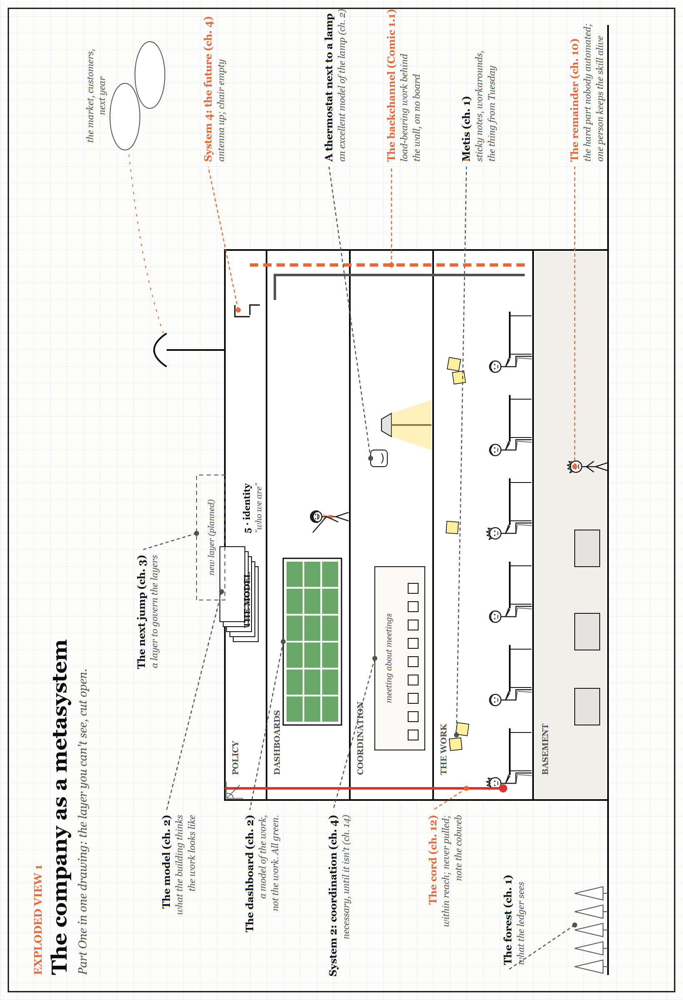

# Exploded View 1 — The Company as a Metasystem

*Part One in one drawing. Every label points to something you have already met; look closely for the small jokes. The drawing is printed sideways: turn the book.*

Everything in Part One is somewhere in this building. Start at the bottom and work up.

- **The work floor** is where the product actually gets made, and where the sticky notes live: the metis of Chapter 1, the knowledge that never reaches a form.
- **The basement** holds the remainder from Chapter 10 — the hard, rare, unautomated part of the job — and the one person still practised enough to do it.
- **Coordination** is Beer's System 2 from Chapter 4: necessary, until the meetings start being about other meetings (Chapter 14). Look for the thermostat, faithfully regulating the lamp beside it (Chapter 2).
- **The dashboard floor** holds the model of the work, not the work — green in every tile.
- **The roof** carries the policy layer: the model the building has of itself, identity (System 5), and a planned new layer to govern the others (Chapter 3). The antenna points at the future; the chair beside it, for System 4, is empty.
- **Down the outside wall** hangs the cord from Chapter 12. Within reach of everyone. Look closely at the top.
- **Inside the right-hand wall**, in orange, runs the backchannel — the load-bearing work that appears on no board.
