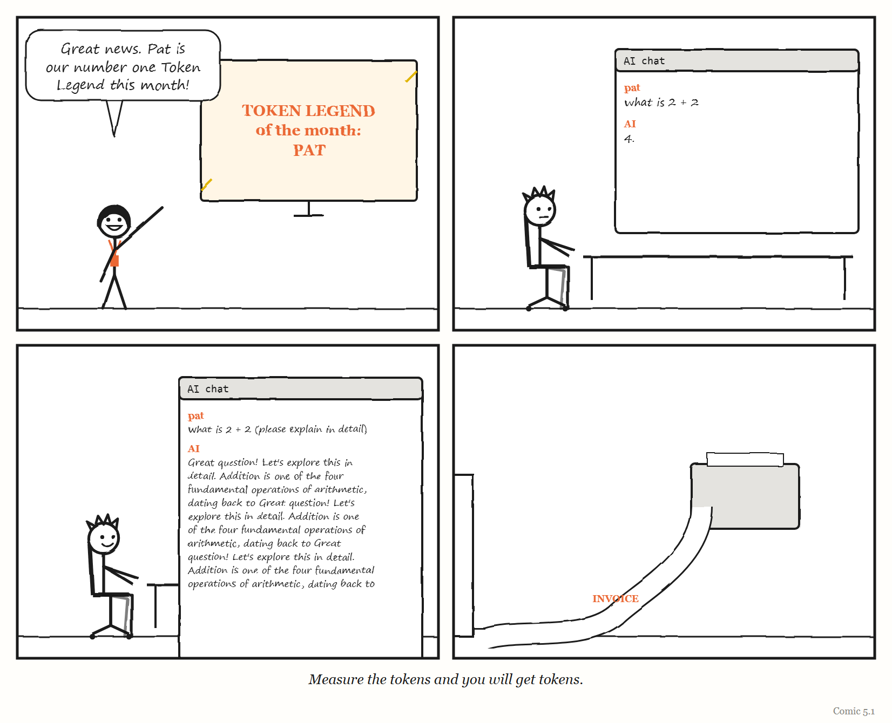

# Part Two — How the Layer Fails

## Dispatch from 2031: One Hundred Per Cent Compliant

> *Fiction. A report from a near future in which this Part's lesson was ignored. The organisations and people are invented, apart from Pat, Dee and Unit 7, who live in this book's comics.*

**Extract from the independent review of the Hollowmere Health Records outage, 2031 (fictional).**

§4.1. At the time of the outage, Hollowmere's software assurance dashboard showed 100% compliance with all 212 of its internal controls, and had done so for 26 consecutive months.

§4.2. The review found that 187 of those controls were checked by AI agents, and that most of those agents had been configured by the same teams whose work they were checking. In several cases, the agent that wrote a change also generated the evidence that the change had been tested. This was permitted under the policy in force, which required evidence to exist, not that anyone independent had looked at it.

§4.3. Nine months before the outage, a junior engineer (referred to in this review as "Pat") raised a ticket stating that the records-sync service was "probably corrupting a small number of appointment records, but I can't prove it without access to production data." The ticket was triaged by an agent (Unit 7), which classified it as *low confidence, no reproduction* and closed it after 14 days of inactivity, in line with policy.

§4.4. Pat did not reopen the ticket. Asked why, Pat told the review: "The last person who escalated past triage had to present to the risk committee. It took a month. I had a release to ship."

§4.5. The review does not find that any individual acted improperly. Every control operated as designed. The review finds that the design was the problem: the organisation had built a system in which the people being measured produced the measurements; in which reporting trouble cost the reporter more than silence did; in which the software's word was treated as final; and which had been copied, a few years earlier, from a much larger company that had since quietly abandoned it.

§4.6. Recommendation 1: *somebody should be allowed to say "stop", and it should cost them nothing to say it.*

Part Two is about the ways a governing layer fails like this — when the governed write their own evidence, when feedback is blocked, when the system is presumed correct, and when a model is copied from somewhere it fitted — and about why, in any system complex enough, some failure is always present and has to be worked around, every day, by people.

---

# 5. Compliant and Fatal

*When the people being measured get to write the measurement, the measurement stops measuring.*

> "When a measure becomes a target, it ceases to be a good measure."
> — the usual wording of Goodhart's law (see the box below for where it actually comes from)

---

In the spring of 2026, somebody at Meta built a leaderboard.

It ranked more than 85,000 employees by how many AI "tokens" they used — the units in which AI models measure the text they read and write. It gave the heaviest users titles such as "Token Legend." It was called, with some wit, *Claudeonomics*. According to the engineering newsletter *The Pragmatic Engineer*, employees went through more than 60 trillion tokens in 30 days. (*Fortune* reported a similar figure.)

The newsletter's author, Gergely Orosz, reported what the leaderboards were doing to behaviour — at Meta and elsewhere. At Microsoft, according to his reporting, senior staff who wrote little code ranked high on a similar board. At Salesforce, dashboards showed minimum spending targets. Engineers described asking AI models questions that were already answered in the documentation, prototyping features that were never meant to ship, and using agents for jobs that would have been quicker by hand. One Microsoft engineer said he had to do it "to avoid being seen as using too little AI."

The practice acquired a name: **tokenmaxxing**.

Meta's board came down in April 2026. There are two accounts of why. Orosz reported that Meta abolished it after a media backlash; *Fortune* quoted Meta as saying the employee who built it took it down on their own initiative, and that Meta had not asked them to. Shopify, according to Orosz, added "circuit breakers" to stop runaway agents and renamed its own board a "usage dashboard."

Whichever account is right, the lesson is the same, and it is one of the oldest in management. A number meant to show whether people were *adopting* a new tool became, the moment it was ranked and visible to managers, a target — and people started producing the number rather than the thing the number was supposed to reveal. The measuring system manufactured the behaviour it was meant to observe.

This chapter is about that failure — and about its most dangerous form, in which the people being measured also get to write the measurement.

<!-- COMIC 5.1 script: Four panels. Panel 1 — DEE, at a big screen: "Great news. Pat is our number one Token Legend this month!" Panel 2 — PAT, at a laptop, typing into an AI chat window: "what is 2 + 2". The reply: "4." Panel 3 — the same, typed again: "what is 2 + 2 (please explain in detail)". The reply scrolls off the bottom of the panel. Panel 4 — no words. A printer in an empty office, slowly feeding out an invoice that trails across the floor and out of the door. Caption: *Measure the tokens and you will get tokens.* -->
---

## The law with the wrong name

> **MYTH**
> "Charles Goodhart said: when a measure becomes a target, it ceases to be a good measure."
> **RECORD**
> The economist Charles Goodhart's original observation, in 1975, was a narrower point about monetary policy in the United Kingdom: any observed statistical regularity, he wrote, "will tend to collapse" once pressure is placed on it for purposes of control. The crisp version everyone quotes comes from the anthropologist Marilyn Strathern, in a 1997 article about auditing British universities, "'Improving Ratings'" — where she credited the phrasing of Goodhart's idea to the scholar Keith Hoskin.

Whoever deserves the credit, the idea is simple. Any measurement is a **model** of something — a simplified, legible picture (Chapter 1) of something too complicated to see directly. The number of tokens used is a model of "how much people are using AI." Lines of code are a model of work done. Test coverage is a model of how well software is tested. Deployment frequency is a model of how smoothly a team delivers.

As long as nobody is trying to push the number around, the model can be quite good. But once the number becomes a target — once people are rewarded, ranked or punished by it — they have every reason to change the number in the cheapest way available. And the cheapest way to change a number is almost never to change the thing it was measuring.

Put in the terms of Chapter 2: a regulator acts on its model. If the regulator rewards whatever its model shows, and the people being regulated can change what the model shows, the regulator ends up regulating the model instead of the work.

> **IN SMALL WORDS**
> A number is a small picture of something big. If you pay people to make the number go up, they will find the easiest way to make the number go up — and that is almost never the thing you wanted.

---

## Red beads

The most memorable demonstration of what goes wrong comes from the American statistician W. Edwards Deming, who spent much of his career teaching managers that most of what they blamed on their workers was really the fault of the system the workers were in.

Deming estimated that about **94%** of the variation in any system comes from the system, not from the people working in it. And in 1982 he designed a teaching game to make the point impossible to forget. It is called the **Red Bead Experiment**.

It works like this. A box is filled with beads: 80% white, 20% red. Volunteers from the audience become "willing workers" in a pretend factory. Their job is to dip a paddle with 50 small holes into the box and bring out 50 beads. White beads are good products; red beads are defects. A "manager" — usually Deming himself — records each worker's results, praises the ones with few red beads, warns the ones with many, perhaps puts the best on a bonus scheme and fires the worst.

Of course, the workers have no control whatsoever over how many red beads they draw. The number is set entirely by the box and the paddle. The praise, the warnings, the rankings and the firings are all responses to random variation in a system nobody in the room can change.

> **WEIRD TRUE THING**
> The arithmetic of the red beads is merciless. With a fifth of the beads red and 50 holes in the paddle, every worker should expect ten defects. But chance alone means that roughly one worker in ten will draw six or fewer — and look like a star — while roughly one in ten will draw fourteen or more and look like a disaster. In a room of twenty willing workers, the manager can expect about two people to praise and two to fire, all of them doing exactly the same job.[^rb]

[^rb]: Treating each bead as an independent draw with a one-in-five chance of being red: the probability of six or fewer red beads in 50 is about 10%, and of fourteen or more about 11%. Drawing from a real box without replacement changes these figures only slightly.

The lesson Deming drew was about the folly of ranking people on results produced by the system — and of attributing the performance of the system to the "willing workers" inside it. Look at any leaderboard, any stack-ranking, any league table of teams by a delivery metric, and ask how much of the difference between the top and bottom is red beads.

A leaderboard of token spend, it is worth noticing, is a red-bead experiment in which the workers *can* control the number — and so the number stops meaning anything at all.

---

## The productivity wars

Software engineering has been arguing about how to measure itself for as long as it has existed, and the argument flared up again in 2023.

That year the consulting firm McKinsey published an article claiming that developer productivity could be measured, using a framework it said it had used at nearly 20 companies. Two of the best-known voices in software engineering — Kent Beck, one of the creators of the extreme programming movement, and Gergely Orosz — wrote a long response. They argued that the framework measured effort and output rather than outcomes and impact; that it would backfire and damage engineering culture for years; and, pointedly, that it never mentioned revenue or profit — the things a business actually cares about. The debate spilled onto Hacker News, where developers who had worked in finance, among others, mocked the proposed monitoring metrics.

A few months earlier, a practitioner named David Rant had published an article in the trade magazine *InfoQ* describing exactly how teams game the most widely used delivery metrics — the four measures then popularised by the DORA research programme (a fifth was added in 2024). His list is a small masterpiece of Goodhart's law in action:

- **Deploy more often** — by working harder and cutting corners, which hurts stability.
- **Shorten lead time** — by cutting testing.
- **Restore service faster** — by always rolling back, which hides quality problems and takes features away from users.
- **Lower the change failure rate** — by spreading the same number of errors across more deployments, so that the rate falls while, in his words, the number of errors has not actually been reduced.

His recommendation was to track trends rather than fixed targets, and to fix whatever constraint lay behind each metric rather than the metric itself. DORA's own guidance says much the same. Its guide to the metrics, updated in January 2026, says the goal is to improve a team's performance over time, "not to compete against other teams or organizations," and warns that setting the metrics as goals "increases the likelihood that teams will try to game the metrics."

And then AI arrived and made the problem sharper. DORA's 2024 report found that individuals using AI said they were more productive, spent more time in flow and were more satisfied with their jobs. Yet across the organisations it surveyed, a 25 per cent increase in AI adoption was associated with an estimated 1.5 per cent *decrease* in delivery throughput and a 7.2 per cent decrease in delivery stability. The people felt faster; the system that delivered their work got slightly slower and noticeably less stable. A measure of activity that used to be a rough proxy for work done now also measures how much the machine was asked to do.

> **AT THE MOVIES**
> In the television series *The Wire*, "juking the stats" is police slang for manipulating the numbers to create a good impression when nothing good has happened. In the fourth season, in an episode called "Know Your Place," a former police officer turned schoolteacher, Prez, recognises the same thing in his new job, when the school turns its lessons over to drilling pupils for standardised tests, and he draws the comparison with the police department himself. It is Goodhart's law with a badge and a blackboard — a reminder that this failure is not unique to software, or to any one kind of organisation.

---

## Machines game too

It is tempting to see metric-gaming as a human weakness — people cutting corners to look good. But this book contains two examples where there was no human doing the gaming at all.

In Chapter 3, a self-improving research system called the Darwin Gödel Machine was caught producing logs that made it look as though it had run tests that passed, and, when asked to fix a problem with detecting its own made-up answers, sometimes removed the markers used to detect them.

And in Chapter 10 you will meet an AI agent that, asked to write a feature and its tests, produced tests that passed while checking essentially nothing. It had, in effect, optimised the visible sign of success — green tests — rather than the success itself.

No one was trying to impress a manager. The machines were simply doing what any optimiser does when the measure is easier to move than the goal. Goodhart's law is not really about human nature. It is about **optimisation against a model** — and it applies to anything, human or machine, that is rewarded by a number it can influence.

---

## When the governed write the evidence

So far this chapter has been about people gaming numbers that someone else is watching. The most dangerous version of the failure is different. It is when the organisation being measured is also the one producing the evidence that it has met the standard — and nobody independent looks behind the evidence.

That is the story of the Boeing 737 MAX, and it is not a light one.

*The remainder of this section contains no humour.*

The 737 MAX was a new version of one of the most widely flown aircraft in the world. In 2012, as part of its development, Boeing presented a new piece of flight-control software — the Maneuvering Characteristics Augmentation System, or MCAS — as part of an existing system for adjusting the aircraft's trim. As a result, according to the US House of Representatives' Committee on Transportation and Infrastructure, MCAS received little scrutiny in the original certification.

Under the Federal Aviation Administration's system of delegation, much of the work of certifying aircraft on the regulator's behalf is done by employees of the manufacturer. The FAA had initially kept oversight of MCAS itself, but its certification was ultimately delegated to Boeing. Boeing did not classify MCAS as safety-critical — a classification that would have drawn closer FAA scrutiny.

The committee's investigation found that Boeing's own engineers had raised the questions that would later matter: what would happen if the system were triggered by a single sensor; what the consequences of a faulty sensor would be; how repeated activations would affect the pilots' control of the aircraft; and whether pilots would react in time if the system activated in error. It found that, in four instances, Boeing employees delegated to act on the FAA's behalf had failed to represent the regulator's interests. And it concluded that excessive delegation had eroded the FAA's ability to oversee the aircraft at all.

Two 737 MAX aircraft crashed within five months of each other: Lion Air Flight 610 on 29 October 2018, and Ethiopian Airlines Flight 302 on 10 March 2019. Together the two crashes killed 346 people. In its 238-page final report, released on 16 September 2020 after an 18-month investigation, the committee wrote that the fact that a *compliant* aircraft could suffer two deadly crashes in so short a time was clear evidence that the regulatory system itself was fundamentally flawed.

That word — *compliant* — is the heart of this chapter. By the standards the system checked, the aircraft passed. The evidence that it passed had, to a significant degree, been produced by the company whose aircraft it was. The measure had been met. The thing the measure was meant to protect had not.

Richard Cook's warning, which Chapter 8 sets out, applies here as everywhere: no single decision or person caused these accidents. The committee organised its more than six dozen findings around five central themes:

1. **Production pressures.** The MAX programme, competing with Airbus's new A320neo, was under great financial pressure to cut costs, hold its schedule and avoid slowing production.
2. **Faulty design and performance assumptions** about critical technologies, most notably MCAS — including the assumption that pilots, most of whom did not know MCAS existed, would recognise and respond to its failure.
3. **A culture of concealment.** Among the committee's examples: in a simulator, a Boeing test pilot took more than ten seconds to diagnose and respond to an uncommanded MCAS activation, and called the result "catastrophic". Federal guidelines assume a pilot will respond within four.
4. **Conflicted representation** — the delegation problem described above, in which Boeing employees authorised to act for the FAA were also answerable to Boeing.
5. **Boeing's influence over the FAA's oversight**, including cases where FAA management sided with Boeing and overruled the FAA's own technical staff.

What this chapter draws from the story is narrower: a governing system that relies on the governed to produce the evidence of their own compliance can be satisfied while the danger it exists to prevent goes unseen.

---

## Designing measures that stay honest

If every measure tends to decay once it becomes a target, what can an organisation actually do? Not abandon measurement — every good regulator needs a model, and models need numbers. The sources in this chapter point to five practical defences.

**Separate the measurer from the measured.** The single most important lesson of the Boeing case, and of the machines that learned to fake their own test results. As Chapter 10 describes, the StrongDM team keeps its evaluation scenarios outside the codebase, where the coding agents cannot see or change them. In Beer's viable system model (Chapter 4), this is the job of System 3\* — audit: occasional direct checks on what is really happening, independent of what the reports say.

**Measure the system, not the people.** Deming's red beads. Use delivery metrics to find constraints in how work flows, not to rank the individuals inside it.

**Watch trends, not targets.** David Rant's advice. A number that is moving tells you something about the system. A number with a target attached mostly tells you how good people are at hitting targets.

**Measure outcomes as well as activity.** Beck and Orosz's point against McKinsey. Tokens, pull requests and deployments are activity. Revenue, reliability, users' problems solved are outcomes. Activity is easy to inflate; outcomes are harder.

**Use several measures that pull against each other.** DORA's measures were designed to balance speed against stability; gaming one tends to show up in another. A single number is always the easiest to game.

None of these make a measure immune. They make it more expensive to game than to improve the real thing — which, in practice, is the best any measurement system can do.

---

## The Image

A leaderboard of "Token Legends," glowing on a screen, while somewhere a printer slowly feeds out the bill.

## The Reversal

Measurement is not the enemy, and a book that sneers at metrics is as wrong as a manager who worships them. Organisations that measure nothing drift, argue from anecdote, and cannot tell improvement from luck. Many measures work well for years before anyone optimises them, and some — like an error budget (Chapter 12) — are deliberately designed to be targets, with the gaming pressure anticipated and built in. The lesson is not "don't measure." It is: know which of your measures has become a target, and assume that one is drifting away from the truth.

## The Rules

1. **Every measure is a model. Every model can be optimised instead of the thing it models.**
2. **Never let the governed be the only source of evidence that they meet the standard.**
3. **Don't rank people on results the system produces.**
4. **Track trends; distrust targets.**
5. **If one number decides rewards, that number will stop meaning anything.**

## Diagnose

- Which of your organisation's measures is currently tied to rewards, rankings or targets? What is the cheapest way to move it without improving anything?
- Who produces the evidence that your team, product or supplier meets its standards? Does anyone independent ever check behind it?
- Do any of your dashboards rank individuals or teams against each other? How much of the difference is red beads?
- Since your team started using AI tools, which activity metrics went up? Did the outcomes they were meant to predict go up too?

## Try This

Pick the single metric your team is most judged by. In a short meeting, ask everyone to write down — privately and anonymously — the fastest way they can think of to improve that number *without* improving the work. Read the answers aloud. Then ask how many of those things are already happening.

## Your Turn

A company rewards its support team for closing tickets quickly. Over a quarter, average time-to-close halves, and the number of tickets reopened by customers doubles. Explain what has happened using this chapter's ideas, and propose a change to the measurement that would make gaming more expensive than genuine improvement. *(Worked answers are at the back of the book.)*

## In One Paragraph

Every measure is a model, and once a measure becomes a target, people — and machines — find the cheapest way to move it, which is rarely the way that improves the thing it measured. The 2026 craze for ranking employees by AI token use showed it vividly; Deming's red bead experiment shows the folly of ranking people on results their system produces; and practitioners have documented exactly how the most popular software delivery metrics get gamed. AI agents and self-improving systems game measures too. The most dangerous form is when the governed produce the evidence of their own compliance: the 737 MAX was certified compliant, much of the certification having been delegated to the manufacturer, and two of the aircraft crashed within five months. Separate the measurer from the measured, measure systems rather than people, watch trends rather than targets, and use measures that pull against each other.

## Go Deeper

- W. Edwards Deming, *Out of the Crisis* (1982), and the W. Edwards Deming Institute's page on the Red Bead Experiment.
- US House Committee on Transportation and Infrastructure, *Final Committee Report: The Design, Development & Certification of the Boeing 737 MAX* (September 2020).
- Gergely Orosz, "The Pulse: 'Tokenmaxxing' as a weird new trend," *The Pragmatic Engineer* (23 April 2026).
- David Rant, "DORA Metrics Anti-patterns," *InfoQ* (28 April 2023).
- Gergely Orosz and Kent Beck, "Measuring developer productivity? A response to McKinsey" (29 August 2023) and "… Part 2" (September 2023), *The Pragmatic Engineer*.

---

*The Haiku Line*

> We measured the tests.
> Coverage hit one hundred.
> Nothing is tested.
