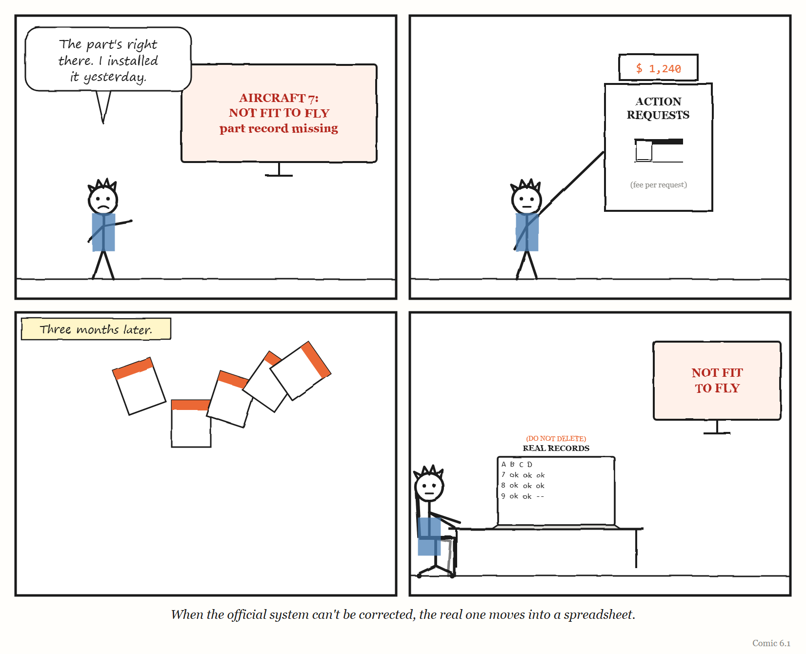
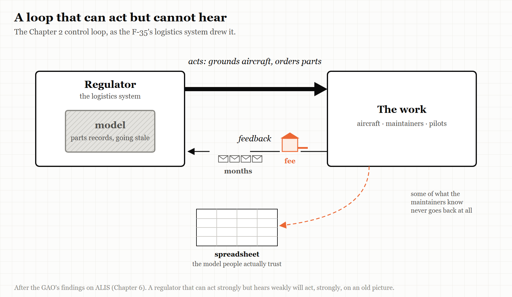

# 6. The Fee for Bug Reports

*A governing system that cannot see what it is doing to the work will keep doing it.*

> "ALIS may or may not be having a notable effect on mission capability rates."
> — US Government Accountability Office, 2020

---

The F-35 is, in the words of the US Government Accountability Office, the Department of Defense's most expensive weapon system programme, and like every aircraft, it has to be maintained.

Every F-35 is made of thousands of parts, and each part has a history: when it was installed, how many hours it has flown, when it must be inspected or replaced. Keeping track of all of that, for a fleet of aircraft spread across bases around the world, is itself an enormous job. So the F-35 came with its own governing system: a software platform called the **Autonomic Logistics Information System**, or ALIS. Among other things, ALIS held the electronic records of the aircraft's parts, and used them to help decide whether each aircraft was ready to fly.

In March 2020 the US Government Accountability Office — the investigative arm of Congress — published a report on ALIS. It is a sober, carefully written document. It is also one of the best case studies ever produced of what happens when a governing layer's model of the work goes wrong and there is no good way to correct it.

This chapter is about feedback — the arrow in the control loop that carries information *back* from the work to the thing governing it — and about what happens when that arrow is slow, expensive or missing.

---

## What GAO found

GAO's investigators visited five F-35 locations, and they heard the same thing at every one of them: the electronic records of parts in ALIS were frequently incorrect, corrupt or missing.

That mattered because ALIS used those records to decide whether an aircraft was fit to fly. A missing or wrong record could make the system treat a perfectly good aircraft as unfit — and ground it. One location told GAO that between October 2018 and September 2019, its F-35s were grounded for **9,262 hours — 9% of the flight hours that were possible** — because of unresolved problems with ALIS, mainly missing and inaccurate parts records. Another location reported grounding aircraft for **2,200 hours in six months** while it waited for contractors to fix parts-related problems.

To put the first number in human terms: a year has 8,760 hours. At that one base, in that one year, the logistics system's errors kept aircraft on the ground for longer than one aircraft sitting idle for the entire year.

When the people at the bases found a problem with ALIS, they had a formal way to report it. It was called an **Action Request**. Every issue needed one, and the response could take months. And — this is the detail that gives the chapter its title — users at one location pointed out to GAO that the Department of Defense **incurred a fee each time an Action Request was submitted**.

> **WEIRD TRUE THING**
> The system that governed the maintenance of America's most expensive fighter jet charged a fee every time somebody reported a problem with it. The fee was paid by the programme, not by the mechanic. Nobody, as far as GAO's report records, measured what a price on complaints did to the number of complaints.

---

## The spreadsheet everyone trusted

What do people do when the official system is unreliable, slow to fix, and costly to complain to?

They build their own.

GAO found that users were tracking critical aircraft information *outside* ALIS — things like aircraft performance data and the deadlines for maintenance inspections — because, as they told the investigators, they did not always trust the data in the system. Tracking it by hand was time-consuming and pulled maintainers away from actual maintenance. At one location, users estimated they spent an average of **5,000 to 10,000 hours a year** manually tracking information that ALIS should have captured automatically and accurately.

They were doing it in spreadsheets. And they were worried about it: at one location, users told GAO there was a danger of overlooking a critical piece of information when key data about an aircraft's status had to be tracked by hand in Excel.

There is a phrase for this in organisational research — a *shadow system* — and it is exactly what Chapter 1 would predict. The official governing layer had built a legible model of the fleet's maintenance. The model was wrong often enough that the people who actually knew the aircraft stopped relying on it. Their knowledge — the metis of maintainers who knew which records to trust — did not disappear. It moved into a set of spreadsheets the official system could not see.

And GAO spotted a quieter danger too. Because ALIS so often raised alerts caused by missing or inaccurate data, squadrons had learned to ignore them. By continuously ignoring alerts that were usually wrong, the report warned, squadrons could end up ignoring ones that were right.

GAO also found that the people at all five locations it visited described ALIS as not user-friendly or intuitive, and its applications as difficult to navigate.

> **IN SMALL WORDS**
> When the official system keeps getting things wrong, people quietly start keeping their own records. Then the official system is watching one world while the real work happens in another.

---

## Nobody was measuring

The most important sentence in GAO's report is not about spreadsheets or fees. It is about measurement.

GAO found that the F-35 programme had **no fleet-wide process** for measuring, collecting and tracking how ALIS was affecting the performance of the aircraft — for instance, the share of the fleet capable of flying its missions. Its careful conclusion was that ALIS "may or may not" be having a notable effect on those rates. Nobody could say, because nobody was measuring.

Go back to the control loop in Chapter 2. A regulator acts on the work and learns from feedback. ALIS acted on the fleet: it helped decide which aircraft could fly. But there was no systematic feedback about what those decisions were doing to the fleet's readiness. The regulator could not see its own effect.

And the costs of that blindness reached beyond the bases. GAO pointed out that the Department of Defense was planning long-term, performance-based contracts for sustaining the F-35. Without understanding what ALIS was doing to the aircraft's performance, it warned, the department risked entering those contracts without understanding all the factors that affected how the aircraft actually operated — and so would be in a weaker position to negotiate them.

GAO made two recommendations. The second — that the department develop a strategy for redesigning ALIS, setting out goals, risks and costs — was recorded as implemented in November 2021. The first — that the programme develop a process for measuring how ALIS affected the fleet's performance — was recorded as implemented in **April 2026**, six years after the report. By then the programme was already moving to ALIS's replacement, a cloud-based system called ODIN, whose hardware it had begun fielding in 2023.

---

## What it cost, and what nobody knew

There is one more finding in the report, and it is a good example of why this book keeps insisting on reading the original.

> **MYTH**
> "The F-35's logistics software cost $16.7 billion and wasted 45,000 hours a year in manual workarounds."
> **RECORD**
> Neither figure is in GAO's 2020 report. The report says that in 2016 GAO had found a Defense Department estimate that ALIS would cost approximately **$17 billion** — and that the estimate was **not fully credible**, because the department had not carried out uncertainty and sensitivity analyses. The only workaround figure in the 2020 report is the **5,000 to 10,000 hours a year** estimated at one location. And the report adds something more telling than either number: the F-35 programme office **could not provide historic costs** showing how much had actually been spent on ALIS over the years.
> *Source: GAO-20-316, "Weapon System Sustainment: DOD Needs a Strategy for Re-Designing the F-35's Central Logistics System," March 2020.*

That last point deserves a moment. The governing layer for the maintenance of a fleet whose sustainment was estimated in 2020 at about $1.2 trillion over its lifetime — for the whole F-35 programme, not just ALIS; by 2024 GAO put the United States' share at $1.6 trillion — was a system whose own cost the programme could not account for. Programme officials told GAO that, when resources were scarce, the aircraft itself had generally been prioritised over its logistics system.

That is a very common choice, and an understandable one: the thing that flies gets the money, and the thing that tracks the thing that flies gets whatever is left. It is also exactly how governing layers come to be under-built, under-maintained and under-measured, until they start grounding the aircraft they exist to support.

<!-- COMIC 6.1 script: Four panels. Panel 1 — a maintenance hangar. PAT, in overalls, holding a clipboard, looks at a screen that reads *AIRCRAFT 7: NOT FIT TO FLY — PART RECORD MISSING*. PAT: "The part's right there. I installed it yesterday." Panel 2 — PAT at a wall-mounted box labelled *ACTION REQUESTS*, with a small coin slot and a meter above it. PAT drops in a form; the meter ticks up. Panel 3 — a calendar; the pages flutter away. Caption: *Three months later.* Panel 4 — no words. PAT at a laptop, a huge spreadsheet open, labelled *REAL RECORDS (DO NOT DELETE)*. Behind PAT, the official screen still reads *NOT FIT TO FLY*. Caption: *When the official system can't be corrected, the real one moves into a spreadsheet.* -->
---

## Four more ways to lose the feedback

ALIS is the most detailed case in this chapter, but it is not unusual. The same failure — a governing system that cannot see what it is doing — turns up again and again in large technology programmes, and it takes several forms.

**No instruments at all.** When the US federal health-insurance website Healthcare.gov launched in October 2013 and failed badly, the government's own Inspector General later found that the failure stemmed largely from organisational missteps, including different parts of the responsible agency each believing they were in charge. Mikey Dickerson, the Google engineer who joined the rescue, later described how, before the team had any monitoring, the only way it knew whether there was a problem was the news: going to lunch every day, he said, "we saw our own problems on CNN." The first fix was to install instruments — to give the governing layer eyes.

**Warnings ignored.** When the Canadian government's new pay system for federal employees, Phoenix, went live in 2016, it went on to underpay, overpay or fail to pay large numbers of public servants. The country's Auditor General called it an "incomprehensible failure" of project management and oversight. Executives had cut functionality and testing to meet budgets and schedules, and warnings from the pay centre in Miramichi and from government departments were not acted on. The feedback existed. It did not reach anyone who would change course. The Auditor General judged the decision to go live unreasonable given what was known at the time, and recommended simplifying the pay rules before automating them.

**The instrument breaks when the world changes.** Chapter 10 describes METR's experiment on AI and programmer productivity, which in February 2026 had to announce that its data had become unreliable — because developers had changed faster than its method could follow. What makes METR worth mentioning here is that it *said so*. Its measuring system stopped matching the thing it measured, and instead of publishing a confident number, it published an explanation of why it no longer had one. That is rarer than it should be, and it is what a healthy feedback loop looks like when it fails: the failure is visible, named and acted on.

**The channel that drowned.** ALIS's reporting channel cost money to use, and was used less. The open-source project curl — a small, very widely used program for moving data across the internet — had the opposite arrangement. It *paid* people who reported security vulnerabilities, through a bug bounty. Over the bounty's life, according to curl's founder and lead developer Daniel Stenberg, it confirmed 87 real vulnerabilities and paid out more than $100,000. Then, in 2025, reports written with AI tools began to pour in. The share of submissions that turned out to be real vulnerabilities fell from above 15% to below 5%, and checking the rest took what Stenberg described as a serious toll on the small team doing it. In January 2026 he ended the bounty and moved reporting to channels that paid nothing. It is the mirror image of ALIS. A feedback channel is tuned to the cost of sending a report. Make sending too expensive, and the truth stops arriving. Make it free and rewarded, at a moment when producing a plausible report costs almost nothing, and the truth arrives buried under everything else. Either way, the regulator goes blind.

---

## Why feedback is the first thing to go

Why is feedback so often the weakest part of a governing system?

Partly because it is the part nobody sees being built. A new logistics system, platform or dashboard is launched with its *outputs* — the decisions it makes, the screens it shows. The route by which the people it governs can tell it that it is wrong is usually an afterthought: a ticket queue, a help desk, a form.

Partly because feedback is inconvenient. Every report that the system is wrong is a report that someone's project, budget or judgement was wrong. Organisations tend to route such reports somewhere slow.

And partly because of the choice GAO recorded: when money is short, the thing that does the work gets priority over the thing that watches it. The watching system is starved first, and the watching system's own feedback — the part that would reveal what it is doing to the work — is starved most of all.

There is a classroom game that shows what slow feedback does even to competent people. In the "beer game", developed at MIT in the 1960s and made famous by Peter Senge's *The Fifth Discipline* in 1990, players each run one stage of a supply chain for beer — retailer, wholesaler, distributor, brewery — placing orders with the stage upstream and receiving deliveries after a delay. Nobody does anything foolish. Each player responds sensibly to what they can see. And yet the chain reliably swings between shortages and gluts far larger than the small change in customer demand that set it off, because every player is acting on information that is already weeks old. ALIS's Action Requests, which took months to resolve, were a beer game played with aircraft.

The result, again and again, is a governing layer that is confident, active and blind: making decisions about the work, never learning what those decisions did.

> **THE MECHANISM**
> 
> 
> <!-- FIGURE 6.1 illustrator brief: The Chapter 2 control loop, redrawn. The *acts* arrow from the regulator to the work is thick and bold. The *feedback* arrow coming back has been drawn thin and broken into segments; at one break sits a small toll booth labelled *fee*, at another a long queue of envelopes labelled *months*, and a third segment curves away entirely into a separate box labelled *spreadsheet*. Inside the regulator, the small box labelled *model* is shaded grey, going stale. -->
> A governing system with a strong arm and weak eyes. It keeps acting on the work, while the information that would correct it is slowed, priced or diverted — and its model of the work quietly goes stale.

---

## Building the eyes first

The cases in this chapter suggest a short list of rules for anyone building a governing layer — a platform, a logistics system, a dashboard, an AI pipeline.

**Instrument the effect, not just the activity.** It is not enough to know what the governing system did. You need to know what it did *to the work*. ALIS knew which aircraft it had grounded; nobody measured what that did to readiness.

**Make it cheap and fast to say the system is wrong.** Any cost — in money, effort, time or standing — reduces the number of reports you get, not the number of problems you have. Months-long queues teach people to stop reporting and start working around. Cheap is not the same as indiscriminate, though: curl's experience shows that a channel which rewards volume will get volume. Make reporting easy, and make triage strong.

**Watch for shadow systems, and treat them as data.** When people build spreadsheets to replace the official system, they are telling you precisely where the official model is wrong. The spreadsheet is the most honest feedback you will ever receive.

**Beware alerts that are usually wrong.** An alert that is ignored because it is usually wrong is worse than no alert, because it trains people to ignore the one that is right.

**Fund the watcher.** The system that governs the work needs its own budget, its own maintenance and its own measurement — not whatever is left over after the work is paid for.

---

## The Image

A mechanic standing beside an aircraft they know is fit to fly, looking at a screen that says it isn't — and a spreadsheet open on the laptop behind them.

## The Reversal

Feedback can also overwhelm. A governing system that responds instantly to every complaint can lurch from change to change and never settle, and a flood of low-quality reports can bury the few that matter. Some friction in a feedback channel — a form that asks for enough detail to act on, a triage step — is a feature, not a flaw. The goal is not the most feedback or the fastest. It is feedback that is cheap enough that people send it, filtered enough that it can be acted on, and always, always measured against what the system is doing to the work.

## The Rules

1. **A governing system must measure its effect on the work, not just its own activity.**
2. **Any cost to reporting a problem reduces the reports, not the problems.**
3. **A shadow system is a map of where the official one is wrong.**
4. **An alert that is usually wrong teaches people to ignore the one that is right.**
5. **Fund the watcher, or it will go blind first.**

## Diagnose

- For your most important governing system, how would you know what it is doing to the work it governs?
- How long does it take, and what does it cost, for someone to report that the system is wrong — and to see it fixed?
- Where have people in your organisation built their own spreadsheets, notes or tools to work around an official system?
- Which of your alerts do people routinely ignore? Why?
- Who funds the maintenance of your governing systems, and do they get what is left over?

## Try This

Find one spreadsheet, document or private tool in your organisation that someone built because they didn't trust an official system. Ask them — kindly, and with no intention of taking it away — what it tracks that the official system gets wrong. Then take that list to whoever owns the official system.

## Your Turn

An internal developer platform generates alerts for security issues in every team's code. Over a year, teams resolve fewer and fewer of them, and a survey finds most engineers believe the alerts are "mostly false positives." Using the ALIS case, describe what may be happening, what risk it creates, and two changes to the feedback loop that would help. *(Worked answers are at the back of the book.)*

## In One Paragraph

The F-35's logistics system, ALIS, held parts records so often wrong that it grounded aircraft fit to fly — 9,262 hours in one year at one base — while problem reports took months to resolve and cost the programme a fee each; maintainers kept the real records in spreadsheets, learned to ignore its alerts, and nobody measured what the system was doing to the fleet's readiness. The widely quoted "$16.7 billion" and "45,000 hours" figures are not what GAO reported; the more telling fact is that the programme could not say what ALIS had cost. Healthcare.gov launched without the monitoring to see its own failure, and Canada's Phoenix pay system went live despite ignored warnings. Governing systems tend to be built with strong arms and weak eyes. Instrument their effect on the work, make it cheap to say they are wrong, and treat every shadow spreadsheet as a map of where the official model has failed.

## Go Deeper

- US Government Accountability Office, *Weapon System Sustainment: DOD Needs a Strategy for Re-Designing the F-35's Central Logistics System*, GAO-20-316 (March 2020), and the testimony GAO-20-665T (July 2020).
- US Department of Health and Human Services, Office of Inspector General, *HealthCare.gov: CMS Management of the Federal Marketplace*, OEI-06-14-00350 (February 2016).
- Office of the Auditor General of Canada, reports on the Phoenix pay system (2018 onward).
- METR, "We are Changing our Developer Productivity Experiment Design" (24 February 2026) — an example of a measuring system honestly reporting its own failure.
- Daniel Stenberg, "The end of the curl bug-bounty" (daniel.haxx.se, 26 January 2026).
- Peter M. Senge, *The Fifth Discipline* (1990), on the beer game.

---

*The Haiku Line*

> Report the fault here.
> A small fee applies. Please wait
> a few months. Thank you.
