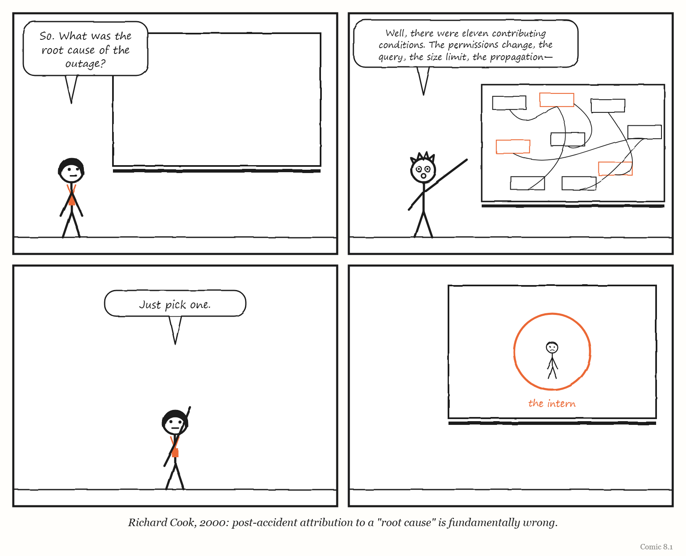
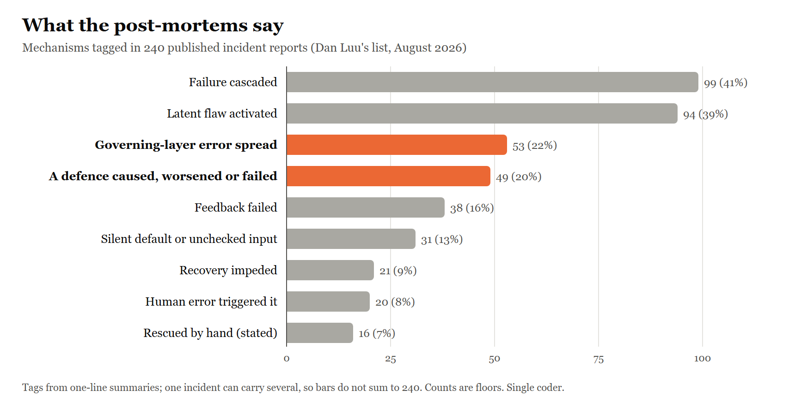
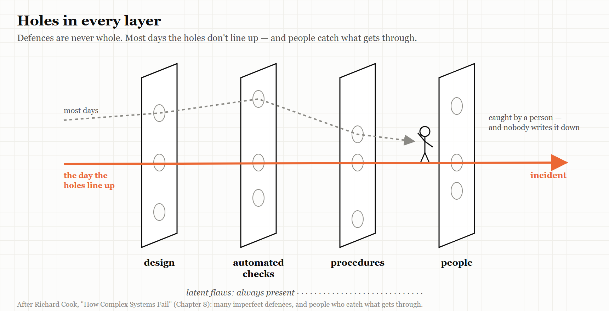

# 8. Running Broken

*Complex systems are always partly broken. The question is what keeps them working anyway.*

> "Complex systems run as broken systems."
> — Richard I. Cook, "How Complex Systems Fail," 2000

---

On 18 November 2025, a large part of the internet stopped working for about six hours.

The company at the centre of it was Cloudflare, which sits in front of a huge share of the world's websites, speeding them up and protecting them from attacks. Its chief executive, Matthew Prince, published a detailed account of what happened, and it is worth reading slowly, because it does not contain a villain.

It began with a change made to *improve* security: an adjustment to permissions in one of the company's databases. That change had an unexpected side effect on a query used to build a configuration file for Cloudflare's system for detecting automated "bot" traffic. The query started returning duplicate rows, and the file grew — past a hard-coded limit of 200 features that the software reading it could handle.

The file was regenerated and sent across Cloudflare's entire network every five minutes. When the software that routes traffic tried to load the oversized file, it crashed and returned errors. And because the permissions change reached the company's database servers gradually, some copies of the file were good and some were bad — so the network kept recovering and then failing again, every few minutes, in a pattern so strange that engineers at first suspected they were under attack.

Errors began at 11:20 UTC and the problem was resolved at 17:06.

Ask "what was the root cause?" and you will get a different answer depending on where you stand. The permissions change? It was made for good reasons, and it did what it was meant to. The query? It had worked for years. The size limit? It was a sensible safeguard until the day it wasn't. The five-minute propagation? That speed is exactly what lets Cloudflare respond to real attacks. The alternating good and bad files? Nobody designed that; it emerged. Each condition was harmless on its own. Only the combination brought the network down.

Cloudflare's remedies are telling. They did not fire anyone or ban permissions changes. They decided to treat configuration files generated by their own systems with the same suspicion as input from strangers, and to add more "kill switches" that let engineers stop a bad change from spreading across the whole network.

That is what this chapter is about: the fact that complex systems are never fully working, that they fail through combinations rather than single causes — and that the people inside them are, most of the time, what holds them together.

---

## How complex systems fail

In 1998, Richard Cook, a physician who studied safety in medicine and other high-risk fields at the University of Chicago, wrote a three-page paper with a plain title: "How Complex Systems Fail." Its revision from 2000 is still passed around among engineers who run large computer systems, and it contains eighteen short numbered points. They are worth summarising, because almost every failure in this book is an illustration of one or more of them.

Complex systems, Cook argues, are **intrinsically hazardous** — transport, healthcare, power generation — and because they are hazardous, they are **heavily and successfully defended**. Layer upon layer of defences builds up over time: technical ones like backup systems, human ones like training and experience, and organisational ones like procedures, certification and regulation. Most of the time, the defences work.

Which is why **catastrophe needs multiple failures**. A single failure is almost never enough. Disaster happens when several small, apparently harmless failures line up — each necessary, none sufficient. There are far more opportunities for failure than actual accidents, because the defences usually catch the trajectory, and when they do not, the people at the front line usually do.

Complex systems always **contain a changing mixture of latent failures** — flaws that are individually too small to cause trouble. It is too expensive to eliminate them all, and hard to see in advance which ones matter. And so, in the line that gives this chapter its title, complex systems **run as broken systems**. They keep working because they are full of redundancy and because people make them work, despite the flaws. After an accident, reviews nearly always find a history of earlier near-misses; the argument that these should have been noticed, Cook says, usually rests on a naive idea of how the system performs.

Then comes a group of points about blame. Cook argues that **attributing an accident to a single "root cause" is fundamentally wrong**, because the accident needed several causes at once. **Hindsight biases** every judgement made afterwards about the people involved. Operators play **two roles at once** — producing whatever the system produces, and defending against its failure — and **every action they take is a gamble**, which looks reckless or wise only once the outcome is known. It is at the "sharp end", where people actually operate the system, that all the ambiguity in the organisation's goals and rules finally gets resolved.

And finally, a group of points about people and change. **Humans are the adaptable part** of complex systems. **People continuously create safety** — by restructuring the work to reduce exposure, concentrating resources where they expect demand, and keeping routes open for retreat and recovery. **Change introduces new forms of failure.** **Views of "cause" limit the defences** built against future events. And, finally: **failure-free operation requires experience with failure.**

> **IN SMALL WORDS**
> Big systems are always a bit broken. They keep working because many small safety nets catch most problems and people quietly fix the rest. Real disasters come when many small problems line up at once — so looking for the one thing to blame usually misses the point.

---

## The writer's warning

Cook's points about blame are also a warning to anyone writing a book like this one.

A book of failure stories wants a clean shape. Something went wrong; here is the cause; here is the lesson. That shape is satisfying to read, and — if Cook is right — it is almost always false. The chapters in this book try to resist it, and it is worth saying so plainly. When the book says that the F-35's logistics system grounded aircraft, or that the 737 MAX was certified by a compromised process, it is describing *conditions* that contributed to outcomes, not single causes that produced them. Every case here had others.

The same warning applies to your own organisation's incident reviews. The phrase "root cause" appears in countless post-incident templates. Cook's point is that the search for one is a search for a story, not an explanation — and that the story it finds usually points at the last person to touch the system.

<!-- COMIC 8.1 script: Four panels. Panel 1 — a meeting room, whiteboard behind. DEE: "So. What was the root cause of the outage?" Panel 2 — PAT, standing at the whiteboard, which is now covered in a tangle of boxes and arrows: "Well, there were eleven contributing conditions. The permissions change, the query, the size limit, the propagation—" Panel 3 — DEE, holding up one hand: "Just pick one." Panel 4 — no words. The whiteboard has been wiped clean except for one small circle, and inside it, a stick figure labelled *the intern*. Caption: *Richard Cook, 2000: post-accident attribution to a "root cause" is fundamentally wrong.* -->
---

## Normal accidents

Cook was not the first to argue that some failures are built in.

In 1984 the sociologist Charles Perrow published *Normal Accidents: Living with High-Risk Technologies*. His argument turned on two properties of a system. **Interactive complexity** means that parts of the system can affect each other in unexpected ways, through connections nobody designed or foresaw. **Tight coupling** means that when something happens in one part, the effects spread quickly to others, with little slack and little time to intervene.

A system with both properties, Perrow argued, will eventually produce accidents in which multiple unexpected failures interact — and these accidents cannot simply be designed away, because adding more safety equipment adds more complexity. He called them **normal accidents** or **system accidents**: not because they are frequent, but because they are an inherent property of the system.

Cloudflare's outage fits Perrow's pattern almost exactly. The interaction between a database permissions change and a bot-detection file was not one anybody had thought about: that is interactive complexity. The five-minute propagation to every machine in the network meant a bad file reached everywhere almost at once: that is tight coupling. And Cloudflare's response — more kill switches, which *loosen* the coupling by letting people stop the spread — is exactly what Perrow's analysis recommends.

> **AT THE MOVIES**
> *Jurassic Park* (1993) is, among other things, a film about a normal accident. A theme park full of engineered safety systems — electric fences, automated doors, tracking systems — fails when several small things go wrong at once in a system nobody fully understands, and the failures spread faster than anyone can respond. The mathematician in the film spends most of it predicting exactly that. It is Perrow with dinosaurs.

---

## Drifting towards the edge

Perrow described failures built into a system's structure. A second tradition describes how organisations *walk* towards failure over time.

The Danish safety researcher Jens Rasmussen, whose work runs through Nancy Leveson's *Engineering a Safer World*, argued that organisations under competitive and budgetary pressure naturally migrate towards the boundaries of safe behaviour. No one decides to take more risk. Instead, many people, in different parts of the organisation and at different times, each optimise their own decisions within their own context — a little faster here, a little cheaper there — and the organisation as a whole drifts towards and sometimes across the edge of what is safe.

The safety researcher Sidney Dekker later developed the idea in *Drift into Failure*. In his account, organisations under production pressure, competition and scarcity inch closer to their safety limits, and the social patterns inside them make each new step seem normal. The most unsettling part of his argument is that organisations can fail not because something has visibly gone wrong, but *because they appear to be performing well*: the success of each small step is taken as evidence that the next one is safe too.

The sociologist Diane Vaughan gave a famous name to one form of this in her study of the 1986 loss of the space shuttle *Challenger*: the **normalisation of deviance**. The board that investigated the loss of *Columbia*, seventeen years later, used her term and glossed it simply as "the acceptance of events that are not supposed to happen."

---

## Columbia

*This section contains no humour.*

On 1 February 2003, the space shuttle *Columbia* broke apart as it returned to Earth, and its seven-member crew was lost. During its launch, sixteen days earlier, a piece of insulating foam had struck the orbiter's left wing.

The Columbia Accident Investigation Board, which investigated the loss, worked for nearly seven months, with 13 board members, a staff of more than 120 and the support of some 400 NASA engineers; it examined more than 30,000 documents and conducted more than 200 formal interviews. It reached a conclusion that belongs at the centre of this book. It determined that the physical and organisational causes played an **equal role** — that NASA's organisational culture had as much to do with the accident as the foam.

The Board traced the organisational causes into the shuttle programme's history: the compromises made to win approval for the shuttle in the first place; years of constrained resources; fluctuating priorities; schedule pressure; the characterisation of the shuttle as an *operational* vehicle rather than a developmental one still being learned about; and the lack of an agreed national vision for human spaceflight. Among the cultural traits and practices it found detrimental to safety was a **reliance on past success as a substitute for sound engineering practice** — such as testing to understand why systems were not performing as their requirements said they should.

And it made an observation about change that should give any organisation pause. After the loss of *Challenger* in 1986, NASA had undergone many management reforms. Yet, the Board found, the agency's powerful human-spaceflight culture had remained intact, along with many of its institutional practices. Cultural norms, it noted, are resilient, and tend to resist change imposed from outside. In the chapter of its report on the organisational causes, the Board stated that without changes to management, it had no confidence that other "corrective actions" would improve the safety of shuttle operations.

The Board's account of what happened during the sixteen days of the flight is told in its own report, in detail, and it should be read there. In outline — and as several contributing conditions rather than the failure of any one person — it goes like this.

The foam came away 81.7 seconds after launch, and engineers reviewing film of the ascent spotted the strike. The debris was larger than anything they had seen strike an orbiter, and it had hit late in the ascent. Different groups of engineers sought better pictures of the wing — images that could be taken of the orbiter in space; by the Board's count, there were three distinct requests to image *Columbia* on orbit. A team was formed to assess the possible damage, and at its first formal meeting, five days into the mission, it asked for on-orbit imaging of the wing. Its members later learned that programme managers had declined. Separately, a request for imagery that had begun to reach the Department of Defense was, as the Board put it, both made and rescinded within 90 minutes; the reason given was that NASA had its own resources and no longer needed the military's help.

Without pictures, the damage-assessment team had to rely on a mathematical model called Crater, which had not been designed for an impact of that kind. Over the following days its members concluded that some localised heating damage during re-entry was likely, but they could not say definitively that structural damage would result — and that uncertainty, in a culture that already believed foam could not seriously hurt the orbiter, was not enough to change course.

That belief had a history, and the Board traced it carefully. Foam had been shed from the external tank on earlier flights. NASA's hazard analyses were built on reducing or eliminating it, and they were not succeeding — yet the analyses were not adjusted to recognise that fact. Foam losses came to be treated as a known, understood, "in-family" problem: a maintenance issue rather than a threat to the flight. Only months before *Columbia*, a significant piece of foam had struck another shuttle, on the mission designated STS-112; the Board found that the management goal of completing a section of the International Space Station — known as Node 2 — on schedule encouraged managers to keep flying. During *Columbia*'s own flight, the Board found, engineers' concerns about risk and safety competed with — and were defeated by — management's belief that foam could not hurt the orbiter, and the need to stay on schedule.

"Reliance on past success as a substitute for sound engineering" is Dekker's drift in a single phrase. Each flight on which foam had been shed without disaster made the next such event easier to accept — the normalisation of deviance, in Vaughan's term, which the Board adopted. And it is the sentence this book would most like engineers building AI systems in 2026 to remember. A pipeline that has worked for six months, whose success has become the main evidence that it is safe, is walking the same road.

---

## Hundreds of ways to break

If complex systems fail through combinations, and each failure is a little different, how can anyone learn anything general from them?

One answer is to collect a great many and look for patterns. Since August 2015, the engineer Dan Luu and dozens of contributors have maintained a public list of post-mortems on GitHub — the reports companies publish after something has gone wrong. By the end of August 2026 it held **240 linked incident reports**, sorted into categories: configuration errors, hardware and power failures, conflicts, time-related bugs, database failures, and a large "uncategorised" section. It covers Amazon, Google, Cloudflare, GitHub, Slack, Stripe and hundreds of others — and also Knight Capital, Healthcare.gov, NASA, AT&T, national power grids and the Therac-25.

Read a few dozen and patterns appear. Take two examples from the list's configuration section, both involving the systems that configure other systems.

In one, Amazon described a change to a configuration in its Seoul region that removed a setting specifying the minimum number of healthy servers for an internal naming service. The system fell back to a very low default, the number of working servers dropped, and name lookups inside customers' virtual networks failed for about 84 minutes until capacity was restored by hand. Amazon's remedies included checking the *meaning* of configuration changes, not just their format, and limiting how quickly servers could be removed.

In another, from May 2024, Google Cloud published an account of how it had deleted the private cloud of an Australian pension fund, UniSuper. In early 2023, Google operators had used an internal tool to set up the service and left one input field blank. The system silently applied a default one-year term — and at the end of the year, it automatically deleted the customer's private cloud. Because the deletion was not initiated by the customer, no advance warning was sent. UniSuper, which manages retirement savings for about 647,000 members, recovered using backups, and Google retired the tool and removed the deletion behaviour. The disruption lasted nearly two weeks: UniSuper issued its first statement on 2 May 2024, members could not log in to their accounts until 9 May, and it confirmed that all member services were restored on 15 May.

The same shape runs through all three of this chapter's configuration stories — Cloudflare, Amazon, Google. In each, a **governing system** — the layer that configures, provisions or controls other machines — was trusted more than it deserved. A default nobody noticed, a limit nobody expected to hit, a file nobody thought to check. And in each, the governing system's reach meant that a small error at the meta level spread everywhere at once. Cloudflare put the lesson most memorably: treat what your own systems generate with the same suspicion as input from strangers.

## What 240 failures say

Reading a few dozen gives you anecdotes. To see whether the patterns hold, I went through all 240 entries in the list as it stood at the end of August 2026 and tagged each one: first by what set it off, then by the mechanisms its summary describes. An incident can carry several mechanisms. A configuration change that exposed an old bug and then spread across services counts under all three.

Start with what set them off. Forty per cent began with a **change**: a deploy, a configuration update, an upgrade, a migration, a new rule. The next largest groups were external causes, such as a supplier's outage or an attack (15 per cent), and manual operations (11 per cent). Load, hardware and power each set off about one in ten. Time bugs — leap seconds, leap years, expired certificates — are only five entries, but they are among the strangest.

Now the mechanisms. Four findings stand out.

**Failures travel.** In 41 per cent of the incidents, the summary describes the failure spreading beyond where it started — to other services, other data centres, other companies. The typical post-mortem is not about a part that broke. It is about a part that broke and took the neighbours with it.

**The flaw was already there.** In 39 per cent, the trigger activated a defect that had been waiting: a bug that needed a particular load, a date, a customer's unusual configuration, or a feature switched on months earlier. In Amazon's Direct Connect failure in Tokyo, a new network protocol had been running for eight months without trouble before one customer's traffic pattern hit its latent defect. This is Cook's point in numbers: complex systems contain flaws all the time, and a change is usually the thing that finds one, not the thing that creates it.

**The governing layer did it.** In 22 per cent — 53 incidents — the fault lay in the layer that configures, provisions, deploys, routes or controls other systems: a configuration pipeline, a control plane, an automated cleanup job, an admin tool. More than half of those, 30, cascaded. This is the chapter's argument, visible in the data: the system that runs the system has the widest reach, so its mistakes travel furthest. Google's policy change with blank fields crashed its API control plane in every region at once. An automated cleanup task at Cloudflare read its instructions wrongly and began withdrawing customers' address ranges. A scheduled cleanup job at one of GitHub's partners deleted the infrastructure behind Copilot.

**The defences did it.** In one incident in five — 49 — the summary describes a safety mechanism causing the failure, making it worse, or failing when it was needed. Failover systems promoted the wrong database. Health checks killed healthy servers. At GitHub, a ninety-second network freeze caused pairs of file servers, each built to take over from the other, to shut each other down. At Amazon, SimpleDB nodes with an overly aggressive timeout removed themselves from the cluster and could not rejoin, because the nodes that would have let them back in had removed themselves too. In India in 2012, under-frequency protection tripped breaker after breaker until the grid serving hundreds of millions of people collapsed. At CircleCI, throttles designed to protect the build system during failures backed off exactly when more throughput was needed. At Twilio, an auto-recharge system that retried failed transactions charged customers' cards again and again. And an Amazon backup generator failed to hold its load during a storm, despite having passed a load test two months earlier and weekly power-on tests. Every one of these defences was part of a governing layer, doing its job as designed — on a model of the world that, for once, was wrong.

Two smaller counts are worth setting side by side. **Human error** — a typo, a wrong command, a deleted directory — set off 20 of the 240, about 8 per cent. That is far less than the folklore suggests. And in 16 incidents the summary says, in so many words, that people restored service **by hand**: raising a timeout manually, bringing generators online when the automatic system failed, deploying temporary DNS resolvers, patching a spacecraft on Mars. One-line summaries rarely mention rescue, so that second number is certainly too low. In the full reports, as Cook would predict, people appear far more often as the ones who stopped the failure than as the ones who started it.

The last pattern is the quietest. In 38 incidents, **feedback failed**: tests missed the problem, monitoring was blind to it, or an alarm did not sound. In the 2003 North American blackout, a bug in the monitoring system stopped the alarm that should have told operators to redistribute power. GitHub's monitoring watched bandwidth, not packets, so a DDoS attack went unrecognised for a while. And in one of Steam's worst bugs, the desktop client deleted users' files — something users had reported months earlier, into a bug tracker nobody triaged. A governing layer that cannot hear is not governing anything.

> **THE MECHANISM**
> 
> 
> <!-- FIGURE 8.1 illustrator brief: A horizontal bar chart titled *What the post-mortems say (n = 240)*. Bars, longest first: *Failure cascaded* 99 · *Latent flaw activated* 94 · *Governing-layer error spread* 53 · *A defence caused, worsened or failed* 49 · *Feedback failed* 38 · *Silent default or unchecked input* 31 · *Recovery impeded* 21 · *Human error triggered it* 20 · *Rescued by hand (stated)* 16. The *governing-layer* and *defence* bars are in the accent colour; the rest are grey. A small note under the axis: *Tags from one-line summaries; one incident can carry several. Counts are floors.* A draft of the chart is in `figures/fig-8-1-postmortems.svg`. -->
> Most failures in the record are not a broken part. They are a hidden flaw, found by a change, spread by the systems built to manage and protect everything else.

> **HOW THIS WAS COUNTED**
> The tags come from the list's one-line summaries, not the full reports, so every count is a minimum. The list is not a random sample of failures: it contains the post-mortems companies chose to publish, and companies that publish often, such as Cloudflare, Google, Amazon and GitHub, make up a third of it. One person did the tagging; a blind re-tag of a random 50 entries agreed with the first pass on about nine judgements in ten (Cohen's kappa 0.63–1.00 for the main categories), though an independent second coder would be a stronger test. The full dataset and the rules used are published alongside this book so that anyone can check or re-tag it — which is, after all, the point of a post-mortem.

> **WEIRD TRUE THING**
> One entry in the dataset involves a repair made on another planet. A few days after NASA's Mars Pathfinder landed in 1997, the spacecraft began resetting itself. Engineers on Earth switched on debugging features remotely, found the cause — a scheduling flaw called a *priority inversion* in the spacecraft's operating system — and patched the software on Mars. It remains the most distant manual rescue on the list.

> **THE MECHANISM**
> 
> 
> <!-- FIGURE 8.2 illustrator brief: A system drawn as several stacked translucent layers, each labelled with a kind of defence — *design*, *automated checks*, *procedures*, *people*. Each layer has a few small holes. A dotted line representing a trajectory passes through a hole in the first layer, a hole in the second, and is caught at the fourth by a small stick figure holding up a hand. A second trajectory, drawn in the accent colour, finds a hole in every layer at once and passes all the way through. Tiny labels along the bottom read *latent flaws: always present*. -->
> Many layers of defence, each imperfect. Most trajectories towards failure are stopped — usually, in the end, by people. Disaster needs the holes to line up. (The picture of stacked, imperfect defences is usually credited to the psychologist James Reason, whose "Swiss cheese" model of accidents it resembles.)

---

## What keeps them working

If complex systems always run partly broken, the interesting question is not why they sometimes fail. It is why they so often *don't*.

Cook's answer is people. The operators, engineers, nurses, pilots and maintainers at the sharp end are constantly adapting — noticing, compensating, working around, catching the trajectory before it reaches disaster. That work is mostly invisible, precisely because it succeeds. It does not appear on dashboards. It is exactly the kind of illegible knowledge Chapter 1 called metis, and exactly what the F-35 maintainers were doing in their spreadsheets in Chapter 6.

A whole field of research has grown up around studying that work rather than only studying failures. It is usually called **resilience engineering**, and its researchers — among them Cook, David Woods, Erik Hollnagel, John Allspaw and Dekker — have produced a large literature on how people create safety in complex systems. The engineer Lorin Hochstein maintains a public reading list of it on GitHub, organised by researcher, which is the best free starting point.

For anyone building governing layers, the implication is uncomfortable. Every time a governing system removes discretion from the people at the sharp end — automating their judgement, forcing them onto a standard path, measuring only what is legible — it may be removing some of the adaptation that was quietly keeping the system alive. Chapter 10 describes what happens when that adaptation is automated away entirely.

---

## The Image

A network that fails, recovers, fails and recovers again every five minutes — and a room of engineers wondering whether they are under attack, when the cause is a change made to keep them safe.

## The Reversal

"There is no root cause" can become an excuse. Some failures really do have a dominant cause, and some organisations use the language of complexity to avoid accountability for decisions that were plainly wrong. The Columbia board did not conclude that nobody was responsible; it concluded that responsibility lay with organisational choices, not only with a piece of foam. The lesson is not that no one is ever to blame. It is that blame aimed only at the last person to touch the system is almost always aimed at the wrong target — and that fixing the conditions is more useful than finding a culprit.

## The Rules

1. **Complex systems are always partly broken. Design as if they are.**
2. **Look for the combination, not the root cause.**
3. **Treat what your own systems generate as carefully as input from strangers.**
4. **Loosen the coupling: build kill switches before you need them.**
5. **Past success is not evidence of safety.**

## Diagnose

- Where does your organisation's most important system rely on people quietly working around flaws? Is that work visible to anyone?
- In your last incident review, how many contributing conditions did you find? Did the review name a single root cause?
- Which of your governing systems — configuration, deployment, provisioning — can spread a change to everything at once? How fast? Can anyone stop it?
- Which risk in your organisation has become acceptable mainly because nothing bad has happened yet?

## Try This

Take your most recent incident report. Delete the "root cause" section. In its place, list every condition that had to be true for the incident to happen, however small. Then, for each one, ask: how long has this been true? The ones that have been true for a long time are your latent failures — and your next incident.

## Your Turn

An AI pipeline has deployed code to production automatically for eight months without a serious incident, and the team proposes removing the last manual approval step "because it never catches anything." Using Cook, Perrow and the Columbia board's findings, write the strongest argument *against* the proposal and the strongest argument *for* it, and suggest a way to decide. *(Worked answers are at the back of the book.)*

## In One Paragraph

Complex systems are always partly broken; they keep working because layers of defence catch most problems and people at the sharp end quietly repair the rest. Disasters come from combinations of small failures, not single root causes — as Cloudflare's six-hour outage in November 2025, triggered by a security improvement, shows. Richard Cook set this out in eighteen points; Charles Perrow showed that tightly coupled, interactively complex systems produce "normal accidents"; Jens Rasmussen and Sidney Dekker showed how organisations drift towards the edge of safety while appearing to perform well; and the Columbia Accident Investigation Board found NASA's organisational culture as much to blame as the foam, naming "reliance on past success" as a substitute for engineering. Treat your own systems' outputs with suspicion, loosen the coupling, and never mistake a history of success for proof of safety.

## Go Deeper

- Richard I. Cook, "How Complex Systems Fail" (2000). Three pages, free.
- Charles Perrow, *Normal Accidents: Living with High-Risk Technologies* (1984; Princeton University Press edition, 1999).
- Sidney Dekker, *Drift into Failure* (2011).
- Columbia Accident Investigation Board, *Report, Volume 1* (August 2003), especially chapters 6 to 8.
- Matthew Prince, "Cloudflare outage on November 18, 2025," Cloudflare blog.
- Dan Luu and contributors, "A List of Post-mortems!" on GitHub, and Lorin Hochstein's "Resilience engineering papers" on GitHub.

---

*The Haiku Line*

> Everything is fine.
> (Eleven small things are not.)
> Everything was fine.
