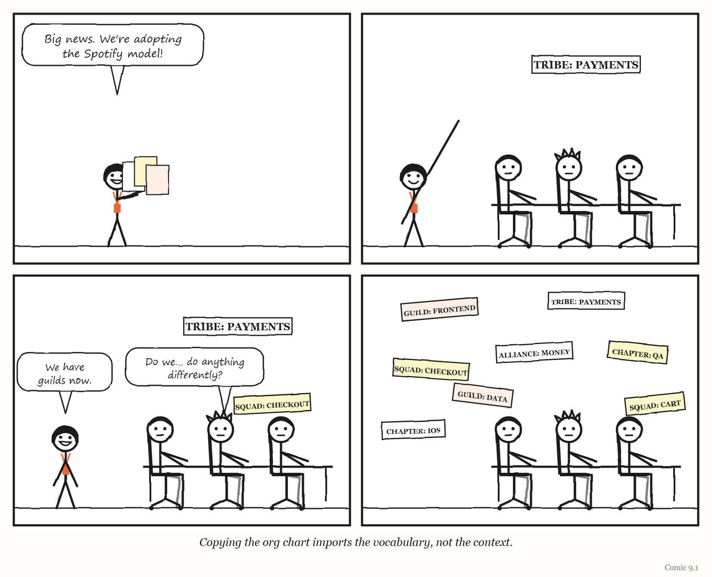
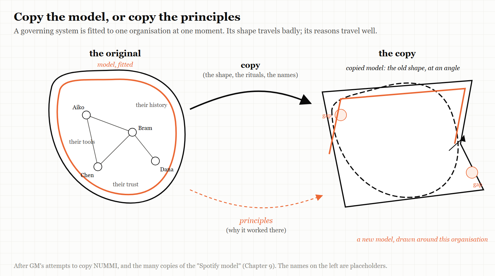

# 9. The Model You Copied

*A governing system is a model of one organisation at one moment. Move it, and it stops fitting.*

> "A time-varying model will be needed to regulate the time-varying reguland."
> — Roger C. Conant and W. Ross Ashby, 1970

---

In 1984, General Motors and Toyota opened a car factory together in Fremont, California.

The joint venture was called NUMMI — New United Motor Manufacturing, Inc. — and it was one of the most generous offers in industrial history. Toyota would show GM, in GM's own former plant, with an American workforce, exactly how the Toyota Production System made cars of much higher quality at much lower cost than GM could.

The Fremont plant had a reputation. Its workforce had been considered one of the worst in the American car industry. Under Toyota's system, according to the radio programme *This American Life*, which told the story in two episodes in 2010 and 2015, those same workers adapted well, and quality improved rapidly. The lesson could hardly have been clearer. It was not the people. It was the system.

And then GM tried to take the system home.

It did not go well. GM's first attempt to replicate NUMMI — at its plant in Van Nuys, California — failed. Some senior GM leaders had treated the whole NUMMI venture as optional learning: a chance that they might learn something, or might not. At Van Nuys, as *This American Life* told it, the workers did not believe threats of closure, because their plant — unlike Fremont — had never actually been shut down. Many union members saw the Toyota system as a threat, because a more efficient plant needs fewer workers, and resentment grew when seniority no longer counted the way it had. Managers resisted losing familiar privileges; according to the programme, one supervisor said they would quit en masse rather than share a parking area with workers. And the system could not work in isolation: suppliers would not redesign their parts, and management elsewhere resisted the changes. Quality at Van Nuys did not improve, and in 1992 GM closed the plant, and 2,600 people lost their jobs.

GM did eventually adopt Toyota's methods, but slowly. After heavy losses in 1992, a new chief executive, Jack Smith, began implementing the Toyota production system rapidly; by around 2000 a generation of managers had passed through NUMMI; and in the early 2000s the company built its own Global Manufacturing System on Japanese principles. By the programme's account, real adoption took about fifteen years — too slow to prevent the company's bankruptcy: GM filed for Chapter 11 protection on 1 June 2009. (Many forces drove that filing, from the financial crisis to legacy costs; the programme's point is narrower — that the better system arrived too late to help.)

NUMMI itself built its last car, a Corolla, in April 2010, and 4,500 people lost their jobs. The plant was later bought by Tesla — and became the factory where, as Chapter 3 describes, Tesla discovered in 2018 that it had over-automated.

GM had been given the answer, in its own building, with its own workers. And it could not move it to its other plants.

This chapter is about why.

---

## The fourth comment

Recall the fourth of Conant and Ashby's comments on their own theorem, from Chapter 2. A regulator must be a model of the system it regulates — and if the system changes, "a time-varying model will be needed to regulate the time-varying reguland."

Read that from the other direction and it becomes the lesson of NUMMI. A governing system — a production system, a management model, an operating model for software teams — is a **model of a particular organisation, at a particular moment**. It was fitted to that organisation's people, history, incentives, relationships and problems. Its power comes from how well it fits.

Lift it out and drop it somewhere else, and you have a regulator modelling a system that is not there. It may look the same — the same meetings, the same job titles, the same diagrams on the wall. But it is regulating the wrong thing.

What transfers easily is the **artefact**: the org chart, the vocabulary, the tools, the rituals. What does not transfer is the part that made the artefact work — the fit between the model and the organisation it was built for. Or, in the language of Chapter 1: the legible parts of a working system travel; the metis stays behind.

> **IN SMALL WORDS**
> A way of running things is made to fit one group of people at one time. If you copy it to a different group, you copy the shape but not the fit — and the fit was the part that worked.

---

## The model Spotify didn't run

The most copied organisational model in software history has a strange distinction: according to people who worked there, the company it is named after never ran it as described.

In November 2012, two coaches working with Spotify — Henrik Kniberg, an agile coach, and Anders Ivarsson, the company's organisational coach — published a short paper called "Scaling Agile @ Spotify with Tribes, Squads, Chapters & Guilds." It described how Spotify organised its engineers at the time: roughly 30 teams across three cities. Two animated videos about Spotify's engineering culture followed in 2014. Small autonomous teams were called *squads*. Squads working in related areas formed *tribes*. People with the same skills across squads formed *chapters*, and looser communities of interest formed *guilds*. The material was clear, attractive and well illustrated, and it spread across the software industry. Companies everywhere renamed their teams squads and their departments tribes.

The people closest to it tried, repeatedly, to warn against copying it.

In 2016, the Spotify chapter lead Marcin Floryan gave a talk whose message was summarised in its reporting as "there is no Spotify model." He urged audiences not to imitate successful companies on the strength of their reputation, and explained that Spotify's actual practice was continuous change around a few principles — autonomy with alignment, trust, decisions informed by data — rather than a fixed structure. The original authors had been careful to describe what Spotify was doing at that particular moment, not what other companies should do — a distinction Kniberg has stressed repeatedly since.

In 2020, Jeremiah Lee, who had been a product manager at Spotify from 2017, published an essay called "Spotify's Failed #SquadGoals." He argued that the model had never worked as described. In his account, chapter leads were responsible for people's career development but had no accountability for what got delivered; engineering managers were not true peers of product managers; and disagreements had to be escalated through several chapter leads. Spotify, he wrote, had published the parts about *autonomy* and never finished the parts about *alignment and accountability* — and teams got little coaching in the agile methods the model assumed. He quoted Joakim Sundén, a Spotify agile coach from 2011 to 2017, saying that even at the time the material was written, Spotify was not really doing it. And he quoted Anders Ivarsson, one of the original authors, worrying that people treated it as a framework to copy.

So the companies that copied the Spotify model were copying a model of an organisation that — according to people inside it — was an aspiration, a snapshot of a moment, and in part a description of something that did not quite exist.

<!-- COMIC 9.1 script: Four panels. Panel 1 — DEE, returning from a conference, arms full of posters: "Big news. We're adopting the Spotify model!" Panel 2 — DEE sticking a sign reading *TRIBE: PAYMENTS* above a desk where PAT and two colleagues sit. Panel 3 — DEE, sticking a smaller sign reading *SQUAD: CHECKOUT* on PAT's monitor. PAT: "Do we... do anything differently?" DEE: "We have guilds now." Panel 4 — no words. The same three people at the same desks, doing the same thing, surrounded by a great many new signs. Caption: *Copying the org chart imports the vocabulary, not the context.* -->
---

## The tool that works at home

The Spotify story has a sequel, and this time it is about software rather than org charts.

Spotify built an internal developer portal — a single place where engineers can find every service, its owner, its documentation and the approved way to create new ones. It released it as open source under the name **Backstage**, and it became one of the most widely adopted tools in platform engineering.

In November 2023 the trade publication TechTarget reported a striking contrast. Inside Spotify, adoption of Backstage was voluntary and nearly universal — reported elsewhere as around 99%. But Spotify itself estimated that the *average* adoption rate inside other organisations that had installed it was roughly **10%**. The reasons adopters gave were revealing: code scattered across many repositories, inconsistent information about which team owned which service, disagreements between stakeholders about a central catalogue, and — in regulated industries such as banking — constant pressure from compliance requirements. Spotify's stated priority for the year was simply to make it easier to use.

The tool was the same. The organisations were not. At Spotify, Backstage sat on top of years of accumulated practice: consistent ownership information, agreed ways of building services, a culture that expected to use the portal. That practice was the model. The software was only its visible surface. Installing the surface elsewhere did not install the model underneath.

The point is not that Backstage is a bad tool. It is that a governing tool is only as good as its fit to the organisation it governs — and the fit does not come in the box.

---

## Self-management, copied and reversed

Operating models for whole companies travel the same way.

In 2014, the online shoe retailer Zappos, under its chief executive Tony Hsieh, adopted **Holacracy**, a system of self-management that replaces conventional managers with explicitly defined roles and a formal process for governance. In 2015, employees were offered a choice: embrace the new system, or take a buyout and leave.

> **MYTH**
> "Eighteen percent of Zappos staff quit over holacracy."
> **RECORD**
> In early 2016, Zappos's chief operating officer, Arun Rajan, told staff that 260 people had left since March 2015 — about 18% of the company. Roughly 210 of those, about 14% of around 1,500 employees, had taken the first buyout offer; a second offer added about 50 more. These were paid exits the company offered to anyone who did not want the new system — not ordinary resignations. The organisation deliberately bought out its own dissenters.
> *Sources: Las Vegas Review-Journal, TIME, the Washington Post and HR Dive, January 2016.*

Zappos kept changing. In March 2017 it layered on what it called Market-Based Dynamics: an internal marketplace in which teams run like small businesses, each with its own profit-and-loss account. At first this was presented as an improvement to Holacracy rather than a replacement — a way of turning an inward-looking system back towards the customer. By February 2020, *Quartz at Work* was reporting that Zappos had "quietly backed away" from Holacracy towards more conventional management. The online publisher Medium had adopted Holacracy too; in 2016 it announced it was leaving it, having concluded the system was getting in the way of the work. It kept the principles it valued, such as distributed authority and explicit roles, and replaced the formal system with its own simpler processes.

Goal-setting systems travel the same way. In a 2022 article titled "Why We Stopped Using OKRs," the company founder Kyle Racki described rolling out the popular objectives-and-key-results method across a whole organisation at once. Teams bent existing projects to fit the format, squeezed multi-year ambitions into quarters, and wrote key results with no baseline; the company spent heavily on software, training and planning retreats. It replaced the system with a short list of priorities set by management, with teams choosing how to deliver them. OKRs have a famous origin: Andy Grove developed them at Intel in the 1970s and described them in his 1983 book *High Output Management*, and John Doerr, who had learned them in a course Grove taught at Intel, introduced them to Google in 1999, when it had fewer than forty employees. Racki's company was neither Intel nor early Google.

None of these systems is foolish. Each was fitted to somewhere. The recurring lesson in every one of these stories is the same: a governing model is a model of the organisation it came from. Copy it whole, and you import a regulator for someone else's system.

> **WEIRD TRUE THING**
> In his commencement address at Caltech in June 1974, the physicist Richard Feynman gave a memorable name to research that follows the outward forms of science without the substance: *cargo cult science*. His image came from reports, as he understood them, of South Pacific islanders who after the Second World War built imitation airstrips in the hope that planes laden with goods would land. (Anthropologists describe the movements he was alluding to as far more complex, and far more reasonable, than his image suggests — a reminder that a borrowed picture of other people is itself a kind of copied model.) Copying another company's org chart in the hope that its results will land is the same move.

---

## What does transfer

If copying fails, how does anything good ever spread from one organisation to another?

The cases in this chapter, and the people who lived through them, point in the same direction.

**Copy principles, not org charts.** Floryan's advice from inside Spotify. The ideas behind the model — autonomy with alignment, trust, data-informed decisions — can travel. The specific structure that expressed them at one company, at one moment, cannot.

**Copy the practice underneath, not the tool on top.** Backstage worked at Spotify because of the ownership data, the conventions and the habits beneath it. An organisation that wants what Backstage gave Spotify has to build those first; the portal is the last step, not the first.

**Adapt, don't adopt.** Medium kept the principles of Holacracy and dropped the ritual. Zappos changed its system again and again. The organisations that got value from someone else's model treated it as raw material to be re-fitted, not a finished product to be installed.

**Keep the model changing.** This is the deepest lesson, and it is Conant and Ashby's fourth comment again. Even the organisation that *invented* a model cannot keep it fixed, because the organisation keeps changing. Spotify's own staff said its practice evolved continuously. The Netflix engineering blog described a similar principle for its internal tools in 2018: teams can leave the "paved road" if they choose, but then take responsibility for their alternative — a design that lets the model and the organisation keep adjusting to each other rather than freezing in place.

**Invest in learning, not just installing.** NUMMI's lesson, finally, is about people. GM's Van Nuys failure came from converting a plant without retraining its workforce. The Toyota system was not a set of procedures that could be written down and moved. It lived in the skills, habits and relationships of the people who ran it — metis again — and those can only be grown, not shipped.

> **THE MECHANISM**
> 
> 
> <!-- FIGURE 9.1 illustrator brief: Two organisations side by side. On the left, the original: a regulator box containing a model, fitted closely to a work system drawn with many specific details — named people, particular tools, a history timeline, a web of relationships. On the right, a second organisation with a different shape of work system. An arrow labelled *copy* carries the regulator box across — but the model inside it still has the *left* organisation's shape drawn on it, and it sits over the right organisation's work at an awkward angle, with gaps showing. A second, thinner arrow labelled *principles* also crosses, and on the right a new model is being drawn around it to fit. -->
> Copying a governing system moves a model of somebody else's organisation. Copying the principles and building a new model to fit is slower — and it is the version that works.

---

## The Image

A Toyota system, working brilliantly in a plant in Fremont — and the company that had been shown it there, unable to make it work anywhere else.

## The Reversal

Some things do transfer well, and standardisation is often exactly right. Shared protocols, common tools and industry-wide practices let organisations cooperate, hire, and learn from one another; nobody should invent their own version control system to preserve their uniqueness. And sometimes copying a good model, imperfectly, is far better than having none — a startup that adopts a sensible off-the-shelf process may do better than one that improvises from scratch. The lesson is not "never copy." It is: know that what you are copying is a model of somewhere else, and budget the time to re-fit it to here.

## The Rules

1. **A governing model is a model of one organisation at one moment.**
2. **Copy principles, not org charts.**
3. **Copy the practice underneath, not the tool on top.**
4. **Adapt, don't adopt — and keep adapting.**
5. **The part that made it work is usually the part you can't see.**

## Diagnose

- Which of your organisation's processes, structures or tools were copied from another company? What problem were they solving *there*?
- What was underneath that model at its origin — the data, habits, culture, history — that you don't have?
- When did your own operating model last change? Has your organisation changed since?
- Which of your team's rituals would you keep if you had to explain, from scratch, what each one is for?

## Try This

Pick one practice your organisation imported from elsewhere — a meeting format, a team structure, a goal-setting method, a tool. Write two short lists: *what it did for the organisation that invented it*, and *what it actually does for us*. If the lists are different, you are running someone else's regulator.

## Your Turn

A 200-person company adopts a well-known internal developer portal after seeing a conference talk about how it transformed another company. After a year, 15% of teams use it. Leadership proposes making it mandatory. Using this chapter, explain what is probably happening, what mandating it would and would not fix, and what you would do instead. *(Worked answers are at the back of the book.)*

## In One Paragraph

A governing system — a production system, an operating model, a platform tool — is a model of one organisation at one moment, and its power comes from its fit. GM was taught Toyota's system in its own Fremont plant and could not spread it for more than a decade; companies across the software industry copied a "Spotify model" that, according to people who worked at Spotify, the company never ran as described; Backstage reached near-universal voluntary use inside Spotify but around 10% on average elsewhere; Zappos and Medium adopted Holacracy and moved away from it. What transfers is the artefact; what made it work — the fit, the practice underneath, the people's skill — stays behind. Copy principles rather than org charts, build the practice before the tool, adapt rather than adopt, and keep the model changing as the organisation does.

## Go Deeper

- *This American Life*, episodes 403, "NUMMI" (2010), and 561, "NUMMI 2015" — full transcripts online.
- Jeremiah Lee, "Spotify's Failed #SquadGoals" (19 April 2020), jeremiahlee.com.
- Ben Linders, "There is No Spotify Model," *InfoQ* (6 October 2016), reporting Marcin Floryan's talk.
- Beth Pariseau, "Behind the scenes: Spotify Backstage a work in progress," *TechTarget* (7 November 2023).
- Philip Fisher-Ogden, Greg Burrell and Dianne Marsh, "Full Cycle Developers at Netflix," *Netflix Technology Blog* (2018).
- Aimee Groth, reporting on Zappos and Holacracy, *Quartz at Work* (3 February 2020); Corporate Rebels, "Zappos's Evolution: From Holacracy to Market-Based Dynamics."

---

*The Haiku Line*

> We copied the chart.
> Tribes, squads, chapters, guilds — the lot.
> Nobody asked why.
