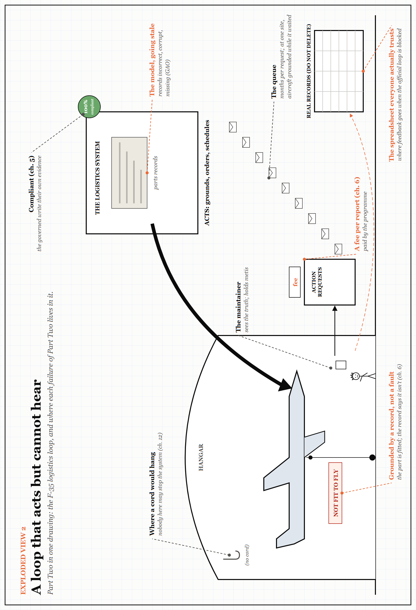

# Exploded View 2 — A Loop That Acts but Cannot Hear

*Part Two in one drawing. Every label points to something you have already met; look closely for the small jokes. The drawing is printed sideways: turn the book.*

Part Two described four ways a governing layer fails. This drawing puts all four in one loop, using the F-35 logistics system from Chapter 6 as the frame.

- **The thick arrow** is the system acting: grounding aircraft, ordering parts, scheduling work. It is strong.
- **The thin, queued path back** is feedback: a fee per report, and months per request. It is weak. A regulator that acts strongly on an old picture will act, strongly, in the wrong direction.
- **The green badge** is Chapter 5: a system that reports itself compliant, because the governed write their own evidence.
- **The hook with no cord** is Chapter 12's question, asked early: who here may stop the system?
- **The spreadsheet** is where the truth goes when the official loop will not take it. Every organisation has one. Most do not know where theirs is.
