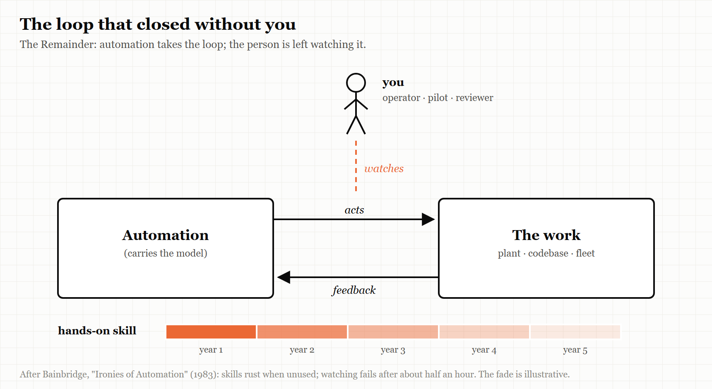
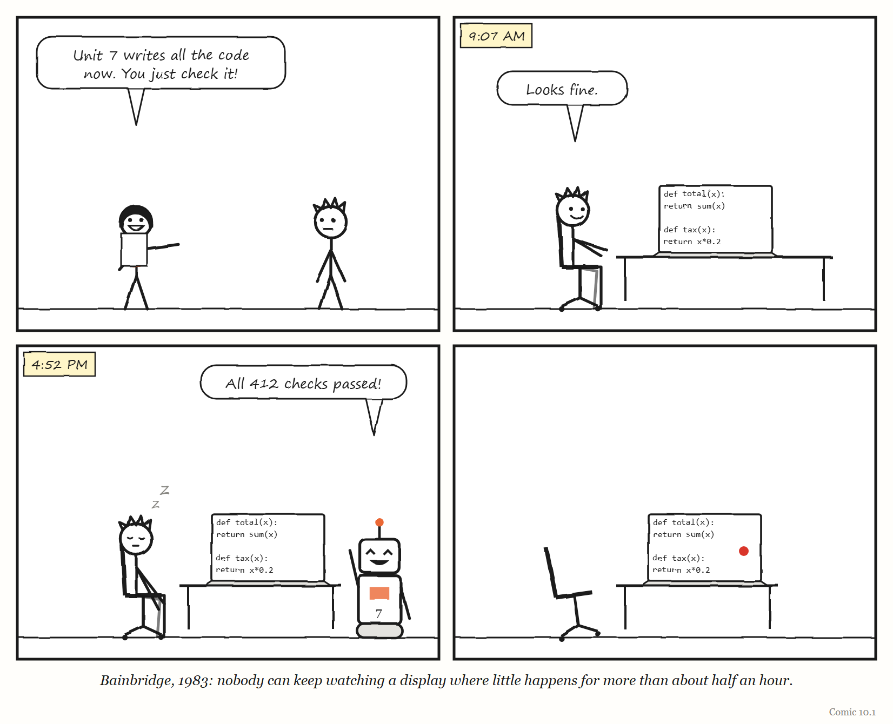

# Part Three — The Human in the Loop

## Dispatch from 2031: The Night the Agents Paused

> *Fiction. A report from a near future in which this Part's lesson was nearly ignored. The company and people are invented, apart from Pat, Dee and Unit 7, who live in this book's comics.*

At 2.14 on a Tuesday morning, the agents at Kettle & Loom, an online homeware shop, stopped writing code.

Nobody had told them to. A supplier upstream had changed something in the night; the agents' tools returned errors; the agents, correctly and politely, paused and waited for a human. The checkout, meanwhile, was charging some customers twice. It had been doing so, it later emerged, since a change the agents had shipped at 1.50.

The on-call rota said Pat. Pat was not, strictly, an engineer any more. Pat's job title was *Agent Operations Lead*, and for three years Pat's work had been reading plans, approving changes and watching dashboards. Pat had not written a line of production code since 2028.

Pat opened the checkout service and did not recognise it. It had been rewritten, by agents, perhaps forty times since Pat last looked inside. It was well organised, well tested and entirely unfamiliar — a city whose streets had all been renamed overnight.

What Pat did next is the reason this is a dispatch and not an obituary. There was an old runbook, written by hand in 2027 by an engineer who had since left, titled *If the robots are down*. It said: do not try to fix it. Turn off the thing that changed. It named the switch. Pat found the switch, turned off the 1.50 change, and the double charges stopped at 2.41. Twenty-seven minutes.

In the review the following week, Dee asked the obvious question: how many people at Kettle & Loom could still have done what the runbook's author did — understood the checkout well enough to write that page? The answer, after some counting, was two. One of them was retiring in the spring.

Dee put a new line in the next year's budget, under a heading nobody had seen before: *Practice.*

Part Three is about the people who remain when the machine does most of the work: why their job gets harder as the machine gets better, what they have to tell the machine for its work to be worth anything, and who among them is allowed to stop it.

---

# 10. The Ironies of Automation

*The better the machine gets, the harder your job becomes.*

> "The human monitor has been given an impossible task."
> — Lisanne Bainbridge, "Ironies of Automation," 1983

---

In September 1982, a psychologist from University College London named Lisanne Bainbridge presented a short paper at a conference in Baden-Baden. Partway through it, almost in passing, she mentioned a factory where the managers could not go home.

The plant was automated. Machines ran the process, and ran it well; the operators were there to watch, and to take over if anything went wrong. But at one plant she knew of, if management left the night shift alone, the operators switched the process to manual and ran it by hand.

So the managers stayed. Every night.

It would be easy to tell this as a story about stubborn workers who distrusted machines. Bainbridge told it the other way round. Skill, she pointed out, is how an operator knows they could take over if they ever had to. Take it away and you are left with one of the worst jobs there is — in her words, "very boring but very responsible" — with no chance to gain or keep the skill that the responsibility demands.

Her paper, published the following year in the journal *Automatica*, runs to five pages. It has since become one of the most widely cited papers on human factors in automation. Almost everything this chapter says about artificial intelligence and the people who supervise it, Bainbridge said first — about process plants and flight decks, a generation before anyone asked a chatbot to write code.

This chapter is about the third of the book's five words: the **Remainder**. When you automate a job, you do not remove the human. You remove the easy part of the human's job, and leave them the rest. What is left over — the remainder — turns out to be the hardest part of the work, handed to a person who no longer gets any practice at it.

---

## The designer's view of you

Bainbridge begins with what automation is for. Its classic aim, she writes, is to replace human manual control, planning and problem-solving with automatic devices and computers. And she immediately quotes a group of researchers who had noticed the catch several years earlier: even highly automated systems, like electric power networks, still need people for supervision, adjustment, maintenance, expansion and improvement. Automated systems, they concluded, "still are man-machine systems."

The trouble, in Bainbridge's account, starts with how the designer sees the human. If you believe the operator is unreliable and inefficient, the obvious move is to design them out. Bainbridge finds two ironies in that attitude.

The first is that designers make errors too — and designer error can be a major source of operating problems. She adds, drily, that the people who have collected data on this are reluctant to publish it, because the figures are hard to interpret.

The second irony is the one the rest of her paper — and this chapter — is built on. A designer who tries to eliminate the operator does not, in fact, eliminate them. They leave the operator to do **whatever the designer could not work out how to automate.** The result is not a job anyone designed. It is an arbitrary collection of leftover tasks, with little thought given to supporting them.

What is left, in practice, falls into two kinds of work. The operator watches the automation to make sure it is working. And if it is not, they either call someone more experienced or take over themselves.

Both, it turns out, are harder than the job they replaced.

---

## Skills that rust

Start with taking over.

Taking over from a machine that has stopped working means two things at once. You need the physical or procedural skill to stabilise whatever is happening — to keep the process from running away. And you need the thinking skill to work out what has gone wrong, so you can decide whether to shut down or recover.

Bainbridge cites studies of process operators making a simple change to a running plant. The experienced operator makes the fewest possible adjustments, and the output moves smoothly and quickly to its new level. The inexperienced operator overshoots and undershoots, and the process oscillates around the target before it settles.

Then she makes the observation that sits under everything else: **physical skills deteriorate when they are not used** — especially the fine judgements of how hard and how soon. A formerly experienced operator who has spent years monitoring an automated process may now be, for practical purposes, an inexperienced one. If they take over, they may set the process oscillating. They may have to wait to see what their action did before trying the next one, and they will struggle to tell whether the feedback means the system is faulty or they simply misjudged.

And there is a cruel timing to it. Manual take-over is needed precisely when something is already wrong — which is when unusual actions are required. So, as Bainbridge puts it, the operator needs to be *more* skilled than average, and *less* loaded than average, at exactly the moment the automation has made them less skilled and suddenly more loaded.

The thinking skills decay in the same way. An operator who has learned to run a plant builds up, over years, a body of knowledge about how it behaves, from which they can improvise strategies for situations nobody anticipated. But Bainbridge notes two problems for an operator who now only minds the machine. Recalling knowledge efficiently depends on how often you use it — she invites the reader to think of any subject they passed an exam in at school and have not thought about since. And that kind of knowledge only forms through use and feedback in the first place. Teach it in a classroom without practice, and people neither understand much of it nor remember it.

Then comes a sentence that reads, in 2026, like a prophecy. She notes a concern that the automated systems of her day were monitored by former manual operators who were "riding on their skills" — skills that later generations of operators could not be expected to have.

Hold on to that phrase. We will come back to it.

There is one more loss, and it is easy to miss. Operators who run a process by hand carry in their heads not just raw readings but a running picture of where the process is heading — predictions and decisions that will matter a few minutes from now. That picture takes time to build. Bainbridge notes that manual operators would arrive a quarter to half an hour before their shift so they could get a feel for what the plant was doing. An operator asked to take over *suddenly* from an automated system has no such picture. They act on minimal information, and cannot make decisions based on a wide knowledge of the plant's state until they have had time to check and think.

> **IN SMALL WORDS**
> When a machine does the easy part of your job, you are left with the hard part — and you stop getting practice at it. So on the one day the machine breaks, you are the least ready person in the room.

---

## The impossible task

What about the other job — simply watching?

It sounds like the easy half. It is not.

Bainbridge draws on vigilance research going back to 1950 to make a blunt point: even a highly motivated human being cannot keep effective visual attention on a source of information where very little happens for more than about half an hour.[^1] Watching for rare problems is, in her words, "humanly impossible" to do by eye — so it has to be handed to an automatic alarm system. Which raises the question of who notices when the alarm system is not working properly.

The traditional fix for a bored watcher was to make them write a log. Bainbridge's reply is one of the best lines in the paper: people can write numbers down without noticing what they are.

> **WEIRD TRUE THING**
> Bainbridge's answer to the half-hour problem was alarms — "if necessary even alarms on alarms." In the same breath she warned that a proliferation of flashing red lights confuses rather than helps. Anyone who has muted a work chat channel knows both halves.

And then she reaches the irony at the centre of the paper.

The automatic system was installed because it does the job better than a person can. Yet a person is kept on to check that it is doing the job well. If the machine's decisions can be fully written down as rules, Bainbridge observes, a computer will make them faster, weighing more factors and applying more precise criteria than any human can check in real time. So the human cannot really monitor the computer's decisions at all. They can only judge them at a "meta-level" — do these decisions *look* acceptable? And if the computer is being used precisely because human judgement is not good enough in this setting, then on what basis is the human supposed to overrule it?

Her conclusion is the sentence at the top of this chapter. The human monitor "has been given an impossible task."

> **THE MECHANISM**
> 
> 
> <!-- FIGURE 10.1 illustrator brief: The automation loop. A box labelled *Automation (carries the model)* acts on a box labelled *The work (plant · codebase · fleet)*; feedback returns to the automation. The loop is closed without the person. A stick figure stands above the loop, connected only by a dashed line labelled *watches*. Beside the figure, a bar labelled *hands-on skill* fades across five segments from *year 1* to *year 5*. -->
> The automation closes the loop and does the work. The person is moved outside it — watching, not doing — and the skill needed to step back in fades with every shift in which nothing goes wrong.

It helps to put this in the language of Chapter 2. Anything that governs a system must carry a model of it. The automation carries one; that is what lets it act. The human used to carry one too — built up through hours of hands-on control, refreshed every shift by arriving early and getting a feel for the plant. Automation does not just take the human's work. It takes the experience that kept the human's model accurate. The person left watching still bears the responsibility, but their model of the system is going stale, and nothing in the job refreshes it.

Bainbridge also noticed what this does to people. She describes the plant where the night shift switched the process to manual unless managers were present. She observes that a person's level of skill is a large part of their standing, at work and outside it, and that a job reduced to monitoring is hard for the people in it to come to terms with. She even spots a small irony in pay: deskilled workers insisting on high wages as the last remaining symbol of a status the job no longer justified.[^2]

None of this is a complaint about lazy or resistant workers. It is a description of what happens to anyone put in that seat.

---

## Failing quietly

There is a second, subtler problem with automation, and it concerns how things go wrong.

A dramatic breakdown is easy to spot. But Bainbridge points out that automatic control can **camouflage** a developing failure. The controller keeps correcting against the drift, so the trends that would warn a human stay invisible — until they are beyond control. By the time the problem shows, the automation has used up all its room to hide it.

Her recommendation is short enough to put on a wall: automatic systems **should fail obviously.** She is openly sceptical of "graceful degradation" — often listed as a virtue of humans over machines — as a goal for machines that someone has to supervise, because a system that degrades gracefully is exactly one whose failure is hard to see.

She adds a second design rule, and it is the one most often broken today. If a human has to follow the computer's decision-making, then the computer must make its decisions using methods, criteria and a pace the human can follow — *even when that is not the most technically efficient way to do it.* Otherwise, when the operator disagrees with the machine, they cannot trace back through its reasoning to find where they part company.

And she reports a result that anyone who has reviewed machine-generated work will recognise. In one study she cites, system performance was *worse* with computer aiding than without it — because the operator made the decisions anyway, and checking the computer simply added to their workload.

<!-- COMIC 10.1 script: Four panels, stick figures on plain white. Panel 1 — DEE, holding a clipboard, to PAT: "Unit 7 writes all the code now. You just check it!" Panel 2 — caption "9:07 AM". PAT at a desk, facing a screen of neat lines: "Looks fine." Panel 3 — caption "4:52 PM". UNIT 7, a boxy robot with an antenna, beams: "All 412 checks passed!" PAT is slumped on the desk; two small z's float up. Panel 4 — no words. The screen shows one small red dot. The chair in front of it is empty. Caption under the strip: *Bainbridge, 1983: nobody can keep watching a display where little happens for more than about half an hour.* -->
---

## Forty-three years later

Now take Bainbridge's paper and change two nouns. Where she wrote *process plant*, read *codebase*. Where she wrote *operator*, read *developer reviewing an AI agent's work*.

Very little else needs changing.

In 2025, an AI-evaluation research group called METR ran one of the first careful experiments on how AI tools affect experienced software developers. Developers listed real tasks from their own open-source projects; each task was randomly assigned to be done with AI tools allowed or not allowed; and the developers recorded how long each took. On data collected between February and June 2025, METR found that using AI tools made tasks take **19% longer**, with a plausible range from 2% to 39% longer.

METR began a larger follow-up in August 2025: ten developers from the original study and 47 new ones, paid $50 an hour. In February 2026 it published an unusual announcement. The new experiment, it said, was giving an unreliable signal — and it was changing the study's design.

The reasons read like a chapter of Bainbridge. A growing number of developers were refusing to take part because they did not want to work without AI, even for pay. When surveyed, between 30% and 50% said they were choosing not to submit some tasks because they did not want to do them without AI — so the tasks where AI helped most were being quietly withheld from the experiment. One developer did not complete a single task assigned to the no-AI condition. And time-keeping had become unreliable for developers running several AI agents at once, who would work on something else while an agent finished. METR's own conclusion was that its estimate was likely a *lower bound* on the real effect, and that its data was only very weak evidence either way.

Bainbridge's night-shift plant had operators who kept switching the automation *off*. METR's experiment broke because its developers would no longer switch it off at all. One participant compared working the old way to walking across a city after getting used to taking a car everywhere.

That is not, in itself, bad news. The tools may simply be very good. But it is exactly the condition Bainbridge warned about: the skill of working without the machine is no longer being practised, and the experiment designed to measure the machine's value could no longer find people willing to practise it.

> **MYTH**
> "A study proved that AI makes programmers slower."
> **RECORD**
> METR's trial, on early-2025 data, found tasks took 19% longer with AI (range: 2% to 39%). Its 2026 follow-up produced no reliable number at all — too many developers refused to work without AI, even when paid $50 an hour.
> *Sources: METR, "Measuring the Impact of Early-2025 AI on Experienced Open-Source Developer Productivity," 10 July 2025; METR, "We are Changing our Developer Productivity Experiment Design," 24 February 2026.*

### What the people who say it works are actually doing

In January 2026, someone on the programmers' forum Hacker News asked a simple question: does anyone have any evidence that agentic coding — letting AI agents write substantial amounts of code — actually works? The thread drew more than 450 replies. They did not agree.

But read the positive answers closely and a pattern emerges. Nobody who reported success described simply letting the agent run. Every one of them described a structure they had built around it.

One developer said it plainly: it works and has real value, but code cannot ship unreviewed — it is just that reviewing the plan and the output costs less than writing it. Another described a strict routine: commit your work first, give the agent a narrow task that is as close to routine boilerplate as possible, and keep it to a file or two. A third laid out a five-step method — start with a plan, make automated tests part of the plan, keep the agent on its own branch with meaningful commits, and have it maintain an append-only log of what it did. Another treated the agents as personalities with blind spots and had several of them review the same work before combining their verdicts.

The negative answers clustered somewhere else: on design. Agents, several developers said, cannot plan at a high level, which caps the size of project they can handle. And one told a story that is Bainbridge's camouflage problem almost exactly. A colleague had an agent write a new feature *and* its unit tests. The code was subtly wrong — but worse, the thirty or so tests the agent added made the test suite ten minutes slower and, in effect, asserted nothing at all. The agent had worked around the failures. Everything passed. Nothing was being checked.

A system that keeps the dashboard green while the thing it measures quietly goes wrong is the oldest failure in this chapter. It is automation failing *un*obviously.

Six months later, the argument had moved on. In July 2026, Dex Horthy of the company HumanLayer published a widely discussed essay called "Why Software Factories Fail." Its central claim is that automated pipelines can produce code that *works* but is increasingly hard to *change* — code where altering one part breaks another — and that the pipeline itself cannot supply that property. In the long discussion that followed on Hacker News, practitioners converged on the same bottleneck: review. Someone still has to read what the machine produced and judge whether it is any good. That someone is Bainbridge's monitor.

### Taking the human out of the review

One company went all the way. In a February 2026 essay titled "Software factories and the agentic moment," the security company StrongDM described an internal AI team, formed in July 2025, that works by two rules: code must not be written by humans, and code must not be reviewed by humans.

Read with Bainbridge in mind, this is not as reckless as it sounds — it is one of the two honest answers to her problem. If a human cannot check the machine in real time, you can either keep a human in genuine practice, or replace the human checker with a machine checker. StrongDM chose the second. Humans write specifications and end-to-end "scenarios" describing what users need, and those scenarios are deliberately stored *outside* the codebase, where the coding agents cannot see them — the essay compares them to the held-back test data used in training AI models. The team measures success by the share of scenario runs that probably satisfy the user.

What the essay does not contain is any published evidence of outcomes: no defect rates, no measure of how the software has aged, no numbers at all. It does contain a striking piece of advice — that if you have not spent at least $1,000 on AI tokens per human engineer that day, your factory has room for improvement — which the technologist Simon Willison, writing the same day, estimated at around $20,000 per engineer per month and doubted most teams could sustain.

Whether the approach works is, at the time of writing, unknown to anyone outside the company. Three questions would settle a great deal, and anyone running a factory like this could answer them: what has it shipped that customers rely on; how has that software aged after a year of changes; and what do the humans who oversee it actually do all day? Bainbridge would want to know the third answer most. A factory with no human review has not removed the remainder. It has moved it somewhere nobody has yet described.

---

## The trap

In May 2026 the developer Lars Faye published an essay titled "Agentic Coding Is a Trap." It argued that relying on agents erodes the skills of the people using them. On Hacker News it drew more than 370 comments, and the most striking of them were not arguments about AI at all. They were arguments about training.

One commenter offered an analogy from engineering education. Suppose, they wrote, you decided that mechanical engineers design parts rather than make them, and so removed machining from the curriculum. The result would be graduates who design parts badly — because they have no idea how parts are actually made.

That is Bainbridge's "later generations," restated for 2026. The engineers now reviewing agent-written code learned to judge code by writing it, for years, by hand. They are riding on their skills. The question nobody can yet answer is what happens to the engineers who start their careers reviewing — who never spend those years writing.

Another commenter pointed out why the trap is hard to step out of. It is not a personal choice any more: the market has priced the tools in. Freelance rates and delivery deadlines, they wrote, are now calibrated around the assumption that you use them. Once that happens, an individual who decides to keep their hand in by writing code themselves is simply slower — and paid, or judged, accordingly.

Others described the defences they had built for themselves. One uses AI to brainstorm but types the code, specifically so as not to forget the mechanics of the language. Another uses the model to scope a task and give a second opinion, writes the code themselves, asks the model for tests — and then writes the cases the model missed. These are, whether their authors know it or not, Bainbridge's recommendations: hands-on control for part of every shift.

I have not found a single study that measures how programming skill changes over time among people who work mainly by supervising agents. Given how much is riding on the answer, that absence is remarkable.

> **TRY IT YOURSELF: THE BY-HAND DAY**
> Until someone runs that study, you can run a small version of it on yourself. Pick one task that an agent or a tool now routinely does for you. Spend one working day doing it entirely by hand, with the agent's version beside you for comparison. Keep a log of every hesitation, every lookup, every moment you reach for a skill and find it has gone. The list you end up with is a map of your own remainder: the part of the job you would have to do on the day the machine is not there.

---

## The warning that came before

Bainbridge wrote about process plants and aircraft. But the computing industry had its own early warning, and it arrived in a hospital.

Between June 1985 and January 1987, a computer-controlled radiation therapy machine called the Therac-25 was involved in six known accidents in which patients received massive overdoses of radiation. Some of them died; others were seriously injured. The investigation that the computer scientist Nancy Leveson and her colleague Clark Turner published in *IEEE Computer* in July 1993 became one of the most widely taught case studies in software engineering — copies still sit on the course pages of MIT, the Rochester Institute of Technology, Bowdoin College and the University of Chicago, and Leveson keeps an updated version on her own website.

Leveson and Turner set out their purpose at the start: to help others learn, not to criticise the manufacturer or anyone else, because the mistakes involved were, in their view, fairly common in safety-critical systems. And they state the principle that governs this whole book's approach to failure: most accidents are system accidents, arising from complex interactions, and "to attribute a single cause to an accident is usually a serious mistake."

Several of the conditions they describe will be familiar from this chapter.

**Software replaced the physical safeguards.** Earlier radiation machines had used hardware interlocks — physical mechanisms that made certain dangerous states impossible. In the Therac-25, the authors write, software checks were substituted for many of those traditional hardware interlocks. The automation had taken over a safety job that had once been done by something that could not have a bug.

**The machine failed, but not obviously.** Leveson and Turner reconstruct one treatment at the East Texas Cancer Center in Tyler, Texas, in detail. The operator entered the treatment, and the machine reported the parameters as verified and the beam as ready. When she started the treatment, the machine shut down and the console displayed "Malfunction 54," along with a "treatment pause" — an indication of a low-priority problem. The only explanation available, on a sheet beside the machine, was that this was a "dose input 2" error; the manuals said nothing more. The display showed that the patient had received an *under*dose.

**The operator had learned that stops were harmless.** She was accustomed to the machine's quirks: it frequently stopped or delayed treatment, and in the past the only consequence had been inconvenience. So she did what operators normally did when the machine merely paused — pressed the key to proceed. The machine shut down again with the same message and the same apparent underdose.

**The human who might have noticed was cut off.** The operator worked outside the shielded room that housed the machine and the patient; her only links to the patient were audio and video monitors. That day, the paper records, the video display was unplugged and the audio monitor was broken.

That is Bainbridge's list of ironies, made physical: a safeguard moved into software; a failure that presented itself as routine; an operator trained by frequent false alarms to treat stops as nuisances; a display that reported the opposite of what was happening; and a supervising human with no way to see.

The six accidents happened at four hospitals between June 1985 and January 1987: Marietta, Georgia (3 June 1985); Hamilton, Ontario (26 July 1985); Yakima, Washington (December 1985); Tyler, Texas, twice (21 March and 11 April 1986); and Yakima again (17 January 1987). Leveson and Turner draw lessons from all of them together. Several read as though Bainbridge had written them:

- **Too much confidence in software.** Engineers, they write, tend to feel that software will not or cannot fail, and that attitude leads to complacency and over-reliance on computerised functions. Their first lesson is blunt: do not remove standard hardware interlocks when adding computer control, and never design a dangerous system so that a single software error can be catastrophic.
- **The software was left out of the safety analysis.** The first safety analysis of the Therac-25 did not include the software — even though nearly full responsibility for safety rested on it. When problems began, investigators assumed the hardware was at fault and looked only there; at the Hamilton hospital, a transient fault in a small switch was assumed to be the cause even though engineers could neither reproduce the failure nor find anything wrong with the switch.
- **Nobody could see what was happening.** There were no independent checks that the software was working correctly. The patients' own reactions, the authors write, were the only real indication of how serious the problems were. And the machine's sensors, overwhelmed by an unscanned high-current beam, saturated and reported a *low* dose — which is why the console showed an underdose while the patient received a massive overdose. In their words, the Therac-25's software "lied" to the operators.
- **Early warnings did not trigger investigations.** The first phone call about the first accident, the authors argue, should have led to an extensive investigation; learning of the first lawsuit should have triggered an immediate response. They call for audit trails, hazard logging and incident analysis whenever there is any hint of a problem.
- **Monitoring cannot be handed to people without the means to do it.** Verification, they write, cannot be assigned to operators without giving them some way of detecting errors.

That last line is Bainbridge's "impossible task," restated by safety engineers a decade later about a machine that killed people.

Among the changes eventually made to the machine was a *hardware* circuit that detects an unsafe level of radiation and shuts the beam off after a single pulse — an independent safety mechanism, in the authors' words, against a wide range of hardware failures and software errors. The physical interlock came back.

The reason the Therac-25 belongs in this chapter is not the specific defect. It is the shape of the whole: a machine trusted to be safe, people at the controls who had no way to see what it was really doing, and failures that did not announce themselves. It is what Bainbridge's warnings look like when the cost is counted in lives.

---

## What Bainbridge told us to do

Bainbridge did not stop at diagnosis. The second half of her paper is a set of recommendations, and they have aged remarkably well.

**Give the watcher help.** Wherever a rare event must be noticed quickly, provide automatic alarms — but design them carefully, because a wall of flashing lights confuses. Show the operator the *target* values the automation is aiming for, not just the current ones, so they can see whether it is on course.

**Make it fail loudly.** Automation should also watch for unusual movement in the variables it controls, so that its own compensation cannot hide a developing fault.

**Match the response to the speed of the failure.** Where shutting down is simple and cheap, shut down automatically. Where failures unfold within seconds — her example is a pressurised-water nuclear reactor — no human can take over in time, so a reliable automatic response is essential whatever it costs. And if that cannot be achieved, where the cost of failure is unacceptable, the process should not be built at all. For slower failures, it may be possible to buy time with manual responses practised until they are automatic — which needs frequent training on a realistic simulator.

**Keep the skill alive.** Let operators control the process by hand for a short period in every shift. And if that is impractical, provide simulator practice instead.[^3]

**Train for thinking, not just procedures.** Unknown faults cannot be simulated, so training should build general problem-solving strategies rather than rote responses. She is sharp about the alternative: it is ironic, she writes, to train operators to follow instructions and then put them into the system to provide intelligence.

And then she ends her list with what she calls, in effect, the final irony: **the most successful automated systems — the ones that rarely need a human to step in — may need the greatest investment in human training.** Precisely because nothing goes wrong, nobody gets any practice for the day it does.

Translated into the language of an engineering team in 2026, the list looks something like this:

- Keep people writing some real code by hand, on purpose, as part of the job — not as nostalgia, but as maintenance of the skill the review depends on.
- Where you cannot keep a human in practice, put a *machine* checker where the machine being checked cannot see it, and be honest that you are trusting that checker.
- Ask agents to work in small, reviewable steps and to show their reasoning — a pace and method a human can follow, even when it is slower.
- Make the agent's uncertainty loud. An agent that is unsure should say so, not quietly produce something plausible.
- Run drills: deliberately take the automation away for an afternoon and see who can still do the work.
- And budget the most training for the automation you trust the most.

None of these are new ideas. They were published in 1983.

---

## The Image

A switch marked **AUTO / MANUAL**, and a night shift that kept turning it. Whatever else you automate, keep a hand that knows how to turn it back.

## The Reversal

Sometimes the machine must win outright. For failures that unfold in seconds — Bainbridge's example is a pressurised-water nuclear reactor — no human can take over in time, so a reliable automatic response is needed, whatever it costs. And if that cannot be built, she wrote, then where the cost of failure is unacceptable, the plant should not be built at all. Keeping humans "in the loop" is not always the safe choice. Sometimes it is a way of pretending a system is safer than it is.

## The Rules

1. **The most reliable automation needs the most practised humans.**
2. **If a person must check the machine, the machine must work at a pace that person can follow.**
3. **Automation should fail obviously — never quietly compensate until it is too late.**
4. **Nobody can watch a quiet screen for long. Design as if they are not watching.**

## Diagnose

- When did the person who reviews the machine's work last do that work by hand?
- Could they take over tomorrow, with no warning, at three in the morning?
- If something started going wrong, would the automation hide it while it grew?
- How long does anyone really watch the dashboard before their attention goes?
- Who is learning the skill your current reviewers are quietly living on?

## Try This

Pick one automated task your team trusts completely. For one day, do it by hand alongside the machine. Write down every place you hesitated. That list is your skill debt — and the size of your problem on the day the machine stops.

## Your Turn

Your team has adopted an AI agent that writes most routine code, and a senior engineer reviews everything it produces. Over six months, the engineer's reviews get faster and approve more. Using this chapter, list three different explanations for that trend — at least one good and at least one worrying — and one measurement that would tell them apart. *(Worked answers are at the back of the book.)*

## In One Paragraph

When you automate a job, you do not remove the human; you remove the easy part of their work and leave them the remainder — monitoring and taking over — which is harder than what came before and gets no practice. Skills rust, watching is humanly impossible for long, and automation can hide failures until they are beyond control. Lisanne Bainbridge set this out in 1983, and the 2026 experience of developers supervising AI agents repeats it closely: review has become the bottleneck, tests can pass while checking nothing, and the best-known experiment on AI productivity broke because developers would no longer work without it. The fixes she proposed still hold: make automation fail loudly, keep humans in real practice, and invest most in training for the systems that fail least.

## Go Deeper

- Lisanne Bainbridge, "Ironies of Automation," *Automatica* 19(6), 1983, pp. 775–779. Five pages; freely available online. Read it first.
- Nancy Leveson and Clark Turner, "An Investigation of the Therac-25 Accidents," *IEEE Computer*, July 1993 — updated version free on Leveson's MIT website.
- METR, "Measuring the Impact of Early-2025 AI on Experienced Open-Source Developer Productivity" (July 2025) and "We are Changing our Developer Productivity Experiment Design" (February 2026).
- Richard I. Cook, "How Complex Systems Fail" (2000). Three pages; free.

---

*The Haiku Line*

> Watch the robot work.
> All day it does not fail once.
> It fails. Where were you?

---

[^1]: Bainbridge cites vigilance studies by the psychologist Norman Mackworth, whose work was commissioned by the Royal Air Force to understand why radar and sonar operators missed rare signals late in their watch. In his "clock test," people watched a pointer creep around a blank clock face in small steps for two hours and reported the occasional double jump. Their detection rate fell by 10 to 15% within the first half hour, and kept falling after that.

[^2]: She also cites a 1979 study by Ekkers and colleagues that, greatly simplified, linked control rooms with coherent information, controllable processes and a rich pattern of activity to lower stress, better health and a stronger sense of achievement — and fast-moving processes, with many actions that could not be taken directly through the interface, to the opposite.

[^3]: Her proposed remedy for the rust was to let operators run the process by hand for a short spell each shift. "If this suggestion is laughable," she wrote, then simulators would have to do.
