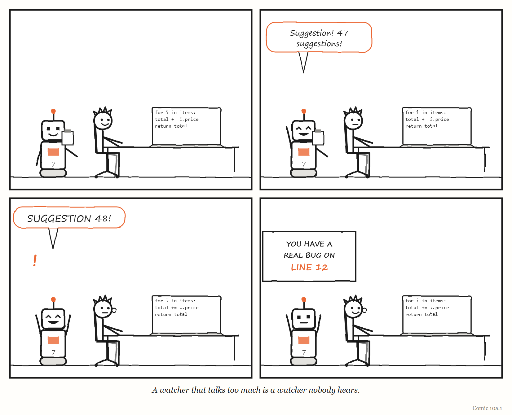

# What If? — What If We Swapped Jobs: the AI Watches, the Human Types?

*An interlude. One silly question, answered seriously.*

---

By 2026, the standard arrangement between people and AI coding agents had settled into a familiar shape. The machine writes. The human watches — reads the plan, reviews the output, approves the change, and takes over when something goes wrong.

Chapter 10 has just spent many pages explaining, via Lisanne Bainbridge, why this gives the human the two worst jobs in the building: watching for rare problems, which people cannot do for long, and taking over in a crisis, which people cannot do well without practice.

So here is a silly question. What if we did it the other way round? The human writes the code. The machine watches.

## Irony one: the rust

Bainbridge's first irony is that skills decay when they are not used. The operator who spends years watching an automated plant is, when the day comes to take over, an inexperienced operator with an experienced operator's job title.

Under the swap, this irony simply vanishes. The human is writing every day. Their skill is not being "maintained" by a special exercise; it is being used, which is the only kind of maintenance a skill has ever reliably received. Bainbridge's own remedy for the rust was to let operators run the process by hand for a short spell in every shift — and, if that sounded laughable, to use simulators. The swap is her remedy, turned up to a full shift.

**Score: human 1, machine 0.**

## Irony two: the half hour

Bainbridge's second irony is about watching. Drawing on vigilance research going back to 1950 — the psychologist Norman Mackworth's studies for the Royal Air Force, in which people watched a pointer tick around a blank clock face and tried to spot the occasional double jump — she noted that nobody, however motivated, keeps effective watch over a quiet source of information for more than about half an hour. In Mackworth's clock test, detection fell by 10 to 15% within the first 30 minutes.

A machine has no first 30 minutes. It does not get bored at minute 31, it does not need coffee, and it does not start thinking about lunch while reading the four-hundredth line of a change. Whatever its faults as a watcher — and it has some, which we will get to — *boredom* is not one of them. Watching is the one job in the building where the machine's peculiar temperament is a genuine qualification.

**Score: human 2, machine 0.** (The machine is scoring for the human here. That is rather the point.)

## Irony three: the picture in your head

Bainbridge described manual operators who would arrive a quarter to half an hour before their shift, just to get a feel for what the plant was doing. The picture of the process in an operator's head — where it is heading, what is about to matter — is built by doing the work. An operator who is suddenly asked to take over from the automation has no such picture, and has to act on scraps.

Under the swap, the person writing the code has the picture, because they are building it. There is nothing to take over. They are already driving.

**Score: human 3, machine 0.**

## So why doesn't everyone do this?

At this point the swap looks like a triumph, and you are entitled to be suspicious. It has three serious problems, and they are the interesting part.

**Problem one: speed.** The whole reason for the standard arrangement is that machines can now write a great deal of code very quickly, and humans cannot. Swap the jobs, and you have swapped away the reason you bought the machine. A team that insists the humans write everything is choosing Bainbridge's safety over the machine's speed — which is sometimes exactly the right choice, and often not the choice anybody is willing to make. (And some developers would simply refuse. Chapter 10 described an experiment that broke in 2026 because too many of the developers in it would not work without AI, even when paid $50 an hour to try.)

**Problem two: the alarm that cries wolf.** A machine watcher never gets bored, but it can be wrong, and — worse — it can be *noisy*. Bainbridge's answer to the half-hour problem was alarms, "even alarms on alarms", and in the same breath she warned that too many flashing lights confuse rather than help. A reviewer-bot that comments on every line of your change will, within a week, be skimmed; within a month, muted. The human's vigilance problem has not disappeared. It has moved from watching the code to watching the watcher.

**Problem three: the extra job.** Bainbridge reported a study in which a system performed *worse* with computer help than without it, because the operators made the decisions anyway, and checking the computer's advice simply added to their workload. A machine that watches you is only useful if what it says is rare enough, and right enough, that listening to it is cheaper than ignoring it. That is a much higher bar than "it found something".

And lurking beneath all three is the thermostat from the interlude after Chapter 2. A machine watcher is a regulator. It acts on its model of what good code looks like. If that model sits next to the lamp — checking style, say, but blind to whether the change does what the customer needed — it will report green, calmly, with complete confidence.

> 
> 
> <!-- COMIC 10a.1 script: Four panels. Panel 1 — PAT typing happily at a keyboard. Behind PAT's shoulder, UNIT 7 watches intently, holding a tiny clipboard. Panel 2 — PAT types one character. UNIT 7, delighted: "Suggestion! 47 suggestions!" Panel 3 — PAT, typing on, one earbud now in. UNIT 7, louder: "Suggestion 48!" Panel 4 — no words. PAT, calm, both earbuds in, typing. Behind PAT, UNIT 7 is holding up a large handwritten sign: *YOU HAVE A REAL BUG ON LINE 12*. PAT does not look round. -->
## The swap in real life

The interesting thing is that nearly every serious engineering team already runs a partial swap, and has done for decades — they just do not call it that.

Automated tests, type checkers and linters are machines that watch humans type. They are descendants of a loom you will meet in Chapter 12, which stopped itself when a thread broke: a machine that does not get bored, watching for one specific kind of abnormality, and halting the line when it sees it. They work because they obey the rules above. They check narrow things. They are right almost every time they speak. And they speak rarely enough to be heard.

And the developers who described their working methods in 2026, in Chapter 10, had quietly arrived at a mixed arrangement of their own: give the agent narrow, routine tasks close to boilerplate, a file or two at a time, and keep the hard, judgement-heavy parts — the ones where the human's skill and picture of the system matter — for the human.

That suggests a better rule than "who writes, who watches". Split the work by which part **needs practice**:

- **The part that needs practice goes to the human**, so the skill does not rust and the picture in their head stays current.
- **The part that needs endless patience goes to the machine** — watching, checking, comparing, not getting bored at minute 31.
- **The part that needs speed** can go to the machine too, *as long as* what comes back is small enough for a human to actually read. Four hundred lines, reviewed at 4.52 on a Friday afternoon, is watching. Forty lines is reading.

## So, what if we swapped jobs?

The human would stay skilled, keep the picture, and never have to take over in a panic. The machine would do the watching it is temperamentally built for. For about a week, it would be glorious.

Then you would discover you had bought a very fast machine and asked it to sit quietly and supervise — and that a watcher which talks too much is a watcher that nobody hears.

The swap is not the answer. But it is a very good question to ask of any arrangement you have now: *is each job going to whoever is actually good at it — or just to whoever was there first?*

---

*The Haiku Line*

> It watches me type.
> Forty-eight helpful comments.
> Now I wear earbuds.

