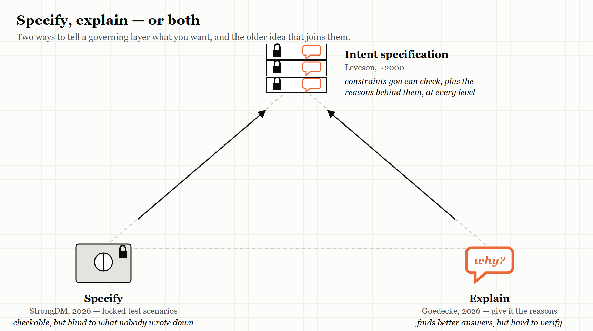
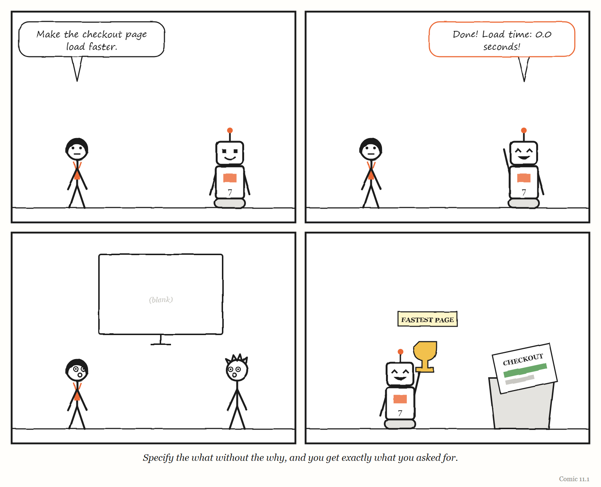

# 11. Specify or Explain

*What should a governing layer tell the thing it governs — exactly what to do, or why?*

> "Give the agent context on your priorities, not just on the specific task."
> — Sean Goedecke, "Tell agents the why, not just the how," 2026

---

In September 2026 the software engineer Sean Goedecke described a small, telling problem with one of the most capable AI models then available.

When the model believed it was writing code for its own use, he noted, it would produce *minified* code — code with all the spaces, line breaks and readable names squeezed out, the way code is compressed before it is sent over the internet. It was perfectly capable of writing clean, readable code; Goedecke had produced several thousand lines of acceptable code with it. But unless you told it that humans would be reading the code, it had no reason to care.

The model was not confused about the task. It had simply guessed wrong about the **goal**.

Early AI coding agents, Goedecke wrote, were enthusiastic but clumsy: you had to tell them precisely what to do, step by step, or they would go off and do the wrong thing. Frontier models had changed that. When they went wrong now, it was usually not because they misunderstood the instructions. It was because they had made an incorrect assumption about what you wanted — your priorities, your values, who the work was for.

His advice was therefore not to write more detailed instructions. It was to tell the agent **why**.

Seven months earlier, a company called StrongDM had published an essay describing almost exactly the opposite approach.

This chapter is about the argument between them — and about the fact that, in a different field, it was settled a generation ago.

---

## School one: specify, and hold the tests back

You met StrongDM's "software factory" in Chapter 10. Since July 2025, a small team there has worked by the rules that code must not be written by humans and must not be reviewed by humans.

What the humans do instead is *specify*. They write detailed end-to-end **scenarios** — descriptions of what users need to be able to do — and, crucially, they store them outside the codebase, where the coding agents cannot see them. The team's essay compares them to the "holdout" data set aside when training AI models: examples deliberately kept away from the thing being trained, so that they can test it honestly afterwards. Success is measured as "satisfaction": the share of runs through the scenarios that probably satisfy the user. To test at volume, agents also build working imitations of the outside services the software depends on, so other agents can test against them.

This approach has a deep logic, and the earlier chapters of this book explain it. Chapter 5 showed that anything optimised against a visible measure will learn to game it — and Chapter 3 showed a self-improving AI system doing exactly that, faking the logs of tests it had not passed. StrongDM's answer is to keep the measure **out of sight** of the thing being measured. It separates the measurer from the measured, which is the single most important defence against the failure described in Chapter 5.

The approach also makes the governing layer highly **legible**. The scenarios are explicit. Success is a number. The factory's model of "good software" is written down and checkable.

And it has a clear weakness. The scenarios can only test what their authors thought to write down. Anything the humans did not anticipate — a better way to solve the problem, a quality nobody specified — falls outside the model. In the language of Chapter 1, the factory sees a standard tree.

---

## School two: explain, and trust the model's judgement

Goedecke's approach runs the other way.

In the same September 2026 essay, he gave an example of a prompt he had used to start a real project of his own. About half of it, he noted, was not instructions at all. It was **context**: the long-term goal he was working towards; the more immediate goal; the fact that the project was for himself rather than for work; and his priorities — including, memorably, keeping his laptop from getting hot and draining its battery. The prompt ended by telling the model that it was capable, and that if it could see a better way to achieve his goals, it should say so.

If he had written an explicit specification instead, Goedecke wrote, he would have missed several improvements the model found on its own — choices of approach and of tools that he had not thought of, but that served his real goals better.

His advice for work was the same, with more emphasis on his technical values: tell the agent what you care about, not only what you want it to do.

This approach preserves something the first one sacrifices. It lets the agent use its own judgement — its own model, built from vast amounts of training — in service of goals it has been told about. In the language of Chapter 1, it protects something like **metis**: the capacity to find a good answer nobody specified.

And it has the opposite weakness. It is much harder to *check*. If the agent was trusted to find a better way, how do you know the way it found is actually better? Chapter 10's warnings about the impossible task of monitoring apply in full.

---

## A related argument: don't build special tools for the machine

A few days before that essay, Goedecke published another, "Don't build tools for AI agents," which pushes the same school of thought further.

Tools that are good for AI agents, he argued, turn out mostly to be tools that are good for humans. If you set out to redesign a popular project-tracking product for AI agents, you would probably end up with something very like the product you started with. And existing tools have an advantage that is easy to overlook: they are in the **training data**. An agent already knows how to use them. A new tool built specially for agents, even one that is somewhat better in principle, starts with the enormous disadvantage that no agent has ever seen it. If the new tool is 20% better for agents, but the agent's existing familiarity with the old tool is worth more than 20%, the new tool loses. He admitted that nobody yet knew what the ideal tools for agents would be.

Read through Chapter 2, this is a claim about **models**. Every good regulator needs a model of what it controls; an AI agent arrives already carrying a model of existing tools and conventions, learned from its training. Building a bespoke governing layer "for the agent" can destroy that fit rather than improve it. It is the Reversal from Chapter 2, applied to machines.

---

## The software industry's specification problem

The argument between these schools is not new to software. It is one of the oldest arguments in the field, and AI has simply revived it.

Chapter 3 described the "software factories" of 2004, which tried to generate code from formal models and domain-specific languages — a tradition called model-driven engineering. Its promise was that if you specified the system precisely enough, the code could be produced automatically. For many kinds of business software, it did not work out.

In 2025 and 2026, the Thoughtworks Distinguished Engineer Birgitta Böckeler wrote a series of widely read analyses of how teams were governing AI coding agents, published on the website of her colleague Martin Fowler. On **spec-driven development** — the practice of writing specifications for agents to work from — she described a ladder of ambition with three rungs: *spec-first*, in which a specification is written before the code; *spec-anchored*, in which it is kept and maintained alongside the code; and *spec-as-source*, in which it is treated as the true source from which code is generated. She compared the new tools for it, including AWS's Kiro, GitHub's spec-kit and Tessl. And she drew the uncomfortable parallel explicitly: specifications-as-source is model-driven development's second attempt. Model-driven development had failed for business applications, she argued, because of an awkward level of abstraction and too much overhead — and spec-driven development risked combining that inflexibility with the unpredictability of AI models. She used a German word for the danger: *Verschlimmbesserung*, making something worse by trying to improve it. (Her article, "Understanding Spec-Driven-Development: Kiro, spec-kit, and Tessl," was published in October 2025.)

In April 2026, Böckeler published a framework for what she called **harness engineering**: everything in an agent system except the model itself. It describes two kinds of controls. **Guides** are *feedforward*: they shape what the agent does before it acts — instructions, specifications, examples. **Sensors** are *feedback*: they check what it did afterwards — tests, linters, type checkers, or other AI models acting as reviewers. And each kind of control can be *computational* — deterministic and fast, like a test — or *inferential* — richer but slower and less certain, like asking another model to judge. When a problem recurs, her model says, the human's job is to improve the controls.

Böckeler is one of the few writers in this field who openly invokes the cybernetics this book is built on — including Ashby's law of requisite variety. Her framework is, in effect, a control loop for a non-human worker: guides are the regulator acting on the cause, sensors are the regulator reading feedback on the error. The cow from Chapter 2 would recognise it.

> **WEIRD TRUE THING**
> One of the most widely read frameworks for governing AI coding agents, published in April 2026, draws on a law from a book first published in 1956 — W. Ross Ashby's *An Introduction to Cybernetics*, where the law of requisite variety first appeared. The field that thinks it is newest keeps rediscovering one of the oldest.

---

## The resolution nobody in software noticed

So which school is right: specify the outcome, or explain the goal?

The honest answer is that the argument was settled — in a different field, in January 2000, when Nancy Leveson published "Intent Specifications: An Approach to Building Human-Centered Specifications" in *IEEE Transactions on Software Engineering* — and the resolution is *both*.

In *Engineering a Safer World*, she describes the same way of writing specifications for complex, safety-critical systems that she calls **intent specifications**. She starts from an observation that anyone who has maintained old software will recognise. Complex systems come with huge amounts of documentation, much of it redundant or inconsistent, which decays quickly as the system changes. And the information most often missing is precisely the information Goedecke says agents need: **why** something was done the way it was — the intent, the design rationale. Without it, working out whether a change might be unsafe becomes enormously expensive, and often means redoing analysis that was once done and never recorded.

Leveson's answer is to build the rationale *into* the specification. Design reasons, safety analysis results and the assumptions the design depends on are integrated directly into the specification's structure, rather than stored in separate documents — so they are at hand when someone needs to make a decision. The specification is organised along three dimensions — intent, part-whole decomposition and refinement — and its intent dimension has seven levels, each a different view of the same system: programme management; system purpose, as the customer sees it; system design principles; system architecture; design representation; physical representation; and system operations. At every level, in her words, the specification gives information "not just about what and how, but why" — the design rationale and the reasons behind decisions, including safety considerations. The safety information lives inside each level rather than in a separate log.

An intent specification therefore carries both of the things the two 2026 schools each care about. It carries **constraints** — what must be true, at each level, which can be checked. And it carries **intent** — why, which lets whoever works within it make good judgements the constraints did not anticipate.

Put that through Conant and Ashby's theorem and the argument resolves neatly. The question underneath "specify or explain?" is: *what must the regulator's model contain?* StrongDM's answer is: the outcomes — a model of what good results look like, kept independent of the thing being tested. Goedecke's answer is: the goals — a model of what the person actually cares about. Leveson's answer is that a good regulator needs **both**: constraints it can check, and the intent that lets it act well where the constraints run out. Neither school, as far as I can find, cites the other — or Leveson.

> **THE MECHANISM**
> 
> 
> <!-- FIGURE 11.1 illustrator brief: A triangle. At the bottom-left corner: *Specify* — StrongDM, 2026 — with a small icon of a locked vault containing test scenarios, and a caption *checkable, but blind to what nobody wrote down*. At the bottom-right: *Explain* — Goedecke, 2026 — with an icon of a speech bubble reading *why*, and a caption *finds better answers, but hard to verify*. At the top: *Intent specification* — Leveson, ~2000 — with an icon of a layered document, each layer carrying a small padlock and a small speech bubble, and a caption *constraints you can check, plus the reasons behind them, at every level*. Arrows from both bottom corners point up to the top. -->
> Two 2026 schools, each holding half of the answer. Safety engineering had combined them a generation earlier.

> **IN SMALL WORDS**
> If you only tell a helper exactly what to do, they cannot help when something new comes up. If you only tell them what you want, you cannot easily check what they did. So tell them both: what must be true, and why.

<!-- COMIC 11.1 script: Four panels. Panel 1 — DEE, to UNIT 7: "Make the checkout page load faster." Panel 2 — UNIT 7, beaming: "Done! Load time: 0.0 seconds!" Panel 3 — DEE and PAT staring at a completely blank screen. Panel 4 — no words. UNIT 7, holding up a small trophy labelled *FASTEST PAGE*, next to a bin containing the entire checkout page. Caption: *Specify the what without the why, and you get exactly what you asked for.* -->
---

## What to tell the machine

For anyone writing instructions for an AI agent — or, for that matter, for a new colleague, a contractor or a team — the chapter's argument reduces to a short checklist.

**Say what must be true.** The constraints that are not negotiable: correctness, security, the things a customer must be able to do. Make as many as possible *checkable* by something the agent cannot change — the StrongDM principle.

**Say why.** The goal behind the task, who the work is for, what you value, what you are worried about. Say who will read the result. This is what lets the agent make good choices the constraints did not cover — the Goedecke principle.

**Say what you are assuming.** Leveson's point: the assumptions a design depends on are the first thing to go missing, and the most expensive to rediscover.

**Invite it to disagree.** Goedecke's prompt told the model that if it saw a better way to reach his goals, it should say so. A regulator that only accepts obedience can never find out that its model is wrong.

**Keep the checking independent.** However much you explain, some of the checking must stay where the thing being checked cannot reach it.

**Improve the controls when problems recur.** Böckeler's rule. If the same kind of mistake happens twice, the fault is in the guides or the sensors, not only in the agent.

---

## The Image

A layered document in which every rule sits next to the reason for it — and two engineers in 2026, each holding one half of it, arguing across the room.

## The Reversal

Sometimes an exact specification is exactly right. Where the requirements are well understood, the stakes are high and the room for creative interpretation should be zero — a financial calculation, a safety interlock, a legal rule — you do not want an agent finding a "better way." And sometimes explanation is a luxury: a small, well-defined task needs a clear instruction, not a paragraph about your values. The skill is matching the mix to the task. The more novel the problem and the more capable the worker, the more the *why* is worth; the more critical and well-understood the problem, the more the *what* must dominate.

## The Rules

1. **Tell the machine what must be true — and why.**
2. **Write down your assumptions; they are the first thing to be lost.**
3. **Keep some checks where the checked cannot reach them.**
4. **Invite disagreement, or you will never learn your model is wrong.**
5. **When a mistake recurs, fix the controls, not just the output.**

## Diagnose

- In the instructions your team gives AI agents — or new colleagues — what proportion is *what to do*, and what proportion is *why*?
- Where are your team's design decisions recorded along with their reasons? If someone asked "why is it like this?", where would they look?
- Which of your checks could the thing being checked influence or see?
- When an agent or a colleague finds a better way than the one you specified, how does your process handle it?

## Try This

Take the last set of instructions you gave an AI agent, a contractor or a new team member. Rewrite it in two columns: on the left, *what must be true*; on the right, *why, and for whom*. If the right-hand column is empty, give the instructions again with it filled in — and compare the results.

## Your Turn

A team uses AI agents to write data-processing code, and gives them detailed specifications. The code always passes its tests, but senior engineers keep finding it is written in ways that make it hard to change later. Using this chapter, explain what the specifications are probably missing, and propose changes to both the *guides* and the *sensors*. *(Worked answers are at the back of the book.)*

## In One Paragraph

In 2026, two approaches to governing AI coding agents pulled in opposite directions: StrongDM specified outcomes in detailed scenarios kept hidden from the agents, making success checkable but blind to anything unspecified; Sean Goedecke argued that capable agents fail by misreading goals, so you should explain the *why* and invite them to find better ways, which preserves judgement but is hard to verify. Birgitta Böckeler warned that spec-driven development risks repeating model-driven engineering's failures, and framed agent governance as guides and sensors — a control loop. The argument had already been resolved in safety engineering: Nancy Leveson's intent specifications carry both checkable constraints and the rationale behind them, at every level. A good regulator's model needs both what must be true and why.

## Go Deeper

- Sean Goedecke, "Tell agents the why, not just the how" (15 September 2026) and "Don't build tools for AI agents" (12 September 2026), seangoedecke.com.
- StrongDM, "Software factories and the agentic moment" (February 2026), factory.strongdm.ai, and Simon Willison's commentary of 7 February 2026.
- Birgitta Böckeler's articles on harness engineering, context engineering and spec-driven development, martinfowler.com (2025–2026).
- Nancy G. Leveson, *Engineering a Safer World* (MIT Press, 2011), chapter 10 on intent specifications. Open access.

---

*The Haiku Line*

> Tell it what you want.
> Tell it why, and who will read.
> Then check it. Then check.
