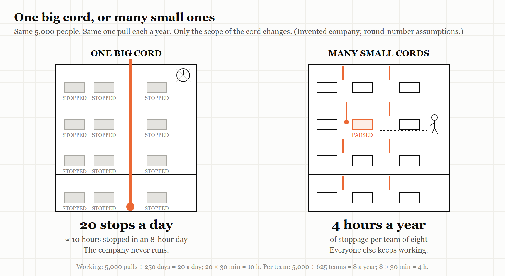

# What If? — What If Every Employee Could Stop the Company?

*An interlude. One silly question, answered seriously.*

---

Chapter 12 made a claim that sounds, the first time you hear it, like a management fantasy: at Toyota, anyone on the line may stop it. The worker at the bottom of the organisation chart can halt the most expensive machine in the building, on their own judgement, and be thanked for it.

So let's push it until it breaks. What if *every* employee of a company had a cord — and pulling it stopped *the whole company*?

## The arithmetic of the big red button

Let's invent a company. *These numbers are assumptions, chosen to be round, not measurements of anyone.* It has 5,000 employees. Each one gets a cord, and the rule is simple: pull it, and everything stops — every team, every release, every sale — until the problem is sorted out.

Suppose people are sensible and restrained. The average employee pulls the cord just **once a year**.

A year has about 250 working days. Five thousand pulls spread across 250 days is **20 stops every working day**. If each one takes half an hour to understand and clear, that is 10 hours of stoppage in an 8-hour working day.[^wi12-1]

The company is never running. It is permanently, fully, and very sincerely stopped. Somewhere, a sales director is standing beside a frozen till, waiting for someone in accounts to finish explaining a rounding error.

So: the literal answer to this interlude's question is that the company would never do anything again. The cord would not be a safety device. It would be a very democratic off switch.

## Now shrink the cord

Here is the same company, the same 5,000 people and the same one pull a year each. Change one thing. The cord no longer stops the company. It stops **your own team's work** — the handful of people doing the same job as you. (A Toyota cord works on the same principle: it stops a line, not Toyota.)

Say teams are eight people. Each team now gets about **eight stops a year** — one every six weeks or so. At half an hour each, that is **four hours a year** of stoppage per team.

Four hours a year. For that price, every team in the company has a way to halt its own work the moment someone sees something wrong. You would pay that for the fire alarm alone.

Nothing about the people changed between these two companies. They are just as trigger-happy in both. The only difference is the **scope** of the cord — how much of the world stops when you pull it. And scope turns out to be the difference between a fantasy and a bargain.

> 
> 
> <!-- FIGURE 12a.1 illustrator brief: Two blueprint drawings of the same office building, side by side. On the left, labelled *ONE BIG CORD*: a single enormous red cord runs down through every floor; every desk has a small *STOPPED* sign; a clock on the wall is wrapped in cobwebs. On the right, labelled *MANY SMALL CORDS*: each team's cluster of desks has its own little cord; one cluster on the third floor has paused, with a team leader walking over to help; every other floor is busy. A tiny caption on the stairwell: *same people, same number of pulls*. -->
## The stops that actually exist are small

Look back at the real cords in this book and notice that every single one is scoped.

- **The Toyota cord** stops a line, not Toyota. And the story goes back further: Sakichi Toyoda's 1924 Type G loom stopped itself when a single thread broke. The interesting consequence was not the stop. It was that **one person could look after many looms**, because each loom would halt itself on any abnormality instead of weaving a roll of ruined cloth. The stop did not slow the factory down. It is what let the factory grow.
- **The nurses at Johns Hopkins**, in Peter Pronovost's intensive-care unit, were authorised to stop a doctor who skipped a step on the central-line checklist. They stopped *a procedure* — not the ward, not the hospital. The ten-day line-infection rate went from 11% to zero.
- **Amazon's customer-service Andon Cord**, which Jeff Bezos named in his 2012 letter to shareholders, is usually described as letting a customer-service representative take one product off sale when they see a recurring defect. Not the website. One product.
- **The error budget** from Google's site reliability engineering halts new releases *of one service* when it has used up its agreed allowance for failure. Not the company's releases. One service's.

Each of these is a cord cut to the size of what the person holding it can see. The nurse can see the procedure. The customer-service rep can see the complaints about one product. The team can see its own service. The authority to stop matches the view — and that is why the stop is trusted.

## What about the other extreme?

If a company where anyone can stop everything never does anything, what about a company where nobody can stop anything?

That one has been tried too, and Chapter 12 described it. Before Toyota arrived at the Fremont plant, the old General Motors plant there had a rule, as *This American Life* told the story: the line never stops, and a worker who stops it can be fired. The line kept moving; the problems were left for later. The result was one of the worst-regarded plants in the American car industry. The same workforce, under Toyota's system at NUMMI, was given the cord — and, by the programme's account, adapted well, while quality improved rapidly.

So the curve has two bad ends. A cord that stops everything stops everything. No cord at all means the problems ride along to the end of the line, and further. The good place is in between, and the arithmetic above tells you where: **small scope, clear authority, and a pull that costs the puller nothing**.

> **WEIRD TRUE THING**
> Toyota's own chronology puts the andon — a board of lights above the line, green for fine, yellow for "I need help", red for "the line has stopped" — at its main plant in 1955. It means the idea of letting any worker stop the line is roughly as old as the transistor radio.

## So, what if every employee could stop the company?

The company would stop, and stay stopped, and everyone in it would be entirely right to have pulled the cord each time. Arithmetic, not bad faith, would kill it.

But ask the question the other way round — *what if every employee could stop the part of the company they can actually see?* — and it stops being a fantasy. It is how Toyota builds cars, how a hospital unit wiped out an infection, and how a well-run software team ships. The cord is not dangerous. A cord that is too long is.

The design question for any organisation, then, is not "should people be allowed to stop things?" It is: *for each person here, what is the biggest thing they can see clearly — and can they stop that?*

---

*The Haiku Line*

> Five thousand cords pulled.
> The company never runs.
> Now shorten the cord.

[^wi12-1]: For readers who want the working: 5,000 pulls ÷ 250 days = 20 pulls a day; 20 × 30 minutes = 600 minutes = 10 hours. The scoped version: 5,000 people ÷ 8 per team = 625 teams; 5,000 pulls ÷ 625 teams = 8 pulls per team per year; 8 × 30 minutes = 4 hours. The half-hour is also an assumption. Real stops vary enormously, and a good team gets faster at them with practice — which is part of why a real team's stops get cheaper over time, not dearer.
