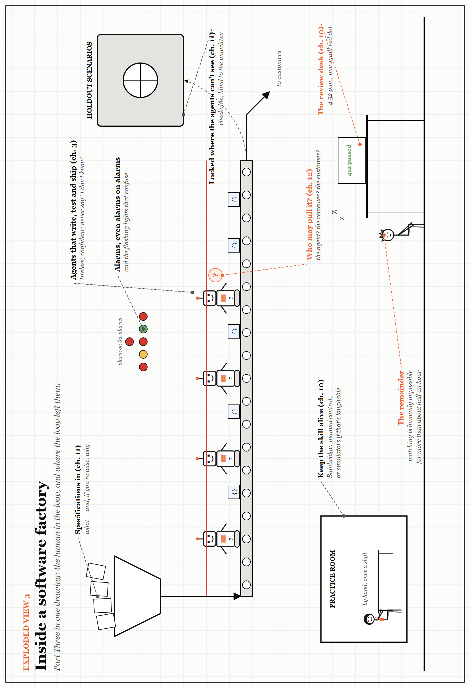

# Exploded View 3 — Inside a Software Factory

*Part Three in one drawing. Every label points to something you have already met; look closely for the small jokes. The drawing is printed sideways: turn the book.*

Part Three put the human back into the loop — and asked what the loop had done to them. Follow the work from left to right.

- **The hopper** takes specifications in (Chapter 11): what to build, and — if you are wise — why.
- **The agents** write, test and ship, tirelessly (Chapter 3). The locked vault on the right holds the holdout scenarios that judge their work, where the agents cannot see them: checkable, but blind to anything nobody wrote down.
- **The red line** above the conveyor is a stop cord. Nobody has decided who may pull it (Chapter 12).
- **The review desk** is Bainbridge's impossible task: 412 checks passed, one small red dot, and a reviewer who stopped being able to watch some hours ago (Chapter 10).
- **The practice room**, bottom left, is the cheapest safety device in the building: someone doing the work by hand, on purpose, so the skill is there on the day it is needed.
