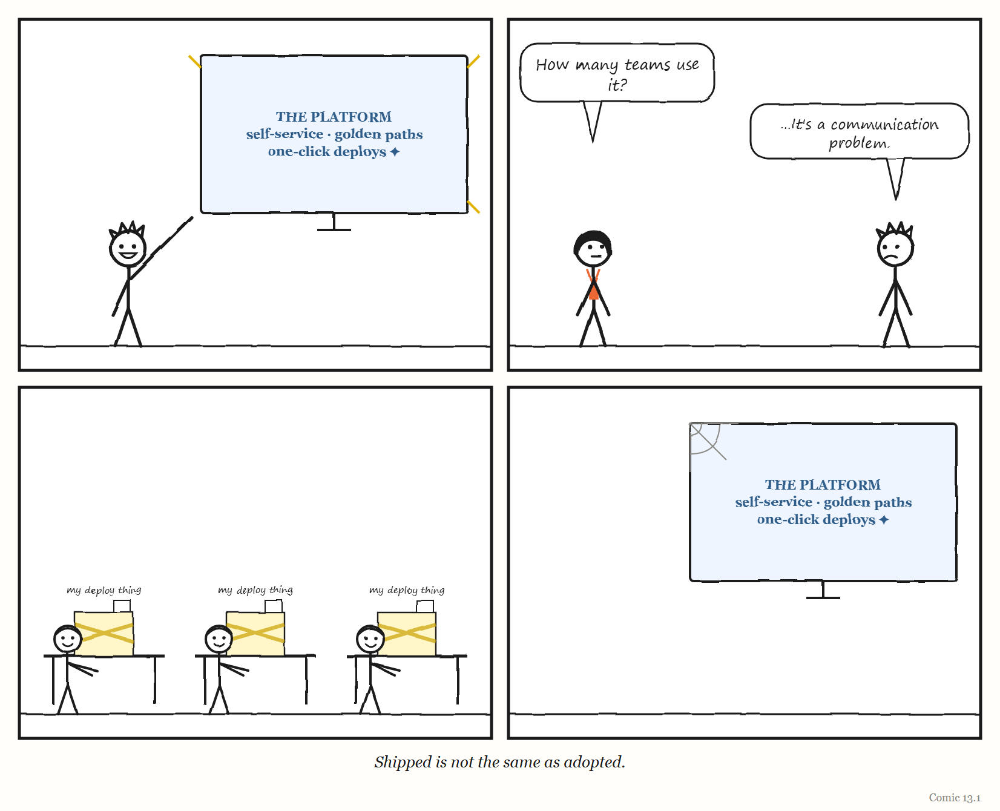
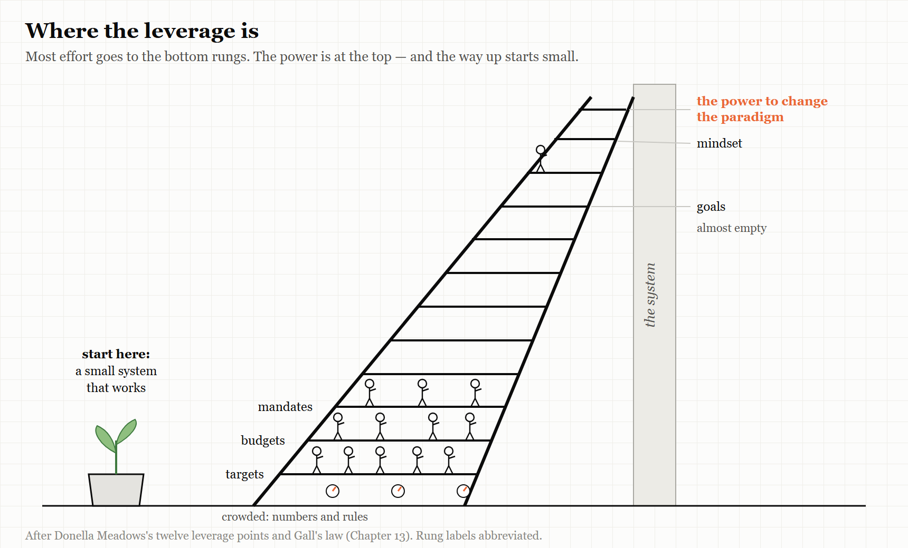

# Part Four — Layers That Work, at Every Scale

## Dispatch from 2031: The Smallest Platform in the Building

> *Fiction. A report from a near future in which this Part's lesson was, for once, learned. The company and people are invented, apart from Pat, Dee and Unit 7, who live in this book's comics.*

The platform team at Oakridge Mutual, a mid-sized insurer, is three people, and in 2031 it is the most envied team in the company. Hardly anyone remembers how that happened, so Pat, who leads it, sometimes tells the story to new starters.

It began, Pat says, with a failure. In 2027 Oakridge spent eighteen months building a grand internal platform to run everything. It had a portal, a catalogue, a set of golden paths and a launch party. Almost nobody used it. The engineers kept their old scripts, because the scripts worked.

So the team threw the grand plan away and started again, smaller. It found the one thing every team hated doing — setting up a new service — and made that one thing easy. Only that. When teams used it, the platform team added the next most hated thing. When a feature went unused for six months, they deleted it, and wrote down why.

The team has four rules, pinned to the wall on an index card:

1. *Build what people already do by hand, not what they ought to do.*
2. *Anyone may stop a release. Say why once. Nobody asks you to justify it twice.*
3. *Every agent has an owner, and the owner reads a sample of its work by hand every week.*
4. *Once a quarter, ask whether any of this is still needed.*

Unit 7 runs much of the day-to-day now, and it is good at it. But the team's agents are only allowed to do what the team already knows how to do by hand, and once a month someone does it by hand anyway, "so we remember what the machine is for". Dee, now in charge of engineering, once asked why the platform team was so small. Pat's answer has become a saying around the building: *the platform is small because we keep checking whether it should exist.*

The platform is not perfect. It has had outages. But when it breaks, people can see it, somebody can stop it, and whoever fixes it understands it.

Part Four is about building governing layers like that — grown from something small that worked, at the scale of a platform, of a whole organisation, and of one person's life.

---

# 13. Grow It, Don't Design It

*Governing layers that work were grown from small ones that worked.*

> "A complex system that works is invariably found to have evolved from a simple system that worked."
> — John Gall, *General Systemantics* (1975)

---

In September 2026, an engineer named Sandeep Bharadwaj Mannapur published an article on the engineering-leadership site LeadDev with a title that many platform engineers would recognise from their own lives: "We built the platform. Nobody used it."

Mannapur had led a team that built an internal platform for deploying machine-learning models. Eight months after it launched, he asked three senior engineers to show him how they actually deployed their models. None of them used the platform. Two had built their own workarounds. The third was running models by hand from notebooks.

For roughly a year, he wrote, leadership had treated the low usage as a communication problem — as if the engineers simply didn't know how good the platform was. It was not. It was a trust problem.

The recovery, when it came, was not a relaunch or a mandate. A platform engineer was embedded in product teams' own work for six weeks, to see what they actually needed. The platform's roadmap was opened up so product teams could help decide what came next. Leadership publicly owned the failure. And the team set itself a new, concrete test of success: a new model deployed in a single day — alongside a regular survey of whether engineers would recommend the platform to colleagues.

That story is the most common story in platform engineering. This chapter is about why — and about what the governing layers that *do* work have in common.

---

## Gall's law

In 1975, an American paediatrician named John Gall published a short, deliberately comic book about why systems fail. Its first title was *General Systemantics*; later editions became *The Systems Bible*. Most of it is aphorism and satire. One line from it has outlived the rest, and it is now known simply as **Gall's law**: a complex system that works is invariably found to have evolved from a simple system that worked. A complex system designed from scratch never works and cannot be patched up to make it work. You have to start over, beginning with a working simple system.

*Systemantics* is not a work of research, and Gall's law is a rule of thumb, not a theorem. But it states something that the cases in this book confirm again and again — and it applies with particular force to governing layers.

> **WEIRD TRUE THING**
> The most quoted law of systems design was written by a paediatrician, in a short book he meant to be funny. Engineers who have never heard of *General Systemantics* repeat Gall's law in design reviews every week — which is, in its way, a system that grew from a small one that worked.

A governing layer — a platform, a process, an operating model — is a model of the work it governs (Chapter 2). A model designed in advance, complete, before anyone has used it, is a model built from the designers' *picture* of the work rather than from the work itself. It is, almost by definition, a legible simplification (Chapter 1) made by people who are not doing the work. Gall's law is what happens next: the big designed system does not fit, cannot be patched to fit, and is quietly routed around — by engineers with notebooks and workarounds.

A governing layer that is **grown** is different. It starts small, serves a few real users, and learns from them. Its model of the work is built from the work. By the time it is large, it has been corrected thousands of times by the people it governs.

> **IN SMALL WORDS**
> Big systems that work started as small systems that worked, and then grew. Big systems that were planned all at once, before anyone used them, almost never work — and you can't fix them by adding more.

---

## Why platforms go unused

The platform-engineering literature of the 2020s is, to a remarkable degree, a literature about platforms nobody used. The same patterns come up again and again, from independent sources.

**Registration is not adoption.** In an April 2026 analysis drawn from his client work, the platform consultant Sean Lobjoit described an organisation where 85% of teams were registered on the internal platform but only about 12% used it in a typical week. He argued that mandates — orders to use the platform — are a symptom of a platform that does not fit its users, not a cure for it.

**Built for imagined users.** Camille Fournier, a former chief technology officer and co-author with Ian Nowland of the 2024 book *Platform Engineering*, described the trap in a 2020 essay written after three years running a platform organisation. A platform team's customers are a small, *captive* audience: they often have no alternative, and may not want to complain to colleagues. That captivity, she wrote, tempts teams to ignore whether anyone is actually adopting what they build — which is how many platform teams end up with several overlapping, half-finished products. Worse, a platform team is rarely handed a well-specified need, so it is easy to drift into software "building to be built". Teams with grand visions of a complex end state, and few working stages on the way to it, produce platforms that are confusing and overengineered — Gall's law, arrived at from the inside. Her last piece of advice was blunter: "remember that you aren't Google." A platform team of seven, or even a hundred, gets bogged down imitating systems that big companies built up over years — systems that quietly encode the assumptions, ecosystem and culture of the company that built them. That Google does something, she argued, is not a reason to do it.

**Never retiring the old.** Fournier has also described platform organisations running three generations of solutions to the same problem at once, with no plan to retire any of them — leaving the engineers they serve confused and dissatisfied. Chapter 4's Suma co-op learned the same lesson about organisations: a new structure cannot succeed while the old one is left running.

**Golden paths decay.** Spotify's engineering blog described in 2020 how its culture of team autonomy had produced a fragmented ecosystem of tools in which the only way to learn how to do something was to ask a colleague — a situation its engineers called "rumour-driven development." Its answer was **golden paths**: opinionated, supported, step-by-step routes for each kind of engineering work, later built into onboarding and into its developer portal. But golden paths are not a one-off project. Lobjoit and others note that they decay unless someone is staffed to keep them current.

And the cost of keeping them current is easy to underestimate. A widely quoted estimate, attributed to the research firm Gartner, is that organisations should expect to dedicate two to five engineers to Backstage for several years — a figure that vendors of rival portals, who have an obvious interest in it, describe as conservative, with some reports suggesting up to twenty. (The Gartner research itself is behind a paywall; treat the number as an order of magnitude, not a quotation.) Chapter 9 described Backstage's gap between near-universal use inside Spotify and roughly 10% average adoption elsewhere. The staffing figure is part of the explanation.

<!-- COMIC 13.1 script: Four panels. Panel 1 — PAT, proudly presenting a gleaming diagram on a screen labelled *THE PLATFORM*: "Self-service, golden paths, one-click deploys." Panel 2 — DEE: "How many teams use it?" PAT: "...It's a communication problem." Panel 3 — a wide view of the office: three engineers, each at a desk, each with a different handmade contraption of sticky tape, notebooks and scripts labelled *my deploy thing*. Panel 4 — no words. The gleaming platform, alone on its screen, with a single small cobweb in the corner. Caption: *Shipped is not the same as adopted.* -->
---

## When the whole thing is designed at once

Gall's law is easiest to see in its failures, and the largest failures are public.

In 2002 the British government launched the National Programme for IT, an effort to centralise the way the National Health Service in England used information. It was examined in three reports by the National Audit Office, several by Parliament's Public Accounts Committee, and a review by the government's Major Projects Authority. In September 2011 the government announced that it would be dismantled, with its component parts kept under separate management. The Committee, reporting in 2013, expected the total cost to exceed £9.8 billion, and described the programme as among the worst contracting fiascos in the history of the public sector — one whose component parts were still running up costs after the programme itself had gone.

In the United States, the Army's Future Combat Systems was meant to equip a brigade as a single networked "system of systems" — vehicles, sensors and communications designed together. It was the Army's largest planned acquisition, and it was cancelled in 2009 after aggressive timelines, poorly understood requirements and uncertain costs. The Government Accountability Office noted that the problems had been visible from the start, not discovered late — and, fairly, praised the programme's ambition and its experimentation. The lesson this book draws is a simple one: a network of systems cannot be integrated faster than its parts mature.

Neither programme failed for want of intelligence or money. Both were models of an enormous working system, drawn in advance by people who could not yet see the work — which is precisely what Gall's law says will not work.

---

## What the platforms that worked did

The counter-examples share a pattern too.

**They made the supported path the easiest path — and left people free to leave it.** In 2018, Netflix's engineering blog described its approach: developers are responsible for operating what they build, supported by centrally built self-service tools. Teams can leave the "paved road" if they want to — but if they do, they take on the responsibility of maintaining their alternative. Tools spread only if they genuinely reduce the load on most engineers. It is a design that treats adoption as something to be earned, and turns every team that leaves the road into feedback about where the road falls short.

**They treated the platform as a product.** Mannapur's recovery — embedding with users, opening the roadmap, measuring whether engineers would recommend it — is what any product team does with customers. It is simply rarer when the customers are colleagues who cannot take their business elsewhere.

**They migrated incrementally — or all at once, with tools.** The engineering blogs of large technology companies contain a rich record of migrations between build systems and languages, and two successful patterns stand out. One is **co-existence**: Airbnb, moving its enormous Java codebase to a new build system called Bazel, ran the new system alongside the old one, migrating breadth-first and automatically generating the new build files, so product work never had to stop; in 2021, before the change, the slowest tenth of its pre-merge checks took 35 minutes. Uber, adopting the same tool for its Go code in 2020, found that the move was not just a technical decision but a commitment to build governing machinery around it — including its system for keeping the main codebase always working. The other pattern is the **atomic cutover**: in March 2022 Stripe moved about 3.7 million lines of code from one type-checking system to another in a *single* change, merged on a Sunday, using a code-transformation tool it had built — so that the next day hundreds of engineers simply started working in the new language. What both patterns avoid is the long, manual middle, in which old and new run side by side with no end in sight.

**They were willing to reverse.** Growth sometimes means going backwards. In 2018 the data company Segment published "Goodbye Microservices," describing how it had split one part of its system into more than 140 separate small services, each with its own queue and repository. Every change to shared code had to be deployed to all of them; defects rose and progress slowed. It consolidated them into one service, and its test runs fell from up to an hour to milliseconds. In 2023 Amazon's Prime Video team described moving one monitoring service from a distributed design into a single process and cutting its infrastructure costs by about 90% — a change to one service, not to Prime Video as a whole. In each case, a governing structure chosen for good reasons had come to cost more in coordination than it returned.

**They kept a way back.** The counter-example shows why. In May 2024 the speaker company Sonos replaced its separate apps for different platforms with a single new cross-platform app, and changed the way the app found speakers on customers' home networks, partly to simplify its own engineering. The new app shipped missing features customers expected; it was slower; and speakers disappeared from home networks. Trade-press accounts reported that beta testing had not reflected the variety of real customers' network setups — and because the old app was replaced all at once, there was no fallback. The chief executive publicly apologised, and the company delayed new products while it repaired the app. The internal simplification was real. Its cost had been transferred, all at once, to every customer.

**They picked their fights.** The engineering leader Will Larson, whose writing on migrations is among the most practical available, describes leading a self-service migration off a monolith at Uber with a core team that grew only from two people to four over two years, by constantly improving its tools. He also describes the migrations he chose *not* to do: arguing against a grand move to services at Stripe because the situation was different, and, at another company, cancelling a planned move from one language to another in favour of a smaller change that was finished within a year. His recipe for a migration is short: de-risk it, enable it with tools, then finish it.

---

## Growing a governing layer for agents

Some of the best-documented agent governance is grown by one person at a time. In February 2026 Mitchell Hashimoto, co-founder of the infrastructure company HashiCorp, described his own path from sceptic to heavy user of AI agents in six stages. The middle of the story is the part worth copying. He forced himself, for a while, to redo work he had already done by hand with an agent — slow and painful, but it taught him to separate planning from doing, and to give agents ways to check their own work. Then he adopted what he called "harness engineering": every time an agent made a mistake, he engineered a fix so that it could not happen again — a line in the instructions file the agent reads, or a script that verifies its output. And he kept doing some of the hands-on work he enjoys, partly so that his own skills would not fade. That is a governing layer grown one mistake at a time, from a practitioner who kept Bainbridge's remedy in the loop.

The company Every, which runs several software products with engineering teams of mostly one person each, gave the same idea a name and a loop. Its engineers call it *compound engineering*: each piece of work should make the next piece easier. Their loop runs plan, work, review — and then a fourth step, *compound*, in which whatever was learned is written back into the instructions, checks and tools the agents use. They say planning and reviewing should take about 80% of an engineer's time, and their own guide admits that first attempts are largely garbage. That admission is the most Gall-like sentence in the whole literature: the system starts small and bad, and it is the loop, not the first design, that makes it good.

The most ambitious governing layer being grown in public in 2026 is Larson's own.

In September 2026 Larson — by then chief technology officer of the company Imprint, and the author of four books on engineering leadership — published an essay called "Trying the software factory pattern." It is not a manifesto. It is a timeline of small steps. In January, Imprint gave an AI coding assistant to all its engineers. In March, it extended AI tools to the whole company. In April it restructured local development so engineers could work in around ten separate copies of the code at once. In June it moved its task tracking to a new tool, for better visibility of what was happening. In July it launched an orchestration system for agents, which it called "Agent Fleet."

The software-factory experiment itself is a loop with four steps. An agent audits each project to check that it is properly documented — that it has a written design document and a dashboard measuring its results. It reviews the project's metrics and open issues, and adds new work where needed. It works on whatever tasks are not blocked. And when a task is done, it either carries on — or, if the project's own description has gone stale, stops to re-evaluate it.

Read with this book's lens, that loop is a small governing layer, and its most important step is the last one. It is Conant and Ashby's fourth comment — a model that must change as the system changes — built directly into the machinery. Larson did not frame it that way, and did not need to.

He offered no numbers or costs. His conclusion was that the approach was promising, and that its pieces compound only to the extent that you have the other pieces — which is Gall's law in another form. The discussion of his essay on Hacker News was sceptical in useful ways. One commenter asked whether it had produced anything both shippable and maintainable. Another asked for any long-term example that an outsider could check for themselves, and argued that the "software factory pattern" was not yet a pattern at all, but a hope. A third, running an agent orchestration system of their own, said that testing whether user interfaces were actually good — especially on mobile — was still a job only a human could do. Another pointed out that it is far easier to run this kind of experiment in a nimble organisation than in an older, more rigid one.

All of those are fair. What makes the essay worth reading is not that it proves anything, but that it shows a governing layer being grown — month by month, piece by piece, from things that already worked. The questions the sceptics asked are the right ones to carry forward, and they apply to every experiment of this kind, including your own: what has it produced that someone relies on; what did it cost; and if you could keep only one of its steps, which would it be? A governing layer that cannot answer the third question does not yet know what it is for.

---

## Where to push

When a governing layer is not working, where should you intervene?

The systems scientist Donella Meadows offered a famous answer in "Leverage Points: Places to Intervene in a System," published in full by the Sustainability Institute in 1999, after a shorter version appeared in the magazine *Whole Earth* in 1997. She listed twelve places to intervene, in increasing order of effectiveness:

12. Constants, parameters, numbers — such as subsidies, taxes and standards.
11. The sizes of buffers and other stabilising stocks, relative to their flows.
10. The structure of material stocks and flows.
9. The lengths of delays, relative to the rate of change in the system.
8. The strength of the negative (correcting) feedback loops, relative to the impacts they are trying to correct.
7. The gain around the driving positive (amplifying) feedback loops.
6. The structure of information flows — who does and does not have access to what information.
5. The rules of the system — incentives, punishments, constraints.
4. The power to add, change, evolve or self-organise system structure.
3. The goals of the system.
2. The mindset or paradigm out of which the system — its goals, structure, rules, delays and parameters — arises.
1. The power to transcend paradigms.

Most attempts to fix a struggling governing layer work at the weak end of the list. They adjust a number (a target, a threshold, a quota), add a buffer (more people, more time), or add a rule (a mandate to use the platform). The stories in this chapter suggest why these so rarely work. Mannapur's recovery happened further up the list: changing the information flows (embedding with users, opening the roadmap) and the goals (from "shipped" to "a model deployed in a day"). Netflix's paved road works at the level of rules and structure: freedom to leave, with a price attached. Larson's stale-description check works on the feedback loop itself.

Meadows' list is a useful discipline. Before adding a mandate, ask whether you are intervening at one of the weakest points available.

> **THE MECHANISM**
> 
> 
> <!-- FIGURE 13.1 illustrator brief: A ladder with twelve rungs, drawn leaning against a wall labelled *the system*. The bottom rungs are wide and crowded with small figures adjusting dials labelled *targets*, *budgets*, *mandates*. The top rungs are narrow and almost empty; they are labelled *goals*, *mindset*, *the power to change the paradigm*. Beside the ladder, a small seedling in a pot, labelled *start here: a small system that works*. -->
> Most interventions happen on the crowded lower rungs, where leverage is weakest. Growing a governing layer from something small that works — and changing its goals and information flows as it grows — reaches higher.

---

## The Image

A platform shining on its launch-day screen, and three engineers at their desks, each deploying with a handmade contraption of scripts and notebooks.

## The Reversal

Some things cannot be grown slowly. A regulatory deadline, a security emergency or a system at the edge of collapse may demand a large, planned change done quickly — and Stripe's one-day migration shows that a big, designed cutover can work when the tools make it atomic. Gall's law is also a rule of thumb, not a proof; its author wrote it partly as a joke. The deeper point is not "never design." It is that a governing layer's model of the work must be tested against the work as early and as often as possible — and a small system that is really used is the fastest way to do that.

## The Rules

1. **Grow governing layers from small ones that work.**
2. **Registration is not adoption. Shipped is not adopted.**
3. **Make the supported path the easiest path, and let people leave it — leaving is feedback.**
4. **Retire the old generation, or the new one will never win.**
5. **Budget for maintaining the path, not just paving it.**
6. **Before adding a mandate, look for a higher rung.**

## Diagnose

- Which of your organisation's governing layers — platforms, processes, tools — were designed complete before anyone used them?
- For your internal platform, what share of teams are *active* users in a typical week, as opposed to registered ones?
- Who maintains your golden paths? How often are they updated?
- How many generations of solutions to the same problem does your organisation currently run?
- The last time your organisation tried to fix a failing governing layer, which rung of Meadows' ladder did it use?

## Try This

Do Mannapur's test. Ask three engineers — or three people in any role your governing layer serves — to show you, step by step, how they actually do the thing your platform or process is for. Don't correct them. Watch where they leave the official path. Each departure is a precise description of where your model of their work is wrong.

## Your Turn

A company's platform team spent eighteen months building an internal deployment platform with every feature it could think of. Three months after launch, 20% of teams have registered and 5% use it weekly. The head of engineering proposes making it mandatory by the end of the quarter. Using Gall's law, Meadows' leverage points and this chapter's cases, propose an alternative plan for the next six months. *(Worked answers are at the back of the book.)*

## In One Paragraph

Gall's law holds that complex systems that work evolved from simple systems that worked, and governing layers are no exception: a platform or process designed complete in advance is a model of its designers' picture of the work, and it tends to be routed around. The recurring platform failure — "we built it, nobody came" — comes from building for imagined users, mandating instead of earning adoption, never retiring old generations and underfunding the maintenance of golden paths. The layers that worked made the supported path easiest while letting people leave it, treated the platform as a product, migrated through co-existence or tool-driven atomic cutovers, and were willing to reverse. Will Larson's 2026 software-factory experiment shows a governing layer for AI agents being grown month by month, with a built-in check for when its own plan has gone stale. When a layer fails, intervene higher up Meadows' ladder than a mandate.

## Go Deeper

- John Gall, *Systemantics: How Systems Work and Especially How They Fail* (1975; later editions as *The Systems Bible*).
- Donella Meadows, "Leverage Points: Places to Intervene in a System" (1997), free from the Donella Meadows Project; and *Thinking in Systems* (2008).
- Camille Fournier and Ian Nowland, *Platform Engineering* (O'Reilly, 2024); and Fournier's essay "Product for Internal Platforms" (Medium, 9 May 2020), the source of the points above.
- Sandeep Bharadwaj Mannapur, "We built the platform. Nobody used it," LeadDev (15 September 2026).
- Will Larson, "Migrations" (lethain.com) and "Trying the software factory pattern" (20 September 2026).
- Segment, "Goodbye Microservices" (2018); Stripe, "Migrating millions of lines of code to TypeScript" (2022), stripe.dev.
- House of Commons Public Accounts Committee, *The dismantled National Programme for IT in the NHS* (2013); RAND, *Lessons from the Army's Future Combat Systems Program* (2012).
- Chris Stokel-Walker, "What went wrong at Sonos?" (LeadDev, 4 February 2025).
- Mitchell Hashimoto, "My AI adoption journey" (5 February 2026); Every's guide to compound engineering.

---

*The Haiku Line*

> We paved a fine road.
> Grass grows through it by the spring.
> Nobody walks there.
