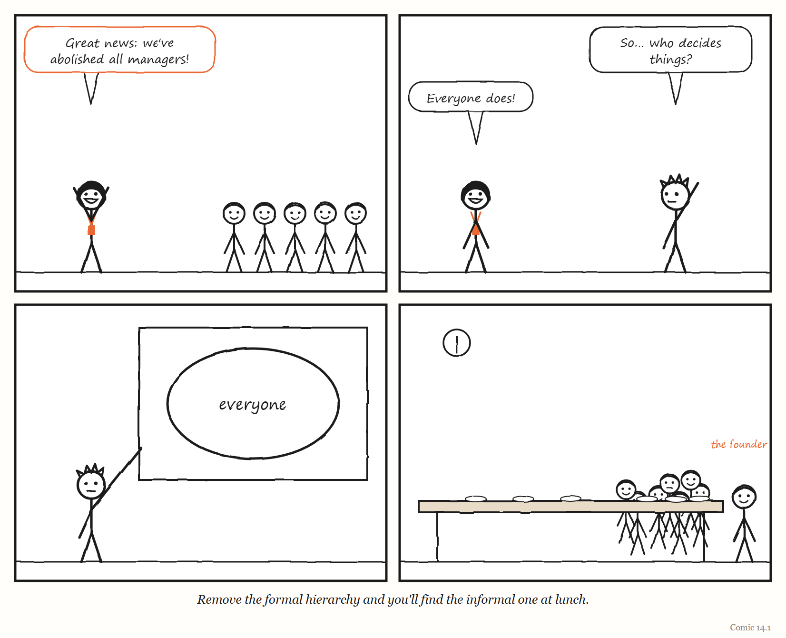
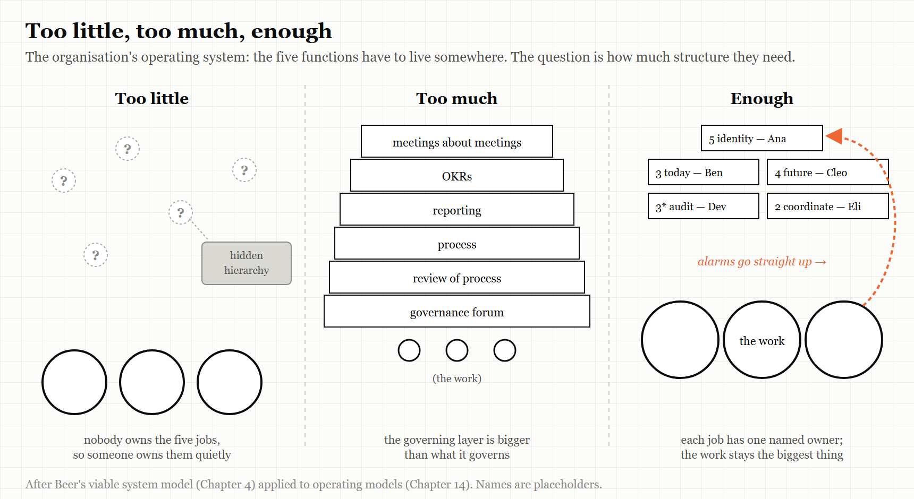

# 14. The Organisation's Operating System

*You can remove the managers. You cannot remove the jobs managers were doing.*

> "Good intentions don't work. Mechanisms do."
> — an Amazon principle, as recorded in *Working Backwards* (2021)

---

In 2015, the social-media software company Buffer did something many people who have worked under a bad manager have fantasised about. It got rid of all its managers.

Buffer's co-founder Leo Widrich described what happened next in an unusually candid post that August, titled "What We Got Wrong About Self-Management." The company had removed its managers, dropped the regular one-to-one meetings between managers and staff, and replaced conventional decision-making with an "advice process": anyone could make a decision, as long as they first sought advice from the people it would affect.

Within months, problems appeared. New staff felt lost; nobody was clearly responsible for helping them find their way. Experienced staff could not see where they could contribute at a strategic level. The structure that had been removed had been doing jobs — guiding, mentoring, setting direction — and those jobs had not gone away. They had simply stopped being done.

Buffer's response was to bring some structure back: mentoring, and higher-level strategic roles. Widrich called the result an "actualised hierarchy" — one that emerges from experience and expertise, rather than being imposed, and that does not grant anyone the power to veto others.

This chapter is about the governing layer that every organisation has, whether it admits it or not: its **operating system** — the way it decides, coordinates, allocates, learns and remembers what it is for.

---

## The five jobs, again

Chapter 4 described Stafford Beer's viable system model: the idea that every organisation that survives performs five functions — the work itself; coordination between the parts doing the work; here-and-now management and audit; attention to the outside world and the future; and identity and purpose. Beer called Systems 2 to 5 the **metasystem**.

The traditional way of performing those functions is a management hierarchy. Managers coordinate, allocate, audit, plan and embody the company's direction. That is why removing the managers is so tempting and so dangerous. It removes a layer that many people experience as obstruction. But the *functions* the layer was performing do not disappear when the layer does. Somebody still has to coordinate, allocate, look ahead and hold the purpose. If the organisation does not decide who, the functions get done informally, invisibly and unevenly — or not at all.

Buffer's experience is almost a textbook illustration. Removing managers removed, among other things, the people who had been doing Systems 2 and 3 for new staff — coordinating their work and helping them find where they fitted — and the part of System 4 that connected experienced staff to the company's longer-term direction. Nothing had been built to replace them.

> **IN SMALL WORDS**
> Bosses do some jobs that still need doing even if you get rid of the bosses — like helping new people, deciding who does what, and thinking about next year. If nobody is given those jobs, they don't vanish. They just stop getting done, or get done in secret.

---

## The hierarchy you cannot see

The second thing that happens when a formal hierarchy is removed is that an informal one grows in its place.

The games company Valve became famous in the 2010s for its "flat" structure, set out in its *Handbook for New Employees*, published in 2012 and much circulated online. The handbook says Valve has no management, and that nobody "reports to" anybody else — even the founder and president is not your manager. Its best-known symbol is the desk on wheels: employees form teams by physically wheeling their desks together around a project, and wheel away when they decide to move on. Some people who worked there described a rather different picture. In 2013, after Valve let her go, the hardware engineer Jeri Ellsworth said there was "a hidden layer of powerful management structure in the company", and that it felt a lot like high school. In July 2018 a former Valve programmer, Rich Geldreich, who had worked there from 2009 to 2014, spent several days tweeting about the politics of an unnamed "self-organizing" company in Bellevue, Washington — where Valve is based — in terms that the games magazine *PC Gamer* found hard to read as being about anyone else. In his account, the flat structure was a surface. Power sat with "barons" close to the company's executives; newcomers needed an influential sponsor to be safe; and a bonus system shaped by peer review let teams hold a colleague's bonus hostage. The glossy handbook, he suggested, was mainly a recruiting device, and insiders laughed at it. These are one person's accounts, not findings, and others who worked at Valve praised its freedom. But they describe a pattern that recurs wherever formal structure is removed.

Buffer's "actualised hierarchy" and Valve's hidden one are two versions of the same thing. Remove formal structure, and structure reappears — sometimes, as at Buffer, openly and deliberately; sometimes, as Ellsworth and Geldreich described Valve, invisibly, where it is harder to question.

This is Chapter 1's legibility problem turned inside out. A formal hierarchy is a legible governing layer: you can see who decides, and argue with them. An informal one is illegible. It may work well — it may be where the organisation's real knowledge lives — but it is very hard to hold to account, and very hard for a newcomer to find.

<!-- COMIC 14.1 script: Four panels. Panel 1 — DEE, delighted, to a room of staff: "Great news: we've abolished all managers!" Panel 2 — PAT, raising a hand: "So... who decides things?" DEE: "Everyone does!" Panel 3 — PAT, at a whiteboard, drawing a big circle labelled *everyone*. Panel 4 — no words. Lunchtime. A long table in the canteen. One person at the head of it, labelled *the founder*. Everyone else in the company is crowded around the three nearest seats, with plates. Caption: *Remove the formal hierarchy and you'll find the informal one at lunch.* -->
---

## Mechanisms, not intentions

If removing structure fails, what does good structure look like? One of the most widely studied answers comes from Amazon.

Amazon is famous for its "two-pizza teams" — teams small enough to be fed by two pizzas. The idea is usually presented as a rule about team size. According to *Working Backwards* (2021), a book by two long-serving Amazon executives, Colin Bryar and Bill Carr, the story is more interesting than that — as summarised by several reviewers.

> **MYTH**
> "Amazon's secret is small, two-pizza teams."
> **RECORD**
> According to *Working Backwards*, written by two former Amazon executives, the two-pizza teams originally reported to a single, multi-disciplinary manager — but such general managers turned out to be very hard to find, and some initiatives needed more than a two-pizza team. Amazon concluded that a team's success depended less on its size than on having a leader with the skills, authority and experience to run a dedicated team — which became its model of the **single-threaded leader**. "Today," the authors write, "despite their initial success, few people at Amazon still talk about two-pizza teams."
> Sources: Colin Bryar and Bill Carr, *Working Backwards* (2021), chapter 3 (the quotation is on p. 75).

Amazon is also known for the idea that good intentions are not enough. The principle — usually attributed to Jeff Bezos, and recorded in *Working Backwards* and in Amazon's own AWS Well-Architected Framework — is that good intentions do not work; mechanisms do. AWS's own documentation defines a mechanism as "a complete process" with three parts: you build a tool, you drive its adoption, and you inspect the results so you can correct course — replacing "human best efforts" with repeatable processes that make something happen whether or not anyone remembers to try. Notice the third step. A tool nobody inspects is not a mechanism; it is a hope with a user interface.

> **WEIRD TRUE THING**
> Amazon's principle that "good intentions don't work; mechanisms do" appears not only in a business book written by former executives, but in the company's official cloud-engineering documentation — the AWS Well-Architected Framework, a technical manual for building reliable systems, which quietly contains a small theory of management.

One of Amazon's best-known mechanisms is a customer-service version of the andon cord from Chapter 12 — borrowed, as the name says, from Toyota. Bezos listed "our customer service Andon Cord" among the company's examples of internally driven improvement in his 2012 letter to shareholders; as it is usually described, it lets a customer-service representative who sees a recurring defect take the product off sale until the problem is fixed. It is a governing layer that deliberately gives the stop to the people closest to the complaint.

Both ideas are about the governing layer. The single-threaded leader is a clear answer to Beer's question of who does System 3 for a particular piece of work — one person, with the authority to do it, and nothing else competing for their attention. And a mechanism is an attempt to make part of the metasystem **legible and reliable** without making it oppressive: a small, explicit piece of governance, owned by someone, that does one job.

---

## Nobody owns the whole

The most common failure of organisational operating systems is not too much structure or too little. It is structure in which nobody is responsible for the whole.

Healthcare.gov, whose launch in October 2013 Chapter 6 described, is the textbook case. The US Department of Health and Human Services' Inspector General, after interviewing 86 people and reviewing thousands of documents, found that one of the central problems was that different divisions of the responsible agency each believed they were in charge. When a single system depends on many teams and many contractors, the missing piece is often an integrator with genuine authority over the whole.

Other government technology programmes tell the same story at larger scale. The US Air Force's Expeditionary Combat Support System, or ECSS, aimed to replace a sprawl of older logistics systems with a single enterprise system. It was cancelled in 2012 after about $1.1 billion and eight years had been spent without fielding any usable capability, leaving the old systems in place. A Senate investigative subcommittee published a staff report on it on 7 July 2014, subtitled *A Cautionary Tale on the Need for Business Process Reengineering and Complying with Acquisition Best Practices*. One of its findings belongs in any book about legibility: when the Air Force began planning ECSS, it did not know how many legacy systems the new one would replace. Its estimates, at different times, ranged from 175 to "hundreds" to more than 900. Investigators also pointed to an unclear idea of what the system was supposed to achieve, weak leadership, and resistance to changing working practices to fit the software; an Air Force official summed it up as simply too big.

Sometimes the missing metasystem is visible in a single resignation letter. In September 2021 Nicolas Chaillan, the US Air Force's first Chief Software Officer, who had led the Defense Department's shared software platform, announced that he was leaving. In his resignation memo, as reported by *Defense One* and others, he described the department as the largest software organisation on the planet with almost no shared repositories and little collaboration between the services — and said that his own office still had no permanent position and no funding. An enterprise platform without budget, authority or headcount is not a governing layer. It is one person's campaign, and it ends when they are tired.

And the Air Force's own software factory, Kessel Run, whose rise and difficulties Chapter 3 described, faltered according to one of its co-founders not because of its engineering but because of the organisation around it — turnover, the lack of career paths and training budgets, and leadership rotating every two years. The software layer worked. The layer that governed the people who built it did not.

In each case, the work units were busy. What was missing, or weak, was the metasystem: the functions that coordinate the whole, own its outcome, look ahead and keep the organisation's purpose clear.

---

## When governance becomes the work

There is an opposite failure, and it is just as common. The governing layer can grow until maintaining it crowds out the work it was meant to serve.

Chapter 9 described the online publisher Medium leaving Holacracy in 2016 because it had concluded the system was getting in the way of the work, and a founder abandoning OKRs after they generated more planning and administration than alignment. Chapter 5 described companies ranking employees by their use of AI, and getting conspicuous waste. And Chapter 1 described the processes that large companies build to make their work legible to leadership and to big customers — processes that, as Sean Goedecke put it, often reduce real efficiency even as they increase control.

None of these governance systems was pointless. Each one was performing a real function. The failure comes when the cost of the function — in meetings, rituals, reports and tools — exceeds its value, and nobody is in a position to notice, because the governance itself is the thing that would have to notice.

Engineers tell a version of this as a joke. Asked on Hacker News for the most outrageous over-engineering they had seen, one described an internal IT ticketing system built with failover across data centres, load balancing and database replication between regions — so resilient that it would stay up after the business systems it tracked had all gone down, leaving staff free to file tickets about everything else being broken. They blamed use-it-or-lose-it budgets, not need. The governing layer had been built to the standard of its budget rather than of the work.

> **TRY IT YOURSELF: THE META-MEETING COUNT**
> A good test for whether governance has become the work: for one month, mark every meeting in your calendar that exists to prepare for, report on, or follow up another meeting. Count them. Then count the hours. If the number surprises you, that surprise is the finding — the governing layer has grown without anybody deciding it should.

---

## Where the accountability goes

In 2024 the economist and writer Dan Davies published *The Unaccountability Machine*, a book that brought Stafford Beer's cybernetics to a general audience. Among its ideas is one that belongs in this chapter: that modern organisations and institutions increasingly contain **accountability sinks** — arrangements in which decisions are delegated to a rulebook, a procedure or a system, so that when something goes wrong it becomes impossible to identify who decided, and nobody can be held directly accountable.

It connects directly to this book's hardest cases. Chapter 7 described the Post Office Horizon scandal, in which the output of an accounting system, protected by a legal presumption, was treated as fact — and the people it harmed had nobody they could hold to account. Chapter 5 described the certification of the 737 MAX, in which the regulator's oversight had been delegated to the company being regulated. In each, the governing layer had become a place where responsibility could go and not come back out.

AI agents are likely to make this worse before they make it better. When an agent writes the code, another agent reviews it, and a pipeline deploys it (Chapter 3), who is accountable when it goes wrong? Eran Kahana, writing for Stanford Law School's CodeX centre in February 2026, put the question in his title: "Built by Agents, Tested by Agents, Trusted by Whom?" Taking StrongDM's factory as his example, he argued that responsibility shifts from the engineers who once reviewed code to the people who design the specifications and watch the metrics; that agents writing code and agents testing it may share the same blind spots; that existing law on liability, disclosure and warranties assumes a human reviewed the software; and that as engineers stop reading code, the expertise needed to diagnose failures will decay. An organisation's operating system should be able to answer that question for every system it runs — before something goes wrong, not after.

> **THE MECHANISM**
> 
> 
> <!-- FIGURE 14.1 illustrator brief: Three organisation charts side by side. Left, labelled *Too little*: work units drawn as circles, with nothing above them; the five metasystem functions float unattached in the air as question marks, and one of them has drifted over to a lunch table labelled *hidden hierarchy*. Middle, labelled *Too much*: the work units are tiny, buried under a huge stack of boxes labelled *process*, *reporting*, *OKRs*, *meetings about meetings*. Right, labelled *Enough*: the work units are large, and above them sits a small, clear structure in which each of the five functions has one named owner, with a thin dotted line labelled *alarms go straight up* running from the work to the top. -->
> An organisation's operating system can fail by doing too little of the metasystem's work, or by letting that work swallow the organisation. The aim is enough: every function owned, visibly, and no more.

---

## Designing an operating system

Drawing the chapter together, and the book's five words with it, gives a short set of questions for anyone designing or reforming how an organisation runs itself.

**Model.** What does our governing layer believe about how the work actually happens? When did that belief last change? (Chapter 2.)

**Legibility.** What does our operating system make visible, and what does it make invisible — the backchannels, the informal hierarchy, the work nobody records? Are we protecting the invisible work that matters? (Chapter 1.)

**Remainder.** When we automate or standardise part of our governance, what is left for people to do — and are they equipped to do it? (Chapter 10.)

**Stop.** Who can halt a decision, a project or a release — and what happens to them when they do? (Chapter 12.)

**Jump.** Which governing layers have we added recently — new tools, new platforms, AI agents — and who governs each one? (Chapter 3.)

And from Beer: **is every one of the five jobs owned, by someone who knows it is theirs?**

---

## The Image

A company with no managers at a long lunch table — and everyone crowded around the three seats nearest the founder.

## The Reversal

Some organisations genuinely thrive with very little formal hierarchy — small teams, co-operatives, groups of experts who know each other well — and the informal structure that forms may be exactly right for them. Chapter 4's Suma co-op made self-management work, eventually. And heavy governance is sometimes precisely what an organisation needs: in safety-critical industries, a thick layer of process can be the difference between a normal day and a disaster. The goal is not the least governance or the most. It is governance whose every part is doing a job someone can name — and that someone can change when the job changes.

## The Rules

1. **Removing managers does not remove the jobs managers did. Give each job an owner.**
2. **Where there is no formal hierarchy, look for the informal one.**
3. **Good intentions fade. Mechanisms, with owners, persist.**
4. **Every system that affects people needs a person who is accountable for it.**
5. **When governing the work becomes the work, stop and count.**

## Diagnose

- For each of Beer's five jobs, who in your organisation does it? Is it written down?
- If your organisation is "flat," where does real decision-making happen? Who would a newcomer need to know?
- Which recent reorganisation left an old structure running alongside the new one?
- For each automated system that makes decisions affecting people, who is accountable when it is wrong?
- What proportion of your working week goes on governing the work rather than doing it?

## Try This

Draw your organisation's *real* org chart — not the official one, but the one a newcomer would need to understand how things actually get decided. Put the official chart next to it. Every difference is either a piece of metis worth protecting or a piece of hidden hierarchy worth bringing into the open. Decide which is which.

## Your Turn

A 60-person company plans to replace its managers with a self-management system it read about, rolling it out company-wide next month. Using Buffer's experience, Beer's five jobs and this chapter's other cases, list the three risks you would most want the company to plan for, and one thing it should do before the rollout. *(Worked answers are at the back of the book.)*

## In One Paragraph

Every organisation has an operating system — the governing layer through which it decides, coordinates, allocates, learns and remembers its purpose. Removing managers, as Buffer did in 2015, does not remove the jobs managers were doing, and a hidden hierarchy tends to grow where the formal one used to be, as a former Valve engineer described. Amazon's move from two-pizza teams to single-threaded leaders, and its preference for mechanisms over intentions, show structure that owns a function clearly without overwhelming the work. Programmes such as Healthcare.gov and the Air Force's $1.1 billion ECSS failed partly because nobody owned the whole, while governance systems like Holacracy and OKRs can grow until they crowd out the work. Dan Davies' idea of "accountability sinks" names the danger that AI agents may intensify. Give each of the five jobs an owner, bring hidden hierarchies into the open, and make sure every system that affects people has someone accountable for it.

## Go Deeper

- Leo Widrich, "What We Got Wrong About Self-Management," Buffer (5 August 2015).
- Colin Bryar and Bill Carr, *Working Backwards: Insights, Stories, and Secrets from Inside Amazon* (2021).
- Dan Davies, *The Unaccountability Machine: Why Big Systems Make Terrible Decisions — and How the World Lost Its Mind* (Profile Books, 2024; University of Chicago Press in the US).
- US Department of Health and Human Services, Office of Inspector General, *HealthCare.gov: CMS Management of the Federal Marketplace* (2016).
- Andy Doyle, "Management and Organization at Medium," Medium (2016).
- Tyler Wilde, "Ex-Valve employee describes ruthless internal politics at 'self-organizing' companies," *PC Gamer* (20 July 2018) — the source for Geldreich's tweets and Ellsworth's 2013 remarks.
- Jeff Bezos, 2012 letter to Amazon shareholders (April 2013).
- AWS, "Building mechanisms," *Operational Readiness Reviews* (AWS Well-Architected documentation).
- *Defense One*, on Nicolas Chaillan's resignation as Air Force Chief Software Officer (September 2021).

---

*The Haiku Line*

> No bosses at all.
> Just ask whoever eats lunch
> with the founder. Thanks.
