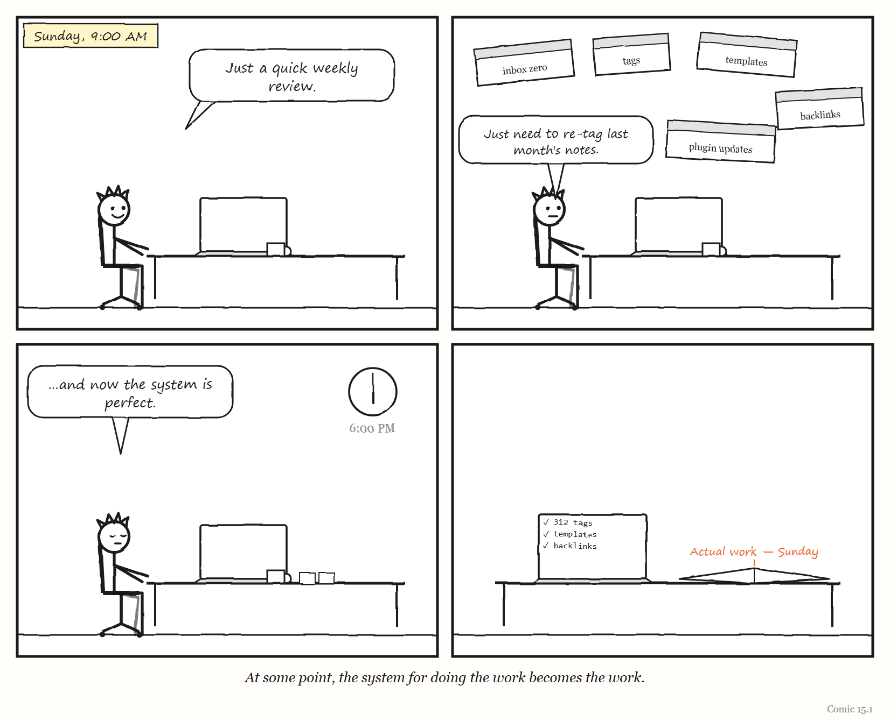
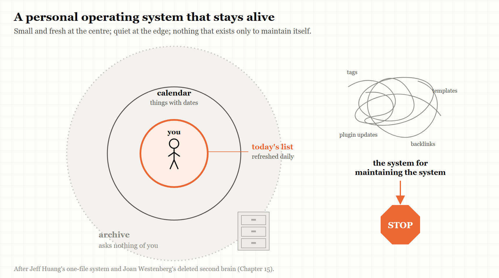

# 15. Your Own Operating System

*The smallest metasystem is the one you run on yourself.*

> "Rather than being the author, you become the administrator of your knowledge base."
> — Ben Khalesi, 2025

---

In the summer of 2025, the writer and technologist Joan Westenberg deleted her second brain.

A "second brain," in the language of the personal-productivity world, is a system for capturing and organising everything you learn and think — notes, links, highlights, ideas, tasks — so that your own brain is free to think. Westenberg's was substantial. The subtitle of her essay about deleting it describes erasing about 10,000 notes and seven years of ideas. Her vault in the popular note-taking app Obsidian went; so, according to accounts of the essay, did notes going back to 2015 and to-do lists spread across several apps.

Her reason was not that the system had failed to store things. It had stored them beautifully. The problem was what it had done to her thinking. The system, she wrote, had become a kind of mausoleum of old interests. And instead of speeding up her thinking, "it began to replace it."

The essay struck a nerve. On the programmers' forum Hacker News, it drew nearly 600 upvotes and nearly 350 comments. Some readers were delighted; one wrote a small plugin in response. Others were horrified at the idea of throwing away years of notes. The writer Elizabeth Tai, who uses Obsidian to turn ideas into published essays, published a response supporting the deletion of cluttered systems — while keeping her own, in which every note has an intended use.

This last chapter takes the book's ideas down to the smallest scale they fit: the governing layer that one person builds to run their own life and work.

---

## A metasystem of one

Most people who work with information have some version of a personal operating system. A to-do list. A calendar. A notes app. A habit tracker. An inbox with folders and rules. A weekly review. Increasingly, an AI assistant that summarises, drafts and reminds.

Each of these is a governing layer over the actual work of your life — the writing, the thinking, the conversations, the craft. And each of them is subject to the same forces this book has traced through factories, platforms, fighter jets and government departments.

A word of honesty first. Stafford Beer's viable system model (Chapter 4) was built for organisations, and the research behind this book found that its preconditions do not straightforwardly apply to a single person. What follows is an *analogy* — a useful one, but an analogy. The five words carry across more cleanly than the full cybernetic apparatus.

---

## Model: the system that stopped matching you

Your personal system is a model of your work and your life: what you are doing, what you care about, what you intend to do next. Like every regulator's model, it was fitted to a particular moment. And like every model, it goes stale.

Westenberg's phrase — a mausoleum of old interests — is a precise description of a model that has stopped changing while its owner kept changing. Her notes described a person she no longer entirely was. The system kept presenting that person back to her, and the effort of maintaining it was effort spent on someone else's priorities: her own, from years before.

This is Conant and Ashby's fourth comment, at the scale of one life. A time-varying person needs a time-varying system — or, sometimes, the courage to let the old model go.

---

## Legibility: capturing is not thinking

The promise of the second brain is legibility. Capture everything, link it, tag it, and your own mind becomes visible to you — searchable, browsable, connected.

The technology journalist Casey Newton described in 2023 what happened when he tried. Through 2021 and 2022 he used Roam Research, a note-taking tool built around links between notes, in the hope that connecting his reporting would surface new ideas. He tried Obsidian, then moved to another app called Mem. The insights, he wrote, never came; he waited, and waited. His conclusion, drawing on the researcher Andy Matuschak, was that the apps were built to display and manipulate notes rather than to help people make meaning from them — and that thinking happens in the mind, through sustained concentration, not in the links between files.

It is Chapter 1's forest again. A note is a legible record of a thought. A system of notes is a Normalbaum: a neat, countable, searchable picture of your thinking. And a system optimised for capture can end up managing out of your life the illegible thing it was meant to support — the slow, unrecorded work of actually thinking about something.

The cost can be counted. The software developer Tomas Vik kept a *Zettelkasten* — a method of writing permanent, linked notes, popular among researchers — for more than a year and wrote honestly about the price. Each permanent note took him about 30 minutes, including the reading behind it. Books took four to six times longer to read, and he gave up on one because of the pace. He kept the method; linking forced him to understand what he was writing. But he wondered whether a simpler practice might give a better return for the time.

> **WEIRD TRUE THING**
> At Tomas Vik's pace of about 30 minutes per permanent note, a second brain the size of Joan Westenberg's — about 10,000 notes — would represent some 5,000 hours of work: roughly two and a half years of full-time employment, spent on the filing. (Most notes in most systems are quicker than Vik's careful ones, so treat this as an upper bound. It is still a lot of Sundays.)

> **IN SMALL WORDS**
> Writing things down is not the same as thinking about them. A system that saves every thought can use up the time you needed to have new ones.

---

## Jump: becoming the administrator

The quotation at the top of this chapter comes from the technology writer Ben Khalesi, who in October 2025 described what happened when he loaded Obsidian with community plugins for tasks and organising data. It slowed down. Syncing to his phone failed. The system became unreliable — and maintaining it began to crowd out his writing. He switched nearly all the plugins off, and the system became faster, more stable and better for what he had wanted it for in the first place.

His summary is the best description of a personal metasystem transition (Chapter 3) that I have found: rather than being the author, you become the administrator of your knowledge base.

Every personal system makes the same jump sooner or later. First you do the work. Then you build a system to help you do the work. Then the system needs maintaining, and you build habits, templates and tools to maintain it — and before long you are running a system for running your system. Each layer is sensible. Together, they turn an author into an administrator.

<!-- COMIC 15.1 script: Four panels. Panel 1 — Sunday morning. PAT, at a laptop with a coffee: "Just a quick weekly review." Panel 2 — PAT, surrounded by floating windows labelled *tags*, *templates*, *backlinks*, *plugin updates*, *inbox zero*: "Just need to re-tag last month's notes." Panel 3 — the clock reads 6:00 PM. PAT, bleary: "...and now the system is perfect." Panel 4 — no words. A notebook on the desk beside the laptop, open to a blank page headed *Actual work — Sunday*. Caption: *At some point, the system for doing the work becomes the work.* -->
---

## Grow it: the text file

If elaborate systems collapse under their own weight, what lasts?

The longest-lived personal system in the research behind this book is almost no system at all. The computer scientist Jeff Huang described in 2020 — and updated in 2022 — how he had kept his to-dos, notes and a record of his completed work in a **single text file** for 14 years. By his update, it had grown to more than 51,000 lines. Each night, he copies the next day's calendar items to the end of the file, making a list for the day. Through the day he annotates it, so the list becomes a record of what he actually did. A few hashtags make it searchable. Everything with a date — including tasks scheduled for when he wants to think about them — lives in his calendar. He had moved away from dedicated task apps, he wrote, because the lists kept getting longer and information ended up scattered across tools.

Huang's file is Gall's law (Chapter 13) at the scale of one person. It started simple and worked, and it grew by accretion from something that already worked. Its model of his work is refreshed every single day, by a ritual small enough to actually do. And its lists are sized to a single day — the unit of time a person can really see.

Readers of Huang's post and Westenberg's essay described their own versions. On Hacker News and the forum Lobsters, people told of replacing corporate task-tracking software with a hand-written spreadsheet file; moving from elaborate digital systems to a paper notebook because rewriting unfinished items by hand every month worked better away from a screen; abandoning a fine-grained system of breaking tasks down after realising they needed to look at how they actually worked, not at the "cool system"; and collapsing an elaborate folder structure into a single folder.

---

## Stop: keep the archive, lighten the load

Not everyone agreed that deletion was the answer, and the disagreement is instructive.

Many of the most thoughtful responses to Westenberg were from people who *kept* their systems. One said their notes had saved them and their team from serious trouble more times than they could count; offloading memory was the point. Another valued old notes the way other people value old photographs — not for retrieving facts, but for revisiting who they had been. Another kept write-only logs because roughly one note in a hundred turned out to be extremely useful years later. Several said they would never delete, but archive — putting old material into a dated file and out of the way. One regretted, decades later, throwing away a notebook from the 1980s.

And one commenter drew the distinction that seems to decide the whole argument. Notes that are really *things to do*, they suggested, are a burden: each one is an obligation, and a large pile of them is a large pile of guilt. Notes that are a *historical record* are not a burden at all; they cost nothing to keep and occasionally repay the keeping.

That distinction maps neatly onto this book's ideas. An active personal system is a regulator — it tells you what to do next — and a regulator carrying a stale model pushes you in the wrong direction. An archive is not a regulator; it is a memory. The healthy move is usually not deletion but **separation**: keep a small, current, active system that is refreshed often, and a large, cold archive that asks nothing of you.

And give yourself the andon cord. In Chapter 12, the power to stop the line was the most important property of a governing system. For a personal system, it is the permission — which you have to grant yourself — to stop maintaining something that no longer serves you, archive it, and start again from something small.

---

## Remainder: the machine that reads your notes

There is one more force at work, and it is new.

In 2023, Newton hoped that AI search across his notes might one day deliver the research assistant the note apps had promised. By 2025, one commenter on Westenberg's essay was suggesting that there was no longer any need to organise old notes at all: archive them, and let a local AI model find whatever was useful in them later.

If that is right, it changes the economics of every personal system — and probably every internal wiki. The effort of manual organisation, of tagging and linking and filing, was the main cost of a second brain. An AI that can search a disorganised pile removes much of it.

But Chapter 10 has something to say about this too. When a machine takes over the easy part of a job, the human is left the remainder. If the machine does the organising, the filing and the retrieving, what remains for you is the part it cannot do: noticing what matters, making connections that mean something, actually thinking. Westenberg's warning — that her system had begun to *replace* her thinking — applies with even more force to a system that can summarise, connect and draft on your behalf. The question for a personal operating system in 2026 is not how much the machine can do. It is which part of the thinking you are determined to keep doing yourself.

> **THE MECHANISM**
> 
> 
> <!-- FIGURE 15.1 illustrator brief: A single person drawn as a small version of the book's control loop. At the centre, a figure labelled *you*. Around them, three rings. The innermost, small and bright, is labelled *today's list — refreshed daily*. The middle ring, thin, is labelled *calendar — things with dates*. The outer ring is large, faded and grey, drawn like a filing cabinet, labelled *archive — asks nothing of you*. A separate, overgrown tangle floating off to one side is labelled *the system for maintaining the system*, with an arrow from it to a small sign reading *stop*. -->
> A personal operating system that lasts: a small active core refreshed every day, a calendar for what has a date, and a cold archive that is memory rather than obligation. Anything that grows into a system for maintaining the system is a candidate for the cord.

---

## The Image

A single text file, fourteen years long, growing by one day at a time.

## The Reversal

Some people genuinely thrive with elaborate personal systems. For a researcher writing a thesis, a lawyer managing hundreds of cases or a writer building a body of published work, a carefully maintained knowledge system can be the backbone of their craft — Elizabeth Tai's every-note-has-a-use vault and Tomas Vik's slip-box are examples of systems their owners chose to keep after counting the cost. Minimalism can also be its own kind of performance. The lesson is not that simple is always better. It is that a personal system should be judged by the work it produces, not by how complete it is — and that any system whose maintenance has begun to crowd out that work needs to be pruned, whatever it looks like.

## The Rules

1. **Judge your system by the work it produces, not by what it contains.**
2. **Keep the active system small and fresh; keep the archive cold.**
3. **Capturing a thought is not having one.**
4. **When you become the administrator, stop and prune.**
5. **Decide which part of the thinking you will never hand to a machine.**

## Diagnose

- How much time each week do you spend maintaining your personal system, as opposed to doing the work it supports?
- How much of what is in your to-do list, notes or inbox describes the person you are now, rather than the person you were?
- Which of your notes are obligations, and which are records?
- If you lost your whole system tomorrow, what would you actually miss?
- What part of your thinking has an app or an AI started doing for you — and is that a part you wanted to give up?

## Try This

For the next seven days, try Jeff Huang's method alongside whatever you use now. Each evening, copy tomorrow's calendar items into a single plain text file and add the few things you really intend to do. During the day, write what actually happened next to each one. At the end of the week, compare it with your usual system. Keep whichever one produced more of the work you care about.

## Your Turn

A friend has spent three years building an elaborate personal knowledge system with hundreds of tags, templates and automated workflows. They say it is "almost perfect" but that they feel they are producing less writing than before they started. Using this chapter, explain what may be happening, and propose a plan that neither deletes their work nor lets the system keep growing. *(Worked answers are at the back of the book.)*

## In One Paragraph

The smallest governing layer is the one a person builds to run their own work and life, and it is subject to the same forces as any other. Its model goes stale — Joan Westenberg deleted a seven-year "second brain" that had become a mausoleum of old interests and had begun to replace her thinking. Legibility misleads — Casey Newton waited for insights from linked notes that never came, and Tomas Vik found each permanent note cost thirty minutes. It jumps into a system for maintaining the system, turning an author into an administrator, as Ben Khalesi put it. What lasts tends to be small, grown and refreshed daily, like Jeff Huang's fourteen-year text file. Keep a small active system and a cold archive, give yourself permission to stop, and decide which part of your thinking you will never hand to a machine.

## Go Deeper

- Joan Westenberg, "I Deleted My Second Brain" (2025), and Elizabeth Tai, "I support deleting your second brain" (29 June 2025).
- Casey Newton, "Why note-taking apps don't make us smarter," *Platformer* (24 August 2023).
- Jeff Huang, "My productivity app is a never-ending .txt file," jeffhuang.com (2020, updated 2022).
- Ben Khalesi, on stripping Obsidian back to its core features, *Android Police* (28 October 2025).
- Tomas Vik, "Slip-box after a year," blog.viktomas.com.

---

*The Haiku Line*

> My second brain grew.
> I now spend all of Sunday
> tending to its needs.
