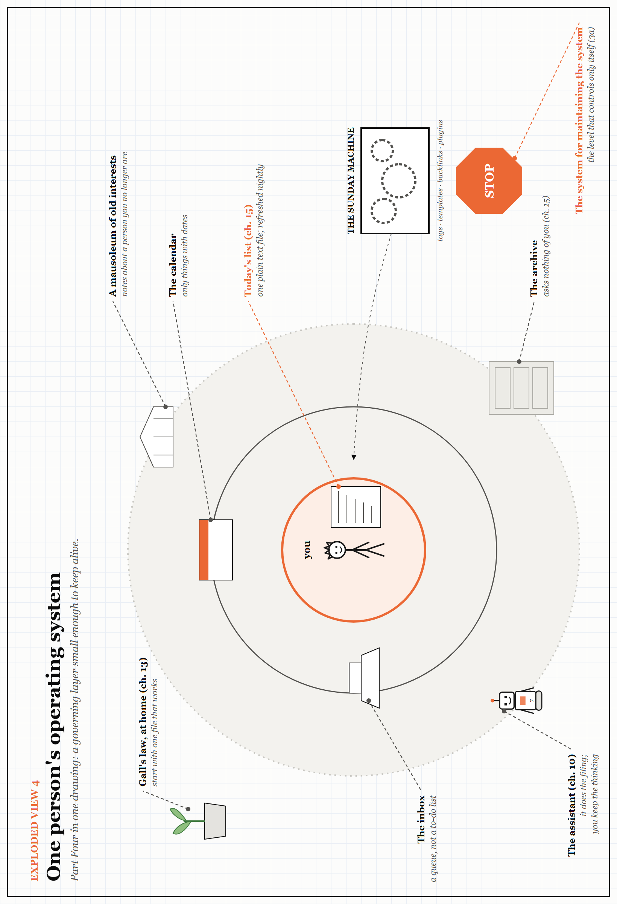

# Exploded View 4 — One Person's Operating System

*Part Four in one drawing. Every label points to something you have already met; look closely for the small jokes. The drawing is printed sideways: turn the book.*

Part Four ended at the smallest scale there is: one person and the layer they build to run their own work.

- **At the centre**, small and bright, is today's list — one plain text file, refreshed every evening (Chapter 15).
- **The middle ring** holds only what has a date, and the inbox: a queue to be emptied, not a list to be lived in.
- **The outer ring** is the archive. It asks nothing of you, which is exactly why it is safe to keep.
- **The assistant** does the filing, so that you can keep the thinking (Chapter 10, at home).
- **Off to the right** is the Sunday machine: the system for maintaining the system, the level from the interlude after Chapter 3 that controls only itself. It has a stop sign. Use it.
- **In the corner**, a seedling: Gall's law (Chapter 13). Start with one small thing that works.
